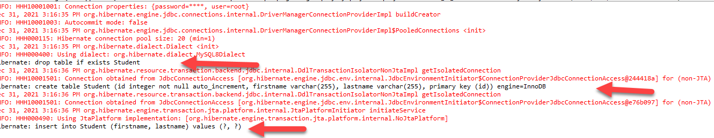

# 1. Java Hibernate : How to connect with DB

Hibernate is a Java framework that simplifies the development of Java application to interact with the database. It is an open source, lightweight, ORM (Object Relational Mapping) tool.
ORM is a programming technique for converting data between incompatible type systems using object-oriented programming languages. This creates, in effect, a "virtual object database" that can be used from within the programming language.

In this tutorial we will learn about the practical implementation of hibernate.
* First thing we need to do is create a database in our mysql workbench.
* In our database create two tables to be used in a student registration project.

* Now Lets Create a maven project in Eclipse ide and connect our database with it.

* One advantage of creating a maven project is installing libraries automatically by just writing dependencies in the pom.xml file.
* This is how we install the hibernate dependency.
    * Go To pom.xml file and click CTRL + SPACE on a blank space -> Insert Dependency.
    
    * Search for "hibernate" and selecte the core- hibernate. it will automatically deploy the latest hibernate to our pom.xml file.
    
* We also need to insert another dependency for a library to connect our project to a database so search JDBC connector (mysql-connector-java)using the same method we used above. 

* After downloading the needed libraries we must create the xml file to configure hibernate. to create the file:
    * Right-click '/src/main/resources' -> new -> other
    * Search for xml and select xml file name the file hibernate.cfg.xml then click on finish.
    
    

## hibernate.cfg.xml
```xml
<?xml version="1.0" encoding="UTF-8"?>
<!DOCTYPE hibernate-configuration SYSTEM
		"http://www.hibernate.org/dtd/hibernate-configuration-3.0.dtd">
		
<hibernate-configuration>
	<session-factory>
	
		<property name="connection.driver_class">com.mysql.jdbc.Driver</property>
		<property name="connection.url">jdbc:mysql://localhost:3306/javadb?useSSL=false</property>
		<property name="connection.username">root</property>
		<property name="connection.password">root</property>
		<property name="show_sql">true</property>
	 <property name="hibernate.hbm2ddl.auto">update</property>


		<mapping class="com.studenthibernateapp.entities.Student" /> <!-- Mapping with our student entity -->


	</session-factory>
</hibernate-configuration>
```
* Now create a student class inside a package.
* To create A package:
    * Right-click '/src/main/java' -> new -> Package
    
* To create a Student Class  
    * Right-click the package -> new ->Class
    

## Student.java   
```java
package com.studenthibernateapp.entities;

import javax.persistence.Entity;
import javax.persistence.GeneratedValue;
import javax.persistence.GenerationType;
import javax.persistence.Id;

@Entity 
public class Student {

	@Id
	@GeneratedValue(strategy = GenerationType.IDENTITY) // Automatically genearate The Id
	Integer id;
	
	String firstname;
	String lastname;
	
	public Integer getId() {
		return id;
	}
	public void setId(Integer id) {
		this.id = id;
	}
	public String getFirstname() {
		return firstname;
	}
	public void setFirstname(String firstname) {
		this.firstname = firstname;
	}
	public String getLastname() {
		return lastname;
	}
	public void setLastname(String lastname) {
		this.lastname = lastname;
	}
}
``` 
**What are Annotation?**
```

Java Annotation is a tag that represents the metadata i.e. attached with class, interface, methods or fields to indicate some additional information which can be used by java compiler and JVM.

Annotations in Java are used to provide additional information, so it is an alternative option for XML and Java marker interfaces.Annotations are used to provide supplemental information about a program. 
Annotations start with ‘@’.
```


* We need a database manger class so lets create a java file in our package. We can name it 'DBmanger.java'

## DBmanger.java
```java
package com.studenthibernateapp.entities;

import org.hibernate.Session;
import org.hibernate.Transaction;
import org.hibernate.cfg.Configuration;

public class DBmanger {

	public static void main (String[] args) {
		//configure
		Configuration cnfg = new Configuration();
		cnfg.configure("hibernate.cfg.xml");
		
		//session
		Session session = cnfg.buildSessionFactory().openSession();
		
		//transaciton open
		Transaction transaction = session.beginTransaction();
		
		// c.r.u.d operation
		Student student = new Student();
		student.setFirstname("Alemu");
		student.setLastname("Kebede");
		
		session.save(student);
		
		// commit transaction
		transaction.commit();
		
		// session close
		session.close();	   
	}
}

```

* Lets run the DBmanager java class as a java application to test our code.
* Before running our code remember to make the id column in our database table To auto-increment because we are not inputting the id but generating it automatically.
 
* Now run the project and see the output in console.
 
* At the bottom of the console page there is a message clearly stating the id , first name and last name we provided is written in our database. Let us check it in our mysql workbench.
 
* So we have seen that we can perform sql operations using hibernate without writing SQL code in our java code hence the name Object Relational Mapping. This easily solves the data mismatch found between the object oriented classes of an application and relational database. ORM connects these two with ease through the use of the XML mapping file. It enables to gain complete control over the application as well as the database design. This feature makes Hibernate flexible and powerful.

Also Hibernate is database independent. It can be used to connect with any database like Oracle and MySQL. This cross database portability of Hibernate is easily achieved by changing a parameter ‘database dialect’ in the configuration file. Database independency is considered as one of the major advantages of Hibernate. No deep knowledge of SQL is needed.
Hibernate supports a powerful query language called HQL (Hibernate Query Language). This query language is more powerful than SQL and is completely object oriented. HQL’s advanced features like pagination and dynamic profiling are not present in SQL. HQL can be used to implement some of the prominent object oriented concepts like inheritance, polymorphism and association.

## For video tutorial go to [Java Hibernate : How to connect with DB ](https://youtu.be/Jf0mAD3mbiw?list=PLfUANuySIYNO7dmckkcSOQY1PepmwdssE)
---

# 2. How To  save an entity
 In the previous section we have seen how to update an existing database table (Entity) using Hibernate from our code. we can also create a new entity using Hibernate with a little tweak in our code.

 * First lets remove the existing student table from our database.
  
* Now Lets Update our hibernate.cfg.xml code and see the difference.

## hibernate.cfg.xml
```xml
<?xml version="1.0" encoding="UTF-8"?>
<!DOCTYPE hibernate-configuration SYSTEM
		"http://www.hibernate.org/dtd/hibernate-configuration-3.0.dtd">
		
<hibernate-configuration>
	<session-factory>
	
		<property name="connection.driver_class">com.mysql.jdbc.Driver</property>
		<property name="connection.url">jdbc:mysql://localhost:3306/javadb?useSSL=false</property>
		<property name="connection.username">root</property>
		<property name="connection.password">root</property>
		<property name="show_sql">true</property>
	 <property name="hibernate.hbm2ddl.auto">create</property>

		<mapping class="com.studenthibernateapp.entities.Student" /> <!-- Mapping with our student entity -->


	</session-factory>
</hibernate-configuration>
```
* Notice The following Line of code is The difference.
```java
<property name="hibernate.hbm2ddl.auto">create</property>
```
* Lets run and see the change in our console.
 
* We can Also see if the entity is created in our database.
  


## For video tutorial go to [How To  save an entity ](https://youtu.be/YDzPei9QCXg?list=PLfUANuySIYNO7dmckkcSOQY1PepmwdssE)
---
# 3. How to fetch data Using Hibernate  

We have seen how to do Create and Update operation Using Hibernate. Now We can See a way of reading data from our database and displaying it in our project.

* But first lets reorganize our DBmanger.java code using methods to make it more efficient and readable.

## DBmanger.java
```java
package com.studenthibernateapp.entities;

import org.hibernate.Session;
import org.hibernate.Transaction;
import org.hibernate.cfg.Configuration;

public class DBmanger {

	public static void main (String[] args) {
		
		Student student = new Student();
		student.setFirstname("Abel");
		student.setLastname("Eshetu");
		
		saveStudent(student); // call function to save or update 
	}
	
	private static void saveStudent(Student student) {
		Session session = getSession();
		Transaction transaction = session.beginTransaction();
		session.save(student); //save, update
		transaction.commit();
		session.close();	
	}
	static Session getSession() {
		Configuration cnfg = new Configuration();
		cnfg.configure("hibernate.cfg.xml");
		
		Session session = cnfg.buildSessionFactory().openSession();
		return session;
	}
}

```

* After this Reorganization we can read data from our data base by writing a function in the above code.
## DBmanger.java
```java
package com.studenthibernateapp.entities;

import java.util.List;

import org.hibernate.Session;
import org.hibernate.Transaction;
import org.hibernate.cfg.Configuration;

public class DBmanger {

	public static void main (String[] args) {
		
		Student student = new Student();
		student.setFirstname("Abel");
		student.setLastname("Eshetu");
		
		saveStudent(student);
		List<Student>students = getAllStudents();
		
		for (Student st:students) {
			System.out.println("Student First-name: "+st.getFirstname()+"Student Second-name: "+st.getLastname()+"Student ID: "+st.getId());
		}
	   
	}
	
	
	private static void saveStudent(Student student) {
		Session session = getSession();
		Transaction transaction = session.beginTransaction();
		session.save(student);//save, update
		transaction.commit();
		session.close();
		
	}
	
	private static List<Student> getAllStudents() {
		Session session = getSession();
		Transaction transaction = session.beginTransaction();
		
		List<Student> students = session.createQuery("FROM Student").list();
		
		transaction.commit();
		session.close();
		
		return students;
	}
	

	static Session getSession() {
		Configuration cnfg = new Configuration();
		cnfg.configure("hibernate.cfg.xml");
		
		Session session = cnfg.buildSessionFactory().openSession();
		return session;
	}
	
	
}

```
 * After we add the Function to fetch data from our database lets run it as a java application and see the result in console.


## For video tutorial go to [How to fetch data ](https://youtu.be/e3PNaforokk?list=PLfUANuySIYNO7dmckkcSOQY1PepmwdssE)

---
