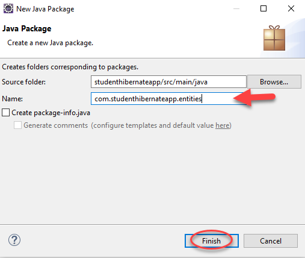
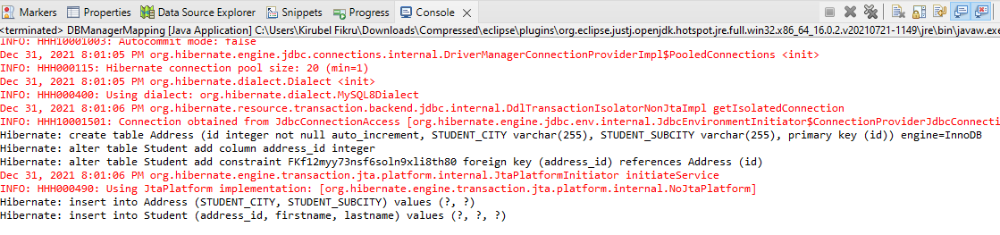
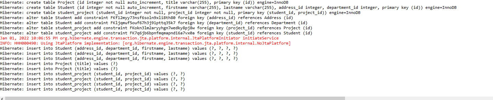
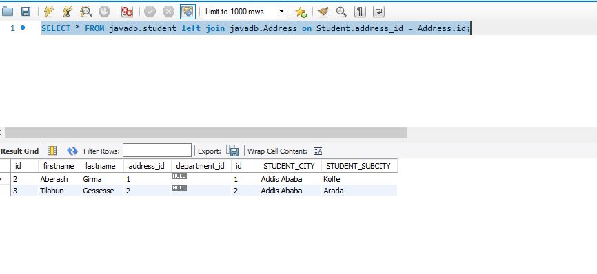

# 1. Java Hibernate : How to connect with DB

Hibernate is a Java framework that simplifies the development of Java application to interact with the database. It is an open source, lightweight, ORM (Object Relational Mapping) tool.
ORM is a programming technique for converting data between incompatible type systems using object-oriented programming languages. This creates, in effect, a "virtual object database" that can be used from within the programming language.

In this tutorial we will learn about the practical implementation of hibernate.
* First thing we need to do is create a database in our mysql workbench.
* In our database create two tables to be used in a student registration project.

* Now Lets Create a maven project in Eclipse ide and connect our database with it.

* One advantage of creating a maven project is installing libraries automatically by just writing dependencies in the pom.xml file.
* This is how we install the hibernate dependency.
    * Go To pom.xml file and click CTRL + SPACE on a blank space -> Insert Dependency.
    
    * Search for "hibernate" and selecte the core- hibernate. it will automatically deploy the latest hibernate to our pom.xml file.
    
* We also need to insert another dependency for a library to connect our project to a database so search JDBC connector (mysql-connector-java)using the same method we used above. 

* After downloading the needed libraries we must create the xml file to configure hibernate. to create the file:
    * Right-click '/src/main/resources' -> new -> other
    * Search for xml and select xml file name the file hibernate.cfg.xml then click on finish.
    
    

## hibernate.cfg.xml
```xml
<?xml version="1.0" encoding="UTF-8"?>
<!DOCTYPE hibernate-configuration SYSTEM
		"http://www.hibernate.org/dtd/hibernate-configuration-3.0.dtd">
		
<hibernate-configuration>
	<session-factory>
	
		<property name="connection.driver_class">com.mysql.jdbc.Driver</property>
		<property name="connection.url">jdbc:mysql://localhost:3306/javadb?useSSL=false</property>
		<property name="connection.username">root</property>
		<property name="connection.password">root</property>
		<property name="show_sql">true</property>
	 <property name="hibernate.hbm2ddl.auto">update</property>


		<mapping class="com.studenthibernateapp.entities.Student" /> <!-- Mapping with our student entity -->


	</session-factory>
</hibernate-configuration>
```
* Now create a student class inside a package.
* To create A package:
    * Right-click '/src/main/java' -> new -> Package
    
* To create a Student Class  
    * Right-click the package -> new ->Class
    

## Student.java   
```java
package com.studenthibernateapp.entities;

import javax.persistence.Entity;
import javax.persistence.GeneratedValue;
import javax.persistence.GenerationType;
import javax.persistence.Id;

@Entity 
public class Student {

	@Id
	@GeneratedValue(strategy = GenerationType.IDENTITY) // Automatically genearate The Id
	Integer id;
	
	String firstname;
	String lastname;
	
	public Integer getId() {
		return id;
	}
	public void setId(Integer id) {
		this.id = id;
	}
	public String getFirstname() {
		return firstname;
	}
	public void setFirstname(String firstname) {
		this.firstname = firstname;
	}
	public String getLastname() {
		return lastname;
	}
	public void setLastname(String lastname) {
		this.lastname = lastname;
	}
}
``` 
**What are Annotation?**
```

Java Annotation is a tag that represents the metadata i.e. attached with class, interface, methods or fields to indicate some additional information which can be used by java compiler and JVM.

Annotations in Java are used to provide additional information, so it is an alternative option for XML and Java marker interfaces.Annotations are used to provide supplemental information about a program. 
Annotations start with ‘@’.
```


* We need a database manger class so lets create a java file in our package. We can name it 'DBmanger.java'

## DBmanger.java
```java
package com.studenthibernateapp.entities;

import org.hibernate.Session;
import org.hibernate.Transaction;
import org.hibernate.cfg.Configuration;

public class DBmanger {

	public static void main (String[] args) {
		//configure
		Configuration cnfg = new Configuration();
		cnfg.configure("hibernate.cfg.xml");
		
		//session
		Session session = cnfg.buildSessionFactory().openSession();
		
		//transaciton open
		Transaction transaction = session.beginTransaction();
		
		// c.r.u.d operation
		Student student = new Student();
		student.setFirstname("Alemu");
		student.setLastname("Kebede");
		
		session.save(student);
		
		// commit transaction
		transaction.commit();
		
		// session close
		session.close();	   
	}
}

```

* Lets run the DBmanager java class as a java application to test our code.
* Before running our code remember to make the id column in our database table To auto-increment because we are not inputting the id but generating it automatically.
 
* Now run the project and see the output in console.
 
* At the bottom of the console page there is a message clearly stating the id , first name and last name we provided is written in our database. Let us check it in our mysql workbench.
 
* So we have seen that we can perform sql operations using hibernate without writing SQL code in our java code hence the name Object Relational Mapping. This easily solves the data mismatch found between the object oriented classes of an application and relational database. ORM connects these two with ease through the use of the XML mapping file. It enables to gain complete control over the application as well as the database design. This feature makes Hibernate flexible and powerful.

Also Hibernate is database independent. It can be used to connect with any database like Oracle and MySQL. This cross database portability of Hibernate is easily achieved by changing a parameter ‘database dialect’ in the configuration file. Database independency is considered as one of the major advantages of Hibernate. No deep knowledge of SQL is needed.
Hibernate supports a powerful query language called HQL (Hibernate Query Language). This query language is more powerful than SQL and is completely object oriented. HQL’s advanced features like pagination and dynamic profiling are not present in SQL. HQL can be used to implement some of the prominent object oriented concepts like inheritance, polymorphism and association.

## For video tutorial go to [Java Hibernate : How to connect with DB ](https://youtu.be/Jf0mAD3mbiw?list=PLfUANuySIYNO7dmckkcSOQY1PepmwdssE)
---

# 2. How To  save an entity
 In the previous section we have seen how to update an existing database table (Entity) using Hibernate from our code. we can also create a new entity using Hibernate with a little tweak in our code.

 * First lets remove the existing student table from our database.
  
* Now Lets Update our hibernate.cfg.xml code and see the difference.

## hibernate.cfg.xml
```xml
<?xml version="1.0" encoding="UTF-8"?>
<!DOCTYPE hibernate-configuration SYSTEM
		"http://www.hibernate.org/dtd/hibernate-configuration-3.0.dtd">
		
<hibernate-configuration>
	<session-factory>
	
		<property name="connection.driver_class">com.mysql.jdbc.Driver</property>
		<property name="connection.url">jdbc:mysql://localhost:3306/javadb?useSSL=false</property>
		<property name="connection.username">root</property>
		<property name="connection.password">root</property>
		<property name="show_sql">true</property>
	 <property name="hibernate.hbm2ddl.auto">create</property>

		<mapping class="com.studenthibernateapp.entities.Student" /> <!-- Mapping with our student entity -->


	</session-factory>
</hibernate-configuration>
```
* Notice The following Line of code is The difference.
```java
<property name="hibernate.hbm2ddl.auto">create</property>
```
* Lets run and see the change in our console.
 
* We can Also see if the entity is created in our database.
  


## For video tutorial go to [How To  save an entity ](https://youtu.be/YDzPei9QCXg?list=PLfUANuySIYNO7dmckkcSOQY1PepmwdssE)
---
# 3. How to fetch data Using Hibernate  

We have seen how to do Create and Update operation Using Hibernate. Now We can See a way of reading data from our database and displaying it in our project.

* But first lets reorganize our DBmanger.java code using methods to make it more efficient and readable.

## DBmanger.java
```java
package com.studenthibernateapp.entities;

import org.hibernate.Session;
import org.hibernate.Transaction;
import org.hibernate.cfg.Configuration;

public class DBmanger {

	public static void main (String[] args) {
		
		Student student = new Student();
		student.setFirstname("Abel");
		student.setLastname("Eshetu");
		
		saveStudent(student); // call function to save or update 
	}
	
	private static void saveStudent(Student student) {
		Session session = getSession();
		Transaction transaction = session.beginTransaction();
		session.save(student); //save, update
		transaction.commit();
		session.close();	
	}
	static Session getSession() {
		Configuration cnfg = new Configuration();
		cnfg.configure("hibernate.cfg.xml");
		
		Session session = cnfg.buildSessionFactory().openSession();
		return session;
	}
}

```

* After this Reorganization we can read data from our data base by writing a function in the above code.
## DBmanger.java
```java
package com.studenthibernateapp.entities;

import java.util.List;

import org.hibernate.Session;
import org.hibernate.Transaction;
import org.hibernate.cfg.Configuration;

public class DBmanger {

	public static void main (String[] args) {
		
		Student student = new Student();
		student.setFirstname("Abel");
		student.setLastname("Eshetu");
		
		saveStudent(student);
		List<Student>students = getAllStudents();
		
		for (Student st:students) {
			System.out.println("Student First-name: "+st.getFirstname()+"Student Second-name: "+st.getLastname()+"Student ID: "+st.getId());
		}
	   
	}
	
	
	private static void saveStudent(Student student) {
		Session session = getSession();
		Transaction transaction = session.beginTransaction();
		session.save(student);//save, update
		transaction.commit();
		session.close();
		
	}
	
	private static List<Student> getAllStudents() {
		Session session = getSession();
		Transaction transaction = session.beginTransaction();
		
		List<Student> students = session.createQuery("FROM Student").list();
		
		transaction.commit();
		session.close();
		
		return students;
	}
	

	static Session getSession() {
		Configuration cnfg = new Configuration();
		cnfg.configure("hibernate.cfg.xml");
		
		Session session = cnfg.buildSessionFactory().openSession();
		return session;
	}
	
	
}

```
 * After we add the Function to fetch data from our database lets run it as a java application and see the result in console.


## For video tutorial go to [How to fetch data ](https://youtu.be/e3PNaforokk?list=PLfUANuySIYNO7dmckkcSOQY1PepmwdssE)

---
# 4. How to delete and update data Using Hibernate
 We have seen how to Write data to our database, we have also seen how to Read data from our database. Now lets see how to Delete data from the database.
 * The following code will delete a row from our student table.

 ## DBmanger.java
```java
package com.studenthibernateapp.entities;

import java.util.List;

import org.hibernate.Session;
import org.hibernate.Transaction;
import org.hibernate.cfg.Configuration;
import org.hibernate.query.Query;

public class DBmanger {

	public static void main (String[] args) {
		delete(3); // Delete the row With an ID number of three
	   
	}
	
	
	private static void delete(int id) {
		Session session = getSession();
		Transaction transaction = session.beginTransaction();
		Query query = session.createQuery("DELETE FROM Student WHERE id =:studentId");
		query.setParameter("studentId", id);
		int rows = query.executeUpdate();
		System.out.println("Rows deleted id: "+rows);
		transaction.commit();
		session.close();
		
	}


	private static void saveStudent(Student student) {
		Session session = getSession();
		Transaction transaction = session.beginTransaction();
		session.save(student);//save, update
		transaction.commit();
		session.close();
		
	}
	
	private static List<Student> getAllStudents() {
		Session session = getSession();
		Transaction transaction = session.beginTransaction();
		
		List<Student> students = session.createQuery("FROM Student").list();
		
		transaction.commit();
		session.close();
		
		return students;
	}
	
	static Session getSession() {
		Configuration cnfg = new Configuration();
		cnfg.configure("hibernate.cfg.xml");
		
		Session session = cnfg.buildSessionFactory().openSession();
		return session;
	}
	
	
}

```
The database Before execution of the code: 

The database After execution of the code: 


* Now lets how we can update data in our database with a tweak in our code.

 ## DBmanger.java
```java

```
The database Before execution of the code: 

The database After execution of the code: 

## For video tutorial go to [How to Delete And Update data ](https://youtu.be/6L4IV9q1BlM?list=PLfUANuySIYNO7dmckkcSOQY1PepmwdssE)

---

# 5. One to one save in Hibernate

Until now we have worked with only one table(Entity) but when it comes to real time application we need to connect different entities together. There are many relations ships that occur between entities of a database. Lets see how one to one relationship works with hibernate.
 * We have already created a Student class. Now lets create a new java class called Address.

 ## Address.Java 
 ```java
package com.studenthibernateapp.entities;

import javax.persistence.Column;
import javax.persistence.Entity;
import javax.persistence.GeneratedValue;
import javax.persistence.GenerationType;
import javax.persistence.Id;

@Entity
public class Address {
	@Id
	@GeneratedValue(strategy = GenerationType.IDENTITY) // Automatically genearate The Id
	private int id;
	@Column(name = "STUDENT_CITY")
	private String city;
	@Column(name = "STUDENT_SUBCITY")
	private String subcity;
	
	
	public int getId() {
		return id;
	}
	public void setId(int id) {
		this.id = id;
	}
	public String getCity() {
		return city;
	}
	public void setCity(String city) {
		this.city = city;
	}
	public String getSubcity() {
		return subcity;
	}
	public void setSubcity(String subcity) {
		this.subcity = subcity;
	}
		
}

 ```
 * After we created the Address class we need to go to the Student class and establish a one to one relationship with it.

 ## Student.java
 ```java
 package com.studenthibernateapp.entities;

import javax.persistence.Entity;
import javax.persistence.GeneratedValue;
import javax.persistence.GenerationType;
import javax.persistence.Id;
import javax.persistence.OneToOne;

@Entity 
public class Student {
	
	@Id
	@GeneratedValue(strategy = GenerationType.IDENTITY) // Automatically genearate The Id
	Integer id;
	
	String firstname;
	String lastname;
	
	public Integer getId() {
		return id;
	}
	public void setId(Integer id) {
		this.id = id;
	}
	public String getFirstname() {
		return firstname;
	}
	public void setFirstname(String firstname) {
		this.firstname = firstname;
	}
	public String getLastname() {
		return lastname;
	}
	public void setLastname(String lastname) {
		this.lastname = lastname;
	}
	
	@OneToOne (cascade = CascadeType.ALL,fetch = FetchType.EAGER)
	Address address; // Establishing one to one relationship.	

}

 ```
 * We also need to map our address entity in the hibernate.cfg.xml file.

 ## hibernate.cfg.xml 
```xml
<?xml version="1.0" encoding="UTF-8"?>
<!DOCTYPE hibernate-configuration SYSTEM
		"http://www.hibernate.org/dtd/hibernate-configuration-3.0.dtd">
		
<hibernate-configuration>
	<session-factory>
	
		<property name="connection.driver_class">com.mysql.jdbc.Driver</property>
		<property name="connection.url">jdbc:mysql://localhost:3306/javadb?useSSL=false</property>
		<property name="connection.username">root</property>
		<property name="connection.password">root</property>
		<property name="show_sql">true</property>
	 <property name="hibernate.hbm2ddl.auto">update</property>


		<mapping class="com.studenthibernateapp.entities.Student" /> <!-- Mapping with our student entity -->

	    <mapping class="com.studenthibernateapp.entities.Address" /> <!-- Mapping with our address entity -->


	</session-factory>
</hibernate-configuration>
```
* We need a new database manager class for testing our relationships. create a java class you can call it DBManagerMapping.
## DBManagerMapping.java
```java
package com.studenthibernateapp.entities;

import java.util.List;

import org.hibernate.Session;
import org.hibernate.Transaction;
import org.hibernate.cfg.Configuration;

public class DBManagerMapping {

	public static void main(String[] args) {
		oneToOneSave();
		
	}

	static void oneToOneSave() {
		Session session = getSession();
		Transaction transaction = session.beginTransaction();
		
		Address address = new Address();
		address.setCity("Addis Ababa");
		address.setSubcity("Kolfe");
		
		Student student = new Student();
		student.setFirstname("Kemal");
		student.setLastname("Ali");
		student.setAddress(address);
		
		session.save(address); 
		session.save(student);
		
		transaction.commit();
		session.close();
		
	}
	
	static Session getSession() {
		Configuration cnfg = new Configuration();
		cnfg.configure("hibernate.cfg.xml");
		
		Session session = cnfg.buildSessionFactory().openSession();
		return session;
	}
}

```

* Lets run our java project and see the changes in our database.

This is the out put in console.

We can see the Address table is created in our database.


We can also see the address table with our input data written on it.


But here is where the one to one relationship occurred between our student and the address table.


## For video tutorial go to [ One to One save ](https://youtu.be/Po2mA5QmF1M?list=PLfUANuySIYNO7dmckkcSOQY1PepmwdssE)
---
# 6. One to Many save
Let us see the implementation of one to many relation in writing data to a database using hibernate.

* Let Us create another class called Department for this implementation to work.


 Remember to map the entity in hibernate.cfg.xml
## hibernate.cfg.xml 
```xml
<?xml version="1.0" encoding="UTF-8"?>
<!DOCTYPE hibernate-configuration SYSTEM
		"http://www.hibernate.org/dtd/hibernate-configuration-3.0.dtd">
		
<hibernate-configuration>
	<session-factory>
	
		<property name="connection.driver_class">com.mysql.jdbc.Driver</property>
		<property name="connection.url">jdbc:mysql://localhost:3306/javadb?useSSL=false</property>
		<property name="connection.username">root</property>
		<property name="connection.password">root</property>
		<property name="show_sql">true</property>
	 <property name="hibernate.hbm2ddl.auto">update</property>


		<mapping class="com.studenthibernateapp.entities.Student" /> <!-- Mapping with our student entity -->

	    <mapping class="com.studenthibernateapp.entities.Address" /> <!-- Mapping with our address entity -->
        <mapping class="com.studenthibernateapp.entities.Department" /> <!-- Mapping with our Department entity -->

	</session-factory>
</hibernate-configuration>
```
 * Lets do relationship mapping in both the Department class and the Student Class. Note that Multiple students can be in one Departments.
## Department.java
```java
package com.studenthibernateapp.entities;

import java.util.List;

import javax.persistence.Entity;
import javax.persistence.GeneratedValue;
import javax.persistence.GenerationType;
import javax.persistence.Id;
import javax.persistence.OneToMany;

@Entity
public class Department {

	@Id
	@GeneratedValue(strategy = GenerationType.IDENTITY) // Automatically genearate The Id
	private int id;
	
	String name;

	public int getId() {
		return id;
	}

	public void setId(int id) {
		this.id = id;
	}

	public String getName() {
		return name;
	}

	public void setName(String name) {
		this.name = name;
	}
	
	@OneToMany (mappedBy = "department")
	List<Student> students;
    public List<Student> getStudents() {
		return students;
	}

	public void setStudents(List<Student> students) {
		this.students = students;
	}
}

```
 ## Student.java
```java
package com.studenthibernateapp.entities;

import javax.persistence.Entity;
import javax.persistence.GeneratedValue;
import javax.persistence.GenerationType;
import javax.persistence.Id;
import javax.persistence.ManyToOne;
import javax.persistence.OneToOne;

@Entity 
public class Student {
	
	@Id
	@GeneratedValue(strategy = GenerationType.IDENTITY) // Automatically genearate The Id
	Integer id;
	
	String firstname;
	String lastname;
	
	public Integer getId() {
		return id;
	}
	public void setId(Integer id) {
		this.id = id;
	}
	public String getFirstname() {
		return firstname;
	}
	public void setFirstname(String firstname) {
		this.firstname = firstname;
	}
	public String getLastname() {
		return lastname;
	}
	public void setLastname(String lastname) {
		this.lastname = lastname;
	}
	
	@OneToOne(cascade = CascadeType.ALL,fetch = FetchType.EAGER)
	Address address;

	public Address getAddress() {
		return address;
	}
	public void setAddress(Address address) {
		this.address = address;
	}	

	@ManyToOne
	Department department;
	public Department getDepartment() {
		return department;
	}
	public void setDepartment(Department department) {
		this.department = department;
	}
}

```


## DBManagerMapping.java
```java
package com.studenthibernateapp.entities;

import java.util.List;

import org.hibernate.Session;
import org.hibernate.Transaction;
import org.hibernate.cfg.Configuration;

public class DBManagerMapping {

	public static void main(String[] args) {
		// oneToOneSave();
		oneToManysave();
		
	}

	static void oneToManysave() {
		Session session = getSession();
		Transaction transaction = session.beginTransaction();
	
		Student student = new Student();
		student.setFirstname("Dawit");
		student.setLastname("Abrha");
		
		Department department = new Department();
		department.setName("Computer science");
		
		session.save(department); 
		session.save(student);
		
		transaction.commit();
		session.close();
		
	}

	static void oneToOneSave() {
		Session session = getSession();
		Transaction transaction = session.beginTransaction();
		
		Address address = new Address();
		address.setCity("Addis Ababa");
		address.setSubcity("Kolfe");
		
		Student student = new Student();
		student.setFirstname("Kemal");
		student.setLastname("Ali");
		student.setAddress(address);
		
		session.save(address); 
		session.save(student);
		
		transaction.commit();
		session.close();
		
	}
	
	static Session getSession() {
		Configuration cnfg = new Configuration();
		cnfg.configure("hibernate.cfg.xml");
		
		Session session = cnfg.buildSessionFactory().openSession();
		return session;
	}
}

```

* Lets see the Output of our code.

This is the out put in console.


We can see the Department table is created in our database.


We can also see the Department table with our input data written on it.


This is the one to many relationship that occurred between our student and the department table.


## For video tutorial go to [ One to many save ](https://youtu.be/wrvC-kNyiZQ?list=PLfUANuySIYNO7dmckkcSOQY1PepmwdssE)

---
7. Many to many save

With this tutorial we will see about many to many implementation in performing a write operation.
* We need to create an entity that has a many to many relationship with student. For example multiple students can participate in multiple projects. So lets create a class called Project.

* Don't forget to map your entity(java class) in the hibernate.cfg.xml file. like we have done with the other entities.

# Project.java
```java
package com.studenthibernateapp.entities;

import java.util.HashSet;
import java.util.Set;

import javax.persistence.Entity;
import javax.persistence.GeneratedValue;
import javax.persistence.GenerationType;
import javax.persistence.Id;
import javax.persistence.ManyToMany;

@Entity 
public class Project {

	
	
	@Id
	@GeneratedValue(strategy = GenerationType.IDENTITY) // Automatically genearate The Id
	Integer id;
	
	String  title;
	
	@ManyToMany(mappedBy = "projects") 
	Set<Student> students = new HashSet<Student>();


	public Integer getId() {
		return id;
	}

	public void setId(Integer id) {
		this.id = id;
	}

	public String getTitle() {
		return title;
	}

	public void setTitle(String title) {
		this.title = title;
	}

	public Set<Student> getStudents() {
		return students;
	}

	public void setStudents(Set<Student> students) {
		this.students = students;
	}
	
	
}

```

* As we are creating a many to many relationship with the student entity lets create lets create our mapping in the student.java file.

# Student.Java
```java
package com.studenthibernateapp.entities;

import java.util.HashSet;
import java.util.Set;

import javax.persistence.Entity;
import javax.persistence.GeneratedValue;
import javax.persistence.GenerationType;
import javax.persistence.Id;
import javax.persistence.JoinTable;
import javax.persistence.ManyToMany;
import javax.persistence.ManyToOne;
import javax.persistence.OneToOne;
import javax.persistence.JoinColumn;
@Entity 
public class Student {
	
	@Id
	@GeneratedValue(strategy = GenerationType.IDENTITY) // Automatically genearate The Id
	Integer id;
	
	String firstname;
	String lastname;
	@ManyToOne
	Department department;
	@OneToOne (cascade = CascadeType.ALL,fetch = FetchType.EAGER)
	Address address;
	
	@ManyToMany
	@JoinTable(
		name = "student_project",
	    joinColumns = {@JoinColumn(name="student_id")},
		inverseJoinColumns = {@JoinColumn(name="project_id")}
		)
	Set<Project> projects = new HashSet<Project>();
	
	
	
	
	public Set<Project> getProjects() {
		return projects;
	}
	public void setProjects(Set<Project> projects) {
		this.projects = projects;
	}
	public Integer getId() {
		return id;
	}
	public void setId(Integer id) {
		this.id = id;
	}
	public String getFirstname() {
		return firstname;
	}
	public void setFirstname(String firstname) {
		this.firstname = firstname;
	}
	public String getLastname() {
		return lastname;
	}
	public void setLastname(String lastname) {
		this.lastname = lastname;
	}
	
	

	public Address getAddress() {
		return address;
	}
	public void setAddress(Address address) {
		this.address = address;
	}	

	
	public Department getDepartment() {
		return department;
	}
	public void setDepartment(Department department) {
		this.department = department;
	}
	
}

```

* Finally we need to create our student objects and our project objects in the DBManagerMapping.java file.
## DBManagerMapping.java
```java
package com.studenthibernateapp.entities;

import java.util.List;

import org.hibernate.Session;
import org.hibernate.Transaction;
import org.hibernate.cfg.Configuration;

public class DBManagerMapping {

	public static void main(String[] args) {
		// oneToOneSave();
		//oneToManysave();
		manyToManysave();
		
	}

	private static void manyToManysave() {
		Session session = getSession();
		Transaction transaction = session.beginTransaction();
	
		Student student1 = new Student();
		student1.setFirstname("Tesema");
		student1.setLastname("Nadew");
	
		Student student2 = new Student();
		student2.setFirstname("Aberash");
		student2.setLastname("Girma");

		Student student3 = new Student();
		student3.setFirstname("Tilahun");
		student3.setLastname("Gessesse");
	
		Project project1 = new Project();
		project1.setTitle("Hospital Managment system");
		
		Project project2 = new Project();
		project2.setTitle("Customer Managment system");
		

		student1.getProjects().add(project1);
		project1.getStudents().add(student1);
		
		student1.getProjects().add(project2);
		project2.getStudents().add(student1);
		
		student2.getProjects().add(project2);
		project2.getStudents().add(student2);
		
		
		student3.getProjects().add(project2);
		project2.getStudents().add(student1);
		
		session.save(student1); 
		session.save(student2);
		session.save(student3);
		
		session.save(project1);
		session.save(project2); 
		
		transaction.commit();
		session.close();
		
	}

	static void oneToManysave() {
		Session session = getSession();
		Transaction transaction = session.beginTransaction();
	
		Student student = new Student();
		student.setFirstname("Debeb");
		student.setLastname("Eshetu");
	
		
		Department department = new Department();
		department.setName("Computer science");
	
		student.setDepartment(department);
		
		session.save(department); 
		session.save(student);
		
		transaction.commit();
		session.close();
		
	}

	static void oneToOneSave() {
		Session session = getSession();
		Transaction transaction = session.beginTransaction();
		
		Address address = new Address();
		address.setCity("Addis Ababa");
		address.setSubcity("Kolfe");
		
		Student student = new Student();
		student.setFirstname("Kemal");
		student.setLastname("Ali");
		student.setAddress(address);
		
		session.save(address); 
		session.save(student);
		
		transaction.commit();
		session.close();
		
	}
	
	static Session getSession() {
		Configuration cnfg = new Configuration();
		cnfg.configure("hibernate.cfg.xml");
		
		Session session = cnfg.buildSessionFactory().openSession();
		return session;
	}
}

```
* Now we can run our code in console to see the affect it has on our database.

This is the out put in console.


We can see the Project table is created in our database.


We can also see the Project table with our input data written on it.


We can also see the Student table with our input data written on it.


This is the Many to many relationship that occurred between our student and the project table on A separate student_project table created. 


## For video tutorial go to [ Many to many save ](https://youtu.be/wrvC-kNyiZQ?list=PLfUANuySIYNO7dmckkcSOQY1PepmwdssE)

---

# 8. One to one fetching 

Until know we have been seeing the implementation of various relationships for writing into the database. We can also read from our database entities that have this kinds of relations. Lets see how we can read entities that has a one to one relationship. 

We have already created a one to one relations ship between a student and address tables. Now lets see how we can fetch the data of a student and his address together using student id.

* We need to update our DBManagerMapping class by creating a one to one fetch function.

## DBMangerMapping.java
```java

package com.studenthibernateapp.entities;

import java.util.List;

import org.hibernate.Session;
import org.hibernate.Transaction;
import org.hibernate.cfg.Configuration;

public class DBManagerMapping {

	public static void main(String[] args) {
		// oneToOneSave();
		//oneToManysave();
		//manyToManysave();
		oneToOneFetch();
		
	}

	private static void oneToOneFetch() {
		// TODO Auto-generated method stub
		Session session = getSession();
		Transaction transaction = session.beginTransaction();
		
		Student student = session.get(Student.class, 1 );
		System.out.println("Full Name: " + student.getFirstname() + " " + student.getLastname());
		System.out.println("Address: " + student.getAddress().getSubcity());
		
		transaction.commit();
		session.close();
		
	}

	private static void manyToManysave() {
		Session session = getSession();
		Transaction transaction = session.beginTransaction();
	
		Student student1 = new Student();
		student1.setFirstname("Tesema");
		student1.setLastname("Nadew");
	
		Student student2 = new Student();
		student2.setFirstname("Aberash");
		student2.setLastname("Girma");

		Student student3 = new Student();
		student3.setFirstname("Tilahun");
		student3.setLastname("Gessesse");
	
		Project project1 = new Project();
		project1.setTitle("Hospital Managment system");
		
		Project project2 = new Project();
		project2.setTitle("Customer Managment system");
		

		student1.getProjects().add(project1);
		project1.getStudents().add(student1);
		
		student1.getProjects().add(project2);
		project2.getStudents().add(student1);
		
		student2.getProjects().add(project2);
		project2.getStudents().add(student2);
		
		
		student3.getProjects().add(project2);
		project2.getStudents().add(student1);
		
		session.save(student1); 
		session.save(student2);
		session.save(student3);
		
		session.save(project1);
		session.save(project2); 
		
		transaction.commit();
		session.close();
		
	}

	static void oneToManysave() {
		Session session = getSession();
		Transaction transaction = session.beginTransaction();
	
		Student student = new Student();
		student.setFirstname("Debeb");
		student.setLastname("Eshetu");
	
		
		Department department = new Department();
		department.setName("Computer science");
	
		student.setDepartment(department);
		
		session.save(department); 
		session.save(student);
		
		transaction.commit();
		session.close();
		
	}

	static void oneToOneSave() {
		Session session = getSession();
		Transaction transaction = session.beginTransaction();
		
		Address address = new Address();
		address.setCity("Addis Ababa");
		address.setSubcity("Kolfe");
		
		Student student = new Student();
		student.setFirstname("Kemal");
		student.setLastname("Ali");
		student.setAddress(address);
		
		session.save(address); 
		session.save(student);
		
		transaction.commit();
		session.close();
		
	}
	
	static Session getSession() {
		Configuration cnfg = new Configuration();
		cnfg.configure("hibernate.cfg.xml");
		
		Session session = cnfg.buildSessionFactory().openSession();
		return session;
	}
}

```

* Now we can run our code but before that lets see our database


* Here is our output in console.

* We can see we have fetched the the name of the indivdual with his address (Sub-city)
## For video tutorial go to [ One to one fetching ](https://youtu.be/CLNw9uX8utU?list=PLfUANuySIYNO7dmckkcSOQY1PepmwdssE)

---

#  9. One to one update and delete

In the section we will see the implementation of update and delete operations in one to one realtionships.
* Lets Update the address of one of the students in DBManagerMapping file.

## DBManagerMapping.java
```java
package com.studenthibernateapp.entities;

import java.util.List;

import org.hibernate.Session;
import org.hibernate.Transaction;
import org.hibernate.cfg.Configuration;

public class DBManagerMapping {

	public static void main(String[] args) {
		// oneToOneSave();
		//oneToManysave();
		//manyToManysave();
		//oneToOneFetch();
		oneToOneUpdate();
		
	}

	

	private static void oneToOneUpdate() {
		// TODO Auto-generated method stub
		Session session = getSession();
		Transaction transaction = session.beginTransaction();
		Student student = session.get(Student.class, 1);
		Address address = new Address();
		address.setCity("Arba minch");
		address.setSubcity("secha");

		session.save(address);
		student.setAddress(address);
		
		transaction.commit();
		session.close();
	}

	private static void oneToOneFetch() {
		// TODO Auto-generated method stub
		Session session = getSession();
		Transaction transaction = session.beginTransaction();
		
		Student student = session.get(Student.class, 1 );
		System.out.println("Full Name: " + student.getFirstname() + " " + student.getLastname());
		System.out.println("Address: " + student.getAddress().getSubcity());
		
		transaction.commit();
		session.close();
		
	}

	private static void manyToManysave() {
		Session session = getSession();
		Transaction transaction = session.beginTransaction();
	
		Student student1 = new Student();
f		student1.setFirstname("Tesema");
		student1.setLastname("Nadew");
	
		Student student2 = new Student();
		student2.setFirstname("Aberash");
		student2.setLastname("Girma");

		Student student3 = new Student();
		student3.setFirstname("Tilahun");
		student3.setLastname("Gessesse");
	
		Project project1 = new Project();
		project1.setTitle("Hospital Managment system");
		
		Project project2 = new Project();
		project2.setTitle("Customer Managment system");
		

		student1.getProjects().add(project1);
		project1.getStudents().add(student1);
		
		student1.getProjects().add(project2);
		project2.getStudents().add(student1);
		
		student2.getProjects().add(project2);
		project2.getStudents().add(student2);
		
		
		student3.getProjects().add(project2);
		project2.getStudents().add(student1);
		
		session.save(student1); 
		session.save(student2);
		session.save(student3);
		
		session.save(project1);
		session.save(project2); 
		
		transaction.commit();
		session.close();
		
	}

	static void oneToManysave() {
		Session session = getSession();
		Transaction transaction = session.beginTransaction();
	
		Student student = new Student();
		student.setFirstname("Debeb");
		student.setLastname("Eshetu");
	
		
		Department department = new Department();
		department.setName("Computer science");
	
		student.setDepartment(department);
		
		session.save(department); 
		session.save(student);
		
		transaction.commit();
		session.close();
		
	}

	static void oneToOneSave() {
		Session session = getSession();
		Transaction transaction = session.beginTransaction();
		
		Address address = new Address();
		address.setCity("Addis Ababa");
		address.setSubcity("Kolfe");
		
		Student student = new Student();
		student.setFirstname("Kemal");
		student.setLastname("Ali");
		student.setAddress(address);
		
		session.save(address); 
		session.save(student);
		
		transaction.commit();
		session.close();
		
	}
	
	static Session getSession() {
		Configuration cnfg = new Configuration();
		cnfg.configure("hibernate.cfg.xml");
		
		Session session = cnfg.buildSessionFactory().openSession();
		return session;
	}
}

```
* here is our database table before the change.


* Lets run our code and see the output.

* Here we have added a new address and updated the address of the first student. Lets see the change in datatbase by joining our two tables.


 * Here we can  the address of the first student is changed from the previous one.

 Delete operations can also be implementend on one to one relationships in two distinict ways.One of the ways to do a delete operation is to remove the student and its address with it. To do that:

 * We need to add a delete method in DBManagerMapping to delete one of the students with their address.
 ## DBManagerMapping.java
```java
package com.studenthibernateapp.entities;

import java.util.List;

import org.hibernate.Session;
import org.hibernate.Transaction;
import org.hibernate.cfg.Configuration;

public class DBManagerMapping {

	public static void main(String[] args) {
		// oneToOneSave();
		//oneToManysave();
		//manyToManysave();
		//oneToOneFetch();
		//oneToOneUpdate();
		oneToOneDelete();
		
	}

	private static void oneToOneDelete() {
		Session session = getSession();
		Transaction transaction = session.beginTransaction();
		Student student = session.get(Student.class, 1);
		
		session.delete(student);
	
		
		transaction.commit();
		session.close();
		
	}

	private static void oneToOneUpdate() {
		// TODO Auto-generated method stub
		Session session = getSession();
		Transaction transaction = session.beginTransaction();
		Student student = session.get(Student.class, 1);
		Address address = new Address();
		address.setCity("Arba minch");
		address.setSubcity("secha");

		session.save(address);
		student.setAddress(address);
		
		transaction.commit();
		session.close();
	}

	private static void oneToOneFetch() {
		// TODO Auto-generated method stub
		Session session = getSession();
		Transaction transaction = session.beginTransaction();
		
		Student student = session.get(Student.class, 1 );
		System.out.println("Full Name: " + student.getFirstname() + " " + student.getLastname());
		System.out.println("Address: " + student.getAddress().getSubcity());
		
		transaction.commit();
		session.close();
		
	}

	private static void manyToManysave() {
		Session session = getSession();
		Transaction transaction = session.beginTransaction();
	
		Student student1 = new Student();
		student1.setFirstname("Tesema");
		student1.setLastname("Nadew");
	
		Student student2 = new Student();
		student2.setFirstname("Aberash");
		student2.setLastname("Girma");

		Student student3 = new Student();
		student3.setFirstname("Tilahun");
		student3.setLastname("Gessesse");
	
		Project project1 = new Project();
		project1.setTitle("Hospital Managment system");
		
		Project project2 = new Project();
		project2.setTitle("Customer Managment system");
		

		student1.getProjects().add(project1);
		project1.getStudents().add(student1);
		
		student1.getProjects().add(project2);
		project2.getStudents().add(student1);
		
		student2.getProjects().add(project2);
		project2.getStudents().add(student2);
		
		
		student3.getProjects().add(project2);
		project2.getStudents().add(student1);
		
		session.save(student1); 
		session.save(student2);
		session.save(student3);
		
		session.save(project1);
		session.save(project2); 
		
		transaction.commit();
		session.close();
		
	}

	static void oneToManysave() {
		Session session = getSession();
		Transaction transaction = session.beginTransaction();
	
		Student student = new Student();
		student.setFirstname("Debeb");
		student.setLastname("Eshetu");
	
		
		Department department = new Department();
		department.setName("Computer science");
	
		student.setDepartment(department);
		
		session.save(department); 
		session.save(student);
		
		transaction.commit();
		session.close();
		
	}

	static void oneToOneSave() {
		Session session = getSession();
		Transaction transaction = session.beginTransaction();
		
		Address address = new Address();
		address.setCity("Addis Ababa");
		address.setSubcity("Kolfe");
		
		Student student = new Student();
		student.setFirstname("Kemal");
		student.setLastname("Ali");
		student.setAddress(address);
		
		session.save(address); 
		session.save(student);
		
		transaction.commit();
		session.close();
		
	}
	
	static Session getSession() {
		Configuration cnfg = new Configuration();
		cnfg.configure("hibernate.cfg.xml");
		
		Session session = cnfg.buildSessionFactory().openSession();
		return session;
	}
}

```
* To see the output in conlsole we need to run our code.

* Here it is shown that the student with id one 1 is deleted lets see if thats the case in our database.

* We can clearly see the student with id 3 is deleted succesfully.

We also have another way of deleting this relationship where we want to keep delete the student but we want to Keep the address.

* All we need to do is go to our students class and change this:
```java
@OneToOne (cascade = CascadeType.ALL,fetch = FetchType.EAGER)
	Address address;
```
To This.
```java
@OneToOne (fetch = FetchType.EAGER)
	Address address;
```
* Now Lets try to delete the address of the student with id 2.
 
* Finally we can sees the database to see the change. Lets run the previous sql command in our database.

* Here we can sees the student is deleted but when we go to the address table we can see the address is entact.


## For video tutorial go to [ One to one Update Delete ](https://youtu.be/kVWQAi2_C0E?list=PLfUANuySIYNO7dmckkcSOQY1PepmwdssE)

---

# 10. One to many fetch and delete
Until now we have seen implementation of CRUD operations on various relationships. now we will see the ipmlemetnation in One to many relationships.
* Lets see our working database for the sudent and the department because we have established that the student has a one to many relation ship with the department.


* Next we will go to our DBManagerMapping class and create a one to many fetch method.
## DBManagerMapping.java
```java
package com.studenthibernateapp.entities;

import java.util.List;

import org.hibernate.Session;
import org.hibernate.Transaction;
import org.hibernate.cfg.Configuration;

public class DBManagerMapping {

	public static void main(String[] args) {
		// oneToOneSave();
		//oneToManysave();
		//manyToManysave();
		//oneToOneFetch();
		//oneToOneUpdate();
		//oneToOneDelete();
		oneToManyFetch();
		
	}

	private static void oneToManyFetch() {
		
			Session session = getSession();
			Transaction transaction = session.beginTransaction();
			
			//Student student = session.get(Student.class, 2);
			
			Department department = session.get(Department.class, 1); 
			
		// To find out number of students in department.
			System.out.println("Name: "+department.getName());
			System.out.println("Number of Students in "+department.getName() + " is " + department.getStudents().size());
		// To travese throught the students in the department
			for (Student student:department.getStudents()) {
				System.out.println("Student Name: " + student.getFirstname() + " " + student.getLastname());
			}
			
			transaction.commit();
			session.close();
			
		}
	

	private static void oneToOneDelete() {
		Session session = getSession();
		Transaction transaction = session.beginTransaction();
		Student student = session.get(Student.class, 2);
		
		session.delete(student);
	
		
		transaction.commit();
		session.close();
		
	}

	private static void oneToOneUpdate() {
		// TODO Auto-generated method stub
		Session session = getSession();
		Transaction transaction = session.beginTransaction();
		Student student = session.get(Student.class, 1);
		Address address = new Address();
		address.setCity("Arba minch");
		address.setSubcity("secha");

		session.save(address);
		student.setAddress(address);
		
		transaction.commit();
		session.close();
	}

	private static void oneToOneFetch() {
		// TODO Auto-generated method stub
		Session session = getSession();
		Transaction transaction = session.beginTransaction();
		
		Student student = session.get(Student.class, 1 );
		System.out.println("Full Name: " + student.getFirstname() + " " + student.getLastname());
		System.out.println("Address: " + student.getAddress().getSubcity());
		
		transaction.commit();
		session.close();
		
	}

	private static void manyToManysave() {
		Session session = getSession();
		Transaction transaction = session.beginTransaction();
	
		Student student1 = new Student();
		student1.setFirstname("Tesema");
		student1.setLastname("Nadew");
	
		Student student2 = new Student();
		student2.setFirstname("Aberash");
		student2.setLastname("Girma");

		Student student3 = new Student();
		student3.setFirstname("Tilahun");
		student3.setLastname("Gessesse");
	
		Project project1 = new Project();
		project1.setTitle("Hospital Managment system");
		
		Project project2 = new Project();
		project2.setTitle("Customer Managment system");
		

		student1.getProjects().add(project1);
		project1.getStudents().add(student1);
		
		student1.getProjects().add(project2);
		project2.getStudents().add(student1);
		
		student2.getProjects().add(project2);
		project2.getStudents().add(student2);
		
		
		student3.getProjects().add(project2);
		project2.getStudents().add(student1);
		
		session.save(student1); 
		session.save(student2);
		session.save(student3);
		
		session.save(project1);
		session.save(project2); 
		
		transaction.commit();
		session.close();
		
	}

	static void oneToManysave() {
		Session session = getSession();
		Transaction transaction = session.beginTransaction();
	
		Student student = new Student();
		student.setFirstname("Debeb");
		student.setLastname("Eshetu");
	
		
		Department department = new Department();
		department.setName("Computer science");
	
		student.setDepartment(department);
		
		session.save(department); 
		session.save(student);
		
		transaction.commit();
		session.close();
		
	}

	static void oneToOneSave() {
		Session session = getSession();
		Transaction transaction = session.beginTransaction();
		
		Address address = new Address();
		address.setCity("Addis Ababa");
		address.setSubcity("Kolfe");
		
		Student student = new Student();
		student.setFirstname("Kemal");
		student.setLastname("Ali");
		student.setAddress(address);
		
		session.save(address); 
		session.save(student);
		
		transaction.commit();
		session.close();
		
	}
	
	static Session getSession() {
		Configuration cnfg = new Configuration();
		cnfg.configure("hibernate.cfg.xml");
		
		Session session = cnfg.buildSessionFactory().openSession();
		return session;
	}
}

```
* Let us run this code to fetch the data needed and to be displayed on console.


* Now we can perform an Update operation on the same method.

## oneToManyFetch()
```java
	private static void oneToManyFetch() {
		
			Session session = getSession();
			Transaction transaction = session.beginTransaction();
			
		// To add a new student	
			Student newStudent = new Student();
			newStudent.setFirstname("Alemnesh");
			newStudent.setLastname("Beqele");
			session.save(newStudent);
			
			Department department = session.get(Department.class, 1); 
			department.getStudents().add(newStudent);
			
			
		// To find out number of students in department.
			System.out.println("Name: "+department.getName());
			System.out.println("Number of Students in "+department.getName() + " is " + department.getStudents().size());
		// To travese throught the students in the department
			for (Student student:department.getStudents()) {
				System.out.println("Student Name: " + student.getFirstname() + " " + student.getLastname());
			}
			
			transaction.commit();
			session.close();
		
		}
```
* Lets run the class with the above code added to our method to add another student to the department.

 * We could also perform a delete operation on this relationship by creating a new method in the the class. Add th following method to delete.
 * The following code intends to delete our department. But the following error might occur.
 
* This is occuring because a foreignkey of a student is found in another table so we must do the following to fix it.
	* Go to you database schema -> rightclick on student -> Alter Table -> Foreign Keys -> Choose the referenced table (Department) -> change OnDelete from restrict to cascade.
	* Do the same for other foreign key relationships.
* Now lets run our class.
	 
* We can also see all students that has a relationship with thr department are deleted.
	 

## Mysql workbench foreign key options [Restrict, Cascade, Set Null, No Action], what do they do?
The table containing the foreign key is called the referencing or child table, and the table containing the candidate key is called the referenced or parent table.

* Set NULL : Sets the column value to NULL when you delete the parent table row.

* CASCADE : Will propagate the change when the parent changes. If you delete a row, rows in constrained tables that reference that row will also be deleted, etc.

* RESTRICT : Causes you can not delete a given parent row if a child row exists that references the value for that parent row.

* NO ACTION : NO ACTION and RESTRICT are very much alike. when an UPDATE or DELETE statement is executed on the referenced table, the DBMS verifies at the end of the statement execution that none of the referential relationships are violated. in short child row no concern if parent row delete or update.

## For video tutorial go to [ One to many fetch and delete ](https://youtu.be/mP7rduMMQvs?list=PLfUANuySIYNO7dmckkcSOQY1PepmwdssE)

---

# 11. Many to many fetch
 
One to many relationships are implemented the same way as Many to many relationships. Except some differences that we will see below.
Lets wwrite all methods in the DBManagerMapping class and trigger them according to teh implementation. First lets trigger our many to many save function and run our class.
## DBManagerMapping.java
```java
package com.studenthibernateapp.entities;

import java.util.List;

import org.hibernate.Session;
import org.hibernate.Transaction;
import org.hibernate.cfg.Configuration;

public class DBManagerMapping {

	public static void main(String[] args) {
		// oneToOneSave();
		//oneToManysave();
		manyToManysave();
		//oneToOneFetch();
		//oneToOneUpdate();
		//oneToOneDelete();
		//oneToManyFetch();
		//oneToManyDelete();
	   // ManyToManyFetch();
	    //ManyToManyUpdate();
	    //ManyToManyDelete();
		
	}

	private static void ManyToManyDelete() {
		Session session = getSession();
		Transaction transaction = session.beginTransaction();
		Project project = session.get(Project.class, 1);
		for(Student student:project.getStudents()) {
			student.getProjects().remove(project);

		}
		
		session.delete(project);	
		transaction.commit();
		session.close();
		
	}

	private static void ManyToManyUpdate() {
		// TODO Auto-generated method stub
		Session session = getSession();
		Transaction transaction = session.beginTransaction();
		Project project = new Project();
		project.setTitle("Test Title");
		
		session.save(project);
	
	   Student existingstudent = session.get(Student.class, 3);
	   existingstudent.getProjects().add(project);
		transaction.commit();
		session.close();	
	}

	private static void ManyToManyFetch() {
		Session session = getSession();
		Transaction transaction = session.beginTransaction();
		
		Student existingstudent = session.get(Student.class, 3);
		System.out.println("Student Name: "+ existingstudent.getFirstname() +" is "+ existingstudent.getLastname());
		
		for (Project project:existingstudent.getProjects()) {
			System.out.println("Project Title: "+ project.getTitle());		
		}
	
	 
		transaction.commit();
		session.close();
		
	}

	private static void oneToManyDelete() {
		Session session = getSession();
		Transaction transaction = session.beginTransaction();
		Department departmentToDelete = session.get(Department.class, 1);
		
		session.delete(departmentToDelete);
	
		
		transaction.commit();
		session.close();
	}

	private static void oneToManyFetch() {
		
			Session session = getSession();
			Transaction transaction = session.beginTransaction();
			
		// To add a new student	
			Student newStudent = new Student();
			newStudent.setFirstname("Alemnesh");
			newStudent.setLastname("Beqele");
			session.save(newStudent);
			
			Department department = session.get(Department.class, 1); 
			department.getStudents().add(newStudent);
			
			
		// To find out number of students in department.
			System.out.println("Name: "+department.getName());
			System.out.println("Number of Students in "+department.getName() + " is " + department.getStudents().size());
		// To travese throught the students in the department
			for (Student student:department.getStudents()) {
				System.out.println("Student Name: " + student.getFirstname() + " " + student.getLastname());
			}
			
			transaction.commit();
			session.close();
			
		}
	

	private static void oneToOneDelete() {
		Session session = getSession();
		Transaction transaction = session.beginTransaction();
		Student student = session.get(Student.class, 2);
		
		session.delete(student);
	
		
		transaction.commit();
		session.close();
		
	}

	private static void oneToOneUpdate() {
		// TODO Auto-generated method stub
		Session session = getSession();
		Transaction transaction = session.beginTransaction();
		Student student = session.get(Student.class, 1);
		Address address = new Address();
		address.setCity("Arba minch");
		address.setSubcity("secha");

		session.save(address);
		student.setAddress(address);
		
		transaction.commit();
		session.close();
	}

	private static void oneToOneFetch() {
		// TODO Auto-generated method stub
		Session session = getSession();
		Transaction transaction = session.beginTransaction();
		
		Student student = session.get(Student.class, 1 );
		System.out.println("Full Name: " + student.getFirstname() + " " + student.getLastname());
		System.out.println("Address: " + student.getAddress().getSubcity());
		
		transaction.commit();
		session.close();
		
	}

	private static void manyToManysave() {
		Session session = getSession();
		Transaction transaction = session.beginTransaction();
	
		Student student1 = new Student();
		student1.setFirstname("Tesema");
		student1.setLastname("Nadew");
	
		Student student2 = new Student();
		student2.setFirstname("Aberash");
		student2.setLastname("Girma");

		Student student3 = new Student();
		student3.setFirstname("Tilahun");
		student3.setLastname("Gessesse");
	
		Project project1 = new Project();
		project1.setTitle("Hospital Managment system");
		
		Project project2 = new Project();
		project2.setTitle("Customer Managment system");
		

		student1.getProjects().add(project1);
		project1.getStudents().add(student1);
		
		student1.getProjects().add(project2);
		project2.getStudents().add(student1);
		
		student2.getProjects().add(project2);
		project2.getStudents().add(student2);
		
		
		student3.getProjects().add(project2);
		project2.getStudents().add(student1);
		
		session.save(student1); 
		session.save(student2);
		session.save(student3);
		
		session.save(project1);
		session.save(project2); 
		
		transaction.commit();
		session.close();
		
	}

	static void oneToManysave() {
		Session session = getSession();
		Transaction transaction = session.beginTransaction();
	
		Student student = new Student();
		student.setFirstname("Debeb");
		student.setLastname("Eshetu");
	
		
		Department department = new Department();
		department.setName("Computer science");
	
		student.setDepartment(department);
		
		session.save(department); 
		session.save(student);
		
		transaction.commit();
		session.close();
		
	}

	static void oneToOneSave() {
		Session session = getSession();
		Transaction transaction = session.beginTransaction();
		
		Address address = new Address();
		address.setCity("Addis Ababa");
		address.setSubcity("Kolfe");
		
		Student student = new Student();
		student.setFirstname("Kemal");
		student.setLastname("Ali");
		student.setAddress(address);
		
		session.save(address); 
		session.save(student);
		
		transaction.commit();
		session.close();
		
	}
	
	static Session getSession() {
		Configuration cnfg = new Configuration();
		cnfg.configure("hibernate.cfg.xml");
		
		Session session = cnfg.buildSessionFactory().openSession();
		return session;
	}
}
 

```
* After we trigger the many to many save this is the look of the database.


* Now Lets run our project by triggering ManyToManyFetch method.

* Now Lets run our project by triggering ManyToManyUpdate method.

* Now Lets run our project by triggering ManyToManyUpdate method.


* Now Lets run our project by triggering ManyToManyDelete method.
	* When it comes to deleting operation in many to many relationship there are some utility methods that must be added. Lets add two methods in the Student class and in The Project Class.
 
## Student.java
```java
package com.studenthibernateapp.entities;

import java.util.HashSet;
import java.util.Set;

import javax.persistence.CascadeType;
import javax.persistence.Entity;
import javax.persistence.FetchType;
import javax.persistence.GeneratedValue;
import javax.persistence.GenerationType;
import javax.persistence.Id;
import javax.persistence.JoinTable;
import javax.persistence.ManyToMany;
import javax.persistence.ManyToOne;
import javax.persistence.OneToOne;
import javax.persistence.JoinColumn;
@Entity 
public class Student {
	
	@Id
	@GeneratedValue(strategy = GenerationType.IDENTITY) // Automatically genearate The Id
	Integer id;
	
	String firstname;
	String lastname;
	@ManyToOne
	Department department;
	@OneToOne (fetch = FetchType.EAGER)
	Address address;
	
	@ManyToMany
	@JoinTable(
		name = "student_project",
	    joinColumns = {@JoinColumn(name="student_id")},
		inverseJoinColumns = {@JoinColumn(name="project_id")}
		)
	Set<Project> projects = new HashSet<Project>();
	
	
	public void removeProject(Project project) {
		this.projects.remove(project);
		project.getStudents().remove(this);
	}
	
	
	public Set<Project> getProjects() {
		return projects;
	}
	public void setProjects(Set<Project> projects) {
		this.projects = projects;
	}
	public Integer getId() {
		return id;
	}
	public void setId(Integer id) {
		this.id = id;
	}
	public String getFirstname() {
		return firstname;
	}
	public void setFirstname(String firstname) {
		this.firstname = firstname;
	}
	public String getLastname() {
		return lastname;
	}
	public void setLastname(String lastname) {
		this.lastname = lastname;
	}
	
	

	public Address getAddress() {
		return address;
	}
	public void setAddress(Address address) {
		this.address = address;
	}	

	
	public Department getDepartment() {
		return department;
	}
	public void setDepartment(Department department) {
		this.department = department;
	}
	
}
	
```

## Project.java
```java
package com.studenthibernateapp.entities;

import java.util.HashSet;
import java.util.Set;

import javax.persistence.Entity;
import javax.persistence.GeneratedValue;
import javax.persistence.GenerationType;
import javax.persistence.Id;
import javax.persistence.ManyToMany;

@Entity 
public class Project {

	
	
	@Id
	@GeneratedValue(strategy = GenerationType.IDENTITY) // Automatically genearate The Id
	Integer id;
	
	String  title;
	
	@ManyToMany(mappedBy = "projects") 
	Set<Student> students = new HashSet<Student>();

	public void removeStudent(Student student) {
		this.students.remove(student);
		student.getProjects().remove(this);
	}


	public Integer getId() {
		return id;
	}

	public void setId(Integer id) {
		this.id = id;
	}

	public String getTitle() {
		return title;
	}

	public void setTitle(String title) {
		this.title = title;
	}

	public Set<Student> getStudents() {
		return students;
	}

	public void setStudents(Set<Student> students) {
		this.students = students;
	}	
	
  }

```


 
## For video tutorial go to [ Many to many fetch ](https://youtu.be/P2JwDvZlaWw?list=PLfUANuySIYNO7dmckkcSOQY1PepmwdssE)

---