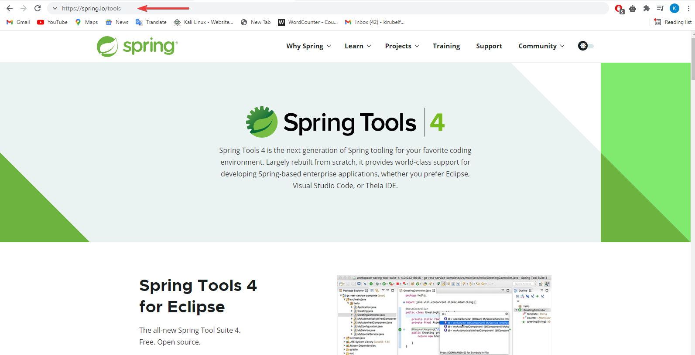

# 1. How to install Spring Tool Suit


The Spring Framework is a mature, powerful and highly flexible framework focused on building web applications in Java.One of the core benefits of Spring is that it takes care of most of the low-level aspects of building the application to allow us to actually focus on features and business logic.

Another strong point is that, while the framework is quite mature and well-established, it's very actively maintained and has a thriving dev community. This makes it quite up to date and aligned with the Java ecosystem right now.

In this chapter we will see how to download and install Spring Tool Suite. Spring Tool Suite is an IDE to develop Spring applications. It is an Eclipse-based development environment. It provides a ready-to-use environment to implement, run, deploy, and debug the application. It validates our application and provides quick fixes for the applications. To download spring tool suite follow this steps:

* Go to your favorite search engine and search for " spring sts download -> click on the the link for "Tools - Spring".  
(Or follow this link [Spring Tools](https://spring.io/tools)).

 

* There various spring tools for various IDEs but we will be using the spring tool for Eclipse. Scroll down and choose your operating system.
 
* The download will start instantly and it will be installed to your default download folder.
* After download is complete double click on the jar file. Automatic installation will result.

    
* After that a folder will be created as a result of the installation. Select it.

    
* Now you can launch your spring tool suite application be clicking on the SpringToolSuite4 application file.


Choose your workspace then click on launch.


You can create various kinds of applications, for example to create a web application.
* Click on Create new Spring starter project -> Name your project -> click next -> Search for spring web in the search box -> select spring web -> click next -> click finish.


*You have successfully creating a spring web project.


## For video tutorial go to [ How to install Spring Tool Suit ](https://youtu.be/xdDc1F1nVhQ?list=PLfUANuySIYNP3rw-EuN_Onmmnx0V60wfW)

---

# 2. What is MVC
The MVC (Model View Controller) is a software development pattern that has become an essential component of modern web application development. It separates an application into three main logical components. Each of these components are built to handle specific development aspects of an application

Currently, MVC is the top-ranked software architecture that developers are using. The three main logical components are : **Model, View & Controller**


**1. Model**

The model is the layer that keeps data for the application. The layer is responsible for storing and retrieving data from the database, and it is also responsible for validating the data.

For example, if you want to create a new user, you will have to create a new user model and save it to the database.

**2. View**

It is the layer used to present the application. It is used to display the data to the end-user.

For instance, if you want to create a user view, you will have to create UI components that the user interacts with, such as a login form or registration form.

**3. Controller**

The controller is the logic layer of the application. It is responsible for processing the user’s request and generating the response. It links the view and the model.

For example, the controller will be responsible for validating the user’s input, and then it will pass the user’s input to the model to save the user.


The Spring Web model-view-controller (MVC) framework is designed around a **DispatcherServlet** that handles all the HTTP requests and responses. Following is the sequence of events corresponding to an incoming HTTP request to DispatcherServlet.

* After receiving an HTTP request, DispatcherServlet consults the HandlerMapping to call the appropriate Controller.

* The Controller takes the request and calls the appropriate service methods based on used GET or POST method. The service method will set model data based on defined business logic and returns view name to the DispatcherServlet.

* The DispatcherServlet will take help from ViewResolver to pickup the defined view for the request.

* Once view is finalized, The DispatcherServlet passes the model data to the view which is finally rendered on the browser.

## For video tutorial go to [ What is MVC ](https://youtu.be/brgexxgFD00?list=PLfUANuySIYNP3rw-EuN_Onmmnx0V60wfW)

---

# 3. Implementing Spring MVC

Now We will see how spring Mvc is implemented in real time spring web project.

* We need to go to our normal eclipse IDE and create a maven application.

* We have seen how to create a maven application in earlier chapters. we can also convert an existing webapplication and change it to a maven application. To do That :
    * Go to your project explorer -> right click on web project -> configure -> convert to a maven project.
* For this tutorial create a maven project using one the two ways.

    * A maven web project is successfully created.


* As this is a maven project we need to add dependencies that are necessary for the installation of of libraries for the web project.
## pom.xml
```xml
<project xmlns="http://maven.apache.org/POM/4.0.0" xmlns:xsi="http://www.w3.org/2001/XMLSchema-instance" xsi:schemaLocation="http://maven.apache.org/POM/4.0.0 https://maven.apache.org/xsd/maven-4.0.0.xsd">
  <modelVersion>4.0.0</modelVersion>
  <groupId>com.ethioclick</groupId>
  <artifactId>SpringMVC</artifactId>
  <version>0.0.1-SNAPSHOT</version>
  <packaging>war</packaging>
  
  <dependencies>
    <dependency>
      <groupId>junit</groupId>
      <artifactId>junit</artifactId>
      <version>3.8.1</version>
      <scope>test</scope>
    </dependency>
  
		<dependency>
			<groupId>org.springframework</groupId>
			<artifactId>spring-webmvc</artifactId>
			<version>5.3.3</version>
		</dependency>
		<!-- https://mvnrepository.com/artifact/org.springframework/spring-orm -->
		<dependency>
			<groupId>org.springframework</groupId>
			<artifactId>spring-orm</artifactId>
			<version>5.3.3</version>
		</dependency>

		<!-- https://mvnrepository.com/artifact/org.hibernate/hibernate-core -->
		<dependency>
			<groupId>org.hibernate</groupId>
			<artifactId>hibernate-core</artifactId>
			<version>5.4.2.Final</version>
		</dependency>

		<!-- https://mvnrepository.com/artifact/mysql/mysql-connector-java -->
		<dependency>
			<groupId>mysql</groupId>
			<artifactId>mysql-connector-java</artifactId>
			<version>5.1.44</version>
		</dependency>

		<dependency>
			<groupId>javax.servlet</groupId>
			<artifactId>javax.servlet-api</artifactId>
			<version>3.1.0</version>
		</dependency>
		<dependency>
			<groupId>javax.servlet.jsp</groupId>
			<artifactId>javax.servlet.jsp-api</artifactId>
			<version>2.3.1</version>
		</dependency>
		<dependency>
			<groupId>javax.servlet</groupId>
			<artifactId>jstl</artifactId>
			<version>1.2</version>
		</dependency>
	
    
  </dependencies>
  
  
  <build>
    <plugins>
      <plugin>
        <groupId>org.apache.maven.plugins</groupId>
        <artifactId>maven-compiler-plugin</artifactId>
        <version>3.8.1</version>
      </plugin>
      	<plugin> 
      		<artifactId>maven-war-plugin</artifactId>
      		<version>3.2.2</version>
		</plugin>
    </plugins>
  </build>
</project>
```
* The next thing to do is servlet mapping in the web.xml file.

## web.xml
```xml
<?xml version="1.0" encoding="UTF-8"?>
<web-app xmlns:xsi="http://www.w3.org/2001/XMLSchema-instance" xmlns="http://xmlns.jcp.org/xml/ns/javaee" xsi:schemaLocation="http://xmlns.jcp.org/xml/ns/javaee http://xmlns.jcp.org/xml/ns/javaee/web-app_4_0.xsd" id="WebApp_ID" version="4.0">
  <display-name>SprinMVC</display-name>
  <welcome-file-list>
    <welcome-file>index.html</welcome-file>
    <welcome-file>index.htm</welcome-file>
    <welcome-file>index.jsp</welcome-file>
    <welcome-file>default.html</welcome-file>
    <welcome-file>default.htm</welcome-file>
    <welcome-file>default.jsp</welcome-file>
  </welcome-file-list>
  
    <servlet>
      <servlet-name>spring</servlet-name>
      <servlet-class>
         org.springframework.web.servlet.DispatcherServlet
      </servlet-class>
      <init-param>
         <param-name>contextConfigLocation</param-name>
         <param-value>/WEB-INF/spring-servlet.xml</param-value>
     </init-param>
      <load-on-startup>1</load-on-startup>
   </servlet>

   <servlet-mapping>
      <servlet-name>spring</servlet-name>
      <url-pattern>/</url-pattern>
   </servlet-mapping>
   
</web-app>
```

* Lets create the spring-servlet.xml file in WEB-INF folder.
## spring-servlet.xml

```xml
<beans xmlns="http://www.springframework.org/schema/beans"
	xmlns:context="http://www.springframework.org/schema/context"
	xmlns:xsi="http://www.w3.org/2001/XMLSchema-instance"
	xmlns:tx="http://www.springframework.org/schema/tx"
	xmlns:mvc="http://www.springframework.org/schema/mvc"
	xsi:schemaLocation="http://www.springframework.org/schema/beans 
  http://www.springframework.org/schema/beans/spring-beans.xsd
  http://www.springframework.org/schema/context 
  http://www.springframework.org/schema/context/spring-context.xsd
  ">
	<context:component-scan base-package="com.ethioclick" />
	<!-- View Resolver -->
	<bean
		class="org.springframework.web.servlet.view.InternalResourceViewResolver">
		<property name="prefix" value="/WEB-INF/jsp/" />
		<property name="suffix" value=".jsp" />
	</bean>
</beans>
```
All MVC frameworks for web applications provide a way to address views. Spring provides view resolvers, which enable you to render models in a browser without tying you to a specific view technology. Spring enables you to use JSPs, Velocity templates and XSLT views.

The two interfaces which are important to the way Spring handles views are ViewResolver and View. The ViewResolver provides a mapping between view names and actual views. The View interface addresses the preparation of the request and hands the request over to one of the view technologies.

* The next task is creating a java controller class in our resource folder. We can put this class in a package.
## HelloController.java
```java
package com.ethioclick;

import org.springframework.stereotype.Controller;
import org.springframework.ui.ModelMap;
import org.springframework.web.bind.annotation.RequestMapping;

@Controller
@RequestMapping("/hello")
public class HelloController {

	@RequestMapping(method = RequestMethod.GET)
	public String printHello(ModelMap model){
		
		model.addAttribute("message", "Hello From Ethioclick");
		
		return "hello";
		
	}
}

```
*  We can run our project on a server and see the output so far.


* This error is occurring because we don't have a page to 
handle this request. Lets create that page.
## hello.jsp

```jsp
<%@ page language="java" contentType="text/html; charset=ISO-8859-1"
    pageEncoding="ISO-8859-1"%>
<!DOCTYPE html>
<html>
<head>
<meta charset="ISO-8859-1">
<title>Insert title here</title>
</head>
<body>
 It Is Working !!!
</body>
</html>
```
* Lets run our application again and see the out put.

* We can see that the view is handled by the view resolver by adding .jsp at the end to display our page.
* We also need to display the message sent by the model in our jsp page.
* To do that add the following code in our hello.jsp file.
## hello.jsp
```jsp
<%@ page language="java" contentType="text/html; charset=ISO-8859-1"
    pageEncoding="ISO-8859-1"%>
<!DOCTYPE html>
<html>
<head>
<meta charset="ISO-8859-1">
<title>Insert title here</title>
</head>
<body>
 It Is Working !!! <br>
 
 <h2> ${message} </h2>
</body>
</html>
```
* We can run our project and see the change in the output.


## For video tutorial go to [ Implementing Spring MVC ](https://youtu.be/RdKToVYmGYY?list=PLfUANuySIYNP3rw-EuN_Onmmnx0V60wfW)

---