# 1. Introduction To JSP
Previously we have seen how implement servlets to build web pages. Next we will dive into JSP.

Java Server Pages (JSP) is a technology which is used to develop web pages by inserting Java code into the HTML pages by making special JSP tags.

It can be used as HTML page, which can be used in forms and registration pages with the dynamic content into it. JSP can be used for separation of the view layer with the business logic in the web application.
    
JSP is an extension of servlets and every JSP page first gets converted into servlet by JSP container before processing the client’s request.

## For video tutorial go to [Introduction To JSP ](https://youtu.be/65VOvRu1v2g?list=PLfUANuySIYNMFFWkjqqd6toygvbVTfwyU)
---
# 2. How to write JSP code 

Let us see how to create a JSP project and how to work with JSP files.

* First thing we need to do is create a dynamic web page.

* Name your project and  Don't forget to Generate web.xml deployment descriptor.
* Next thing we need to do is create a JSP file.
     *  To create a jsp file, Right click on Your project -> new -> JSP file.
     
    * Name  your file and click on finish
    
* As we can see, our Eclipse ide is not recognizing the jsp tag on the top of our page. To fix this We need to import some files from our apache tomcat download. To do that follow this steps.
    * Right click on our project -> build path -> Configure build path -> Libraries -> Classpath -> Add External JARs
     
    * Next go to the extracted Tomcat folder and click on the lib folder. In that folder pick a jar file named servlet-api and click on open then apply and close.
* Now our error is gone and we can proceed with JSP.
* Lets move to the web.xml file and make our home.jsp file the default page.

## web.xml
```xml
<?xml version="1.0" encoding="UTF-8"?>
<web-app xmlns:xsi="http://www.w3.org/2001/XMLSchema-instance" xmlns="http://xmlns.jcp.org/xml/ns/javaee" xsi:schemaLocation="http://xmlns.jcp.org/xml/ns/javaee http://xmlns.jcp.org/xml/ns/javaee/web-app_4_0.xsd" id="WebApp_ID" version="4.0">
  <display-name>jspdemo</display-name>
  <welcome-file-list>
    <welcome-file>index.html</welcome-file>
    <welcome-file>index.htm</welcome-file>
    <welcome-file>home.jsp</welcome-file> <!-- Adding our jsp file here-->
    <welcome-file>default.html</welcome-file>
    <welcome-file>default.htm</welcome-file>
    <welcome-file>default.jsp</welcome-file>
  </welcome-file-list>
</web-app>
```
* You can test your project with a simple text out put. Sava all and run your project on a server.
## home.jsp
```jsp
<%@ page language="java" contentType="text/html; charset=ISO-8859-1"
    pageEncoding="ISO-8859-1"%>
<!DOCTYPE html>
<html>
<head>
<meta charset="ISO-8859-1">
<title>Insert title here</title>
</head>
<body>
  This from JSP
</body>
</html>
```
   

  ## **JSP Tags**
JSP tags are an essential part of Java Server Pages. Tags in JSP create a container for Java code, insulating and providing separation of dynamic content from static design elements in your site. Here are some of the most popular JSP tags.

  **Declaration Tags** 

Declaration tags in JSP function as identification containers for the functions, methods and variables in JSP pages.

```jsp
<%! jsp declaration %>
```
  **Expression Tags**

  Expression tags signal JSP to convert a Java statement into a string and display the output.

  ```jsp
  <%= Java statement %>
  ```

  **JSP Scriptlet Tags**
  
Scriptlet tags allow you to embed any valid Java source code in JSP server pages. The code within the tags executes in consecutive order on the server side and is available for client access through a Web browser.  
```jsp 
 <% Java code %> 
```

* We can see some of this tags in action using a simple program that adds two numbers.

 ## home.jsp
 ```jsp
 <%@ page language="java" contentType="text/html; charset=ISO-8859-1"
    pageEncoding="ISO-8859-1"%>
<!DOCTYPE html>
<html>
<head>
<meta charset="ISO-8859-1">
<title>Insert title here</title>
</head>
<body>
  <h1>This from JSP <br></h1>   <!--  Html header -->
  
  <%! int x=3; int y = 5;   int sum = 0; %>  <!-- Declaration Tag  -->
  
  <% sum = x+y; %> <!-- Scriptlet Tag -->
  
  The Sum of <%= x  %> and <%= y %> is  <%=sum %> <!-- Expression Tag -->
</body>

</html>
 ```

 Save and refresh our page.

 

 With this simple program we have seen how to use Jsp tags in a jsp file for the static html part and for the dynamic java part. 
 
 We Can see further implementation of the dynamic nature of our program by adding more logic to the program where our output changes colors to green and red when the sums are even and odd respectively. Here we are making sure that the website is changing based on the users action.

 ## home.jsp

 ```jsp
 <%@ page language="java" contentType="text/html; charset=ISO-8859-1"
    pageEncoding="ISO-8859-1"%>
<!DOCTYPE html>
<html>
<head>
<meta charset="ISO-8859-1">
<title>Insert title here</title>
</head>
<body>
  <h1>This from JSP <br></h1>   <!--  Html header -->
  
  <%! int x=3; int y = 5;   int sum = 0; %>  <!-- Declaration Tag  -->
  
  <% sum = x+y; %> <!-- Scriptlet Tag -->
  
   <%
   if (sum%2 ==0){
   %>
  <p style = "color:green">
  <%
   }
  else{
   %>
   <p style = "color:red">
   <%}%>
   The Sum of <%= x  %> and <%= y %> is  <%=sum %> <!-- Expression Tag -->
   </p>
</body>

</html>
```
* Save and refresh our page
 
 ## For video tutorial go to [How to write a JSP code ](https://youtu.be/Vz2ElCkdyes?list=PLfUANuySIYNMFFWkjqqd6toygvbVTfwyU)
---
 # 3. Writing Java and Servlet syntax in JSP
 As we have seen earlier we can write java syntax in a jsp file using a tag. servlet is nothing but a java class so we can also write servlets in jsp files. 
 * Let us create a jsp file using the steps we followed earlier. It will be named "syntax".
 * We need to make sure the syntax page is the default page by updating our web.xml file.
 * In the  previous code that adds to numbers we outputted our result in the html part of our code outside of the java code. 
    * 
* There is another way we can print our output inside the java tag using out.print. We can see that by using the following simple code.

## syntax.jsp
```jsp
<%@ page language="java" contentType="text/html; charset=ISO-8859-1"
    pageEncoding="ISO-8859-1"%>
<!DOCTYPE html>
<html>
<head>
<meta charset="ISO-8859-1">
<title>Insert title here</title>
</head>
<body>
<%! int i = 5; %>

<%
	if (i%2 == 0){
		out.print("<p style = \"color:red; \">this is even number</p>"); // We used a skipping character / as we are telling the compiler not to confuse the " characters.
	}else{
		out.print("<p style = \"color:blue; \">this is odd number</p>");
	}

%>

</body>
</html>
```
* Run the project and see the out put
 
* We can also see how to use loop syntax in jsp and how to insert an html tag inside the loop. 
## synax.jsp
```jsp
<%@ page language="java" contentType="text/html; charset=ISO-8859-1"
    pageEncoding="ISO-8859-1"%>
<!DOCTYPE html>
<html>
<head>
<meta charset="ISO-8859-1">
<title>Insert title here</title>
</head>
<body>
<%! int i = 5; %>
<%
	if (i%2 == 0){
		out.print("<p style = \"color:red; \">this is even number</p>");
	}else{
		out.print("<p style = \"color:blue; \">this is odd number</p>");
	}
%>
<%
int x=3;
for(int i = 0; i<x; i++){
 %>
<p style="font-size: <%= (i+1)*10%>px"> This is text -  <%=(i+1) %> </p>
// An html tag can be used in for loop using this logic by separating the java tags
<%	
}
%>
</body>
</html>
```
* Save and refresh the syntax page 


* We can use other loops like while and do while using the same logic of separating the static html part and the dynamic java part.
 ---
 ## For video tutorial go to [Writing Java and Servlet syntax in JSP](https://youtu.be/NNkTAuNwOHk?list=PLfUANuySIYNMFFWkjqqd6toygvbVTfwyU)
# 4. How to use JSP directives 
JSP directives are the elements of a JSP source code that guide the web container on how to translate the JSP page into it’s respective servlet. They are special instruction to Web Container at the time of page translation. Directive tags are of three types: **Page, Include and Taglib.**

Page: Defines page dependent properties such as language, session, errorPage.

Include: Defines file to be included.

Taglib: Declares tag library used in the page

* Let us create another jsp file to see directives in action. Make sure to make this new page the default page of our project.
* When we create any jsp file the page directive will be on top of our page by default.
## Page directive
## directive.jsp

```jsp
<%@ page language="java" contentType="text/html; charset=ISO-8859-1"
    pageEncoding="ISO-8859-1"%>   <!-- This is A page directive --> 
<!DOCTYPE html>
<html>
<head>
<meta charset="ISO-8859-1">
<title>Insert title here</title>
</head>
<body>

</body>
</html>
```
The ***Page directive*** defines a number of page dependent properties which communicates with the Web Container at the time of translation. Basic syntax of using the page directive is **<%@ page attribute="value" %>** where attributes can be one of the following :

* **Import attribute** : The import attribute defines the set of classes and packages that must be imported in servlet class definition.
* **Language attribute**:  defines scripting language to be used in the page.
* **Extends attribute**: defines the class name of the superclass of the servlet class that is generated from the JSP page.
* **Session attribute**: defines whether the JSP page is participating in an HTTP session. The value is either true or false.
* **IsThreadSafe attribute** : declares whether the JSP is thread-safe. The value is either true or false
* **IsErrorPage attribute** : declares whether the current JSP Page represents another JSP's error page.
* **ErrorPage attribute** : indicates another JSP page that will handle all the run time exceptions thrown by current JSP page. It specifies the URL path of another page to which a request is to be dispatched to handle run time exceptions thrown by current JSP page.
* **ContentType attribute** : defines the MIME type for the JSP response.
* **AutoFlush attribute** : defines whether the buffered output is flushed automatically. The default value is "true".
* **Buffer attribute** : defines how buffering is handled by the implicit out object.

Let us see an example of using the import attribute in a jsp file. When we try to use List and arrayList in the java tag it shows an error. This is because we need to import their classes to our project. For that we simply need to import the classes in the page directive as shown below.


## directive.jsp
```jsp
   <%@ page language="java" contentType="text/html; charset=ISO-8859-1"
    pageEncoding="ISO-8859-1" 
    import="java.util.List,java.util.ArrayList;" 
    %> <!-- This is how we import classes and packages in the page directive -->
<!DOCTYPE html>
<html>
<head>
<meta charset="ISO-8859-1">
<title>Insert title here</title>
</head>
<body>
 <%
 List<String>favoriteFoods = new ArrayList<String>();
 favoriteFoods.add("Shiro");
 favoriteFoods.add("Doro");
 favoriteFoods.add("Sigawet");
 
 for(String food : favoriteFoods){
	 %>
	 <h3><%= food %></h3>
<%	 
 }
 %>
</body>
</html>
```
* Now the error is gone 
* (Another error might occur depending on the tomcat server you are using Try removing the ';' from your import)
   ```jsp
      <%@ page language="java" contentType="text/html; charset=ISO-8859-1"
    pageEncoding="ISO-8859-1" 

    import="java.util.List, java.util.ArrayList " 

    %>
  ```
* Now, we can run our project to see the output.


## Include directive
The ***include directive*** tells the Web Container to copy everything in the included file and paste it into current JSP file. The syntax of include directive is :

    ***<%@ include file="file.jsp" %>***

There are many ways in which this directive proves to be quite useful in giving a structure to your web application code. 

For exampleWhenever we are building a web application, with webpages, all of which have the same top header and bottom footer . We make them as separate jsp files and include them using the include directive in all the pages. Hence whenever we have to update something in the top header or footer, we just have to do it at one place.  We can see the implementation below.

* Let us create two jsp files called "header" and "footer".
* 

## directives.jsp
```jsp
<%@ page language="java" contentType="text/html; charset=ISO-8859-1"
    pageEncoding="ISO-8859-1" 
    import="java.util.List, java.util.ArrayList" 
    %>
<!DOCTYPE html>
<html>
<head>
<meta charset="ISO-8859-1">
<title>Insert title here</title>
</head>
<body>
<%@ include file="header.jsp" %> <!-- Header File -->

<hr>

 <%
 List<String>favoriteFoods = new ArrayList<String>();
 favoriteFoods.add("Shiro");
 favoriteFoods.add("Doro");
 favoriteFoods.add("Sigawet");
 
 for(String food : favoriteFoods){
	 %>
	 <h3><%= food %></h3>
<%	 
 }
 %>
 
 <hr>
 
 <%@ include file="footer.jsp" %><!-- Footer file -->
</body>
</html>
```
## header.jsp
```jsp
 <div>

<a href="#">Home</a>  | <a href="#">About-us</a>  |  <a href="#">Contact-us</a>

</div>
```
## footer.jsp
```jsp
<div>

<h4>This is the footer</h4>

</div>
```

* Save and refresh our page and here is the output


## Taglib Directive
The ***taglib directive*** is used to define tag library that the current JSP page uses. A JSP page might include several tag library. JavaServer Pages Standard Tag Library (JSTL), is a collection of useful JSP tags, which provides many commonly used core functionalities. It has support for many general, structural tasks such as iteration and conditionals, ready made tags for manipulating XML documents, internationalization tags, and for performing SQL operations. 
Syntax of taglib directive is:
```jsp
<%@ taglib prefix="prefixOfTag" uri="uriOfTagLibrary" %>
```
The prefix is used to distinguish the custom tag from other library custom tag. Prefix is prepended to the custom tag name. Every custom tag must have a prefix.

## For video tutorial go to [How to use JSP directives ](https://youtu.be/4Cc_ZvhY3Jo?list=PLfUANuySIYNMFFWkjqqd6toygvbVTfwyU)
---

# 5. Implicit objects

JSP implicit objects are created during the translation phase of JSP to the servlet. These objects can be directly used in scriplets that goes in the service method. They are created by the container automatically, and they can be accessed using objects. JSP Implicit Objects are also called pre-defined variables.JSP provide you Total 9 implicit objects which are as follows 

**request:** This is the object of HttpServletRequest class associated with the request.

**response:** This is the object of  HttpServletResponse class associated with the response to the client.

**config:** This is the object of ServletConfig class associated with the page.

**application:** This is the object of ServletContext class associated with the application context.

**session:** This is the object of HttpSession class associated with the request.

**page context:** This is the object of PageContext class that encapsulates the use of server-specific features. This object can be used to find, get or remove an attribute.

**page object:** The manner we use the keyword this for current object, page object is used to refer to the current translated servlet class.

**exception:** The exception object represents all errors and exceptions which is accessed by the respective jsp. The exception implicit object is of type java.lang.Throwable.

**out:** This is the PrintWriter object where methods like print and println help for displaying the content to the client.


* Lets create another jsp file called "implicitObj.jsp" to see implicit objects in action.
* Lets Make it our default page in the web.xml file.
* We also need to create another jsp file called "requestTest.jsp" to test out redirection in jsp.

## implicitObj.jsp
```jsp
<%@ page language="java" contentType="text/html; charset=ISO-8859-1"
    pageEncoding="ISO-8859-1"%>
<!DOCTYPE html>
<html>
<head>
<meta charset="ISO-8859-1">
<title>Insert title here</title>
</head>
<body>
<a href="requestTest.jsp"> Go to request Test !</a>
</body>
</html>
```
## requestTest.jsp
```jsp
<%@ page language="java" contentType="text/html; charset=ISO-8859-1"
    pageEncoding="ISO-8859-1"%>
<!DOCTYPE html>
<html>
<head>
<meta charset="ISO-8859-1">
<title>Insert title here</title>
</head>
<body>
Request test is Working !!!
</body>
</html>
```

* Now  we can save all files and run the project.

* We will be on our default page which is "implicitObj.jsp" and on that page there is a link to redirect us to the requestTest page. click on it.

* We have successfully linked two jsp files together, Now we can see some implicit object implementations.
* We can send data from one page to another using the request parameter. we can use a form to manipulate the input but we can test this parameter automatically without a form. Lets update the Jsp files to accomplish this task.


## implicitObj.jsp
```jsp
<%@ page language="java" contentType="text/html; charset=ISO-8859-1"
    pageEncoding="ISO-8859-1"%>
<!DOCTYPE html>
<html>
<head>
<meta charset="ISO-8859-1">
<title>Insert title here</title>
</head>
<body>
<a href="requestTest.jsp?msg=secret&secretKey=123456"> Go to request Test !</a>
</body>
</html>
```
Notice the change in the a tag 
```jsp
<a href="requestTest.jsp?msg=secret&secretKey=123456"> Go to request Test !</a>
```
Lets save and refresh our page.


* Our data is sent to our new page and it can be seen in the URL bar because by default get method is used.
* To view our sent data on our page we must use implicit objects. Specifically the request object,
* Lets update the requestTest.jsp file


## requestTest.jsp
```jsp

<%@ page language="java" contentType="text/html; charset=ISO-8859-1"
    pageEncoding="ISO-8859-1"%>
<!DOCTYPE html>
<html>
<head>
<meta charset="ISO-8859-1">
<title>Insert title here</title>
</head>
<body>
<h2>Request test is Working !!!</h2> <br>

Msg Value is : <%= request.getParameter("msg") %> <br>
Secret Key Value is : <%= request.getParameter("secretKey") %>
</body>
</html>
```
Lets save and refresh to see the changes.


We can continue with other implicit objects but lets create another jsp file called "error.jsp". With this file we can create an error page that is triggered when the value of "msg" is null. With this example we can see how to use two other implicit objects, respond and session objects.
* Lets write some code in our new jsp file and update the previous files.

## error.jsp
```jsp
<%@ page language="java" contentType="text/html; charset=ISO-8859-1"
    pageEncoding="ISO-8859-1"%>
<!DOCTYPE html>
<html>
<head>
<meta charset="ISO-8859-1">
<title>Insert title here</title>
</head>
<body>
<h3>There is an error !!!</h3> 
 Please return to main page <a href = "implicitObj.jsp">Go to main page</a>
</body>
</html>
```
* After an error occurs we will redirect our page back to our default page (implicitObj.jsp). But first we need to create a session to pass an error parameter on or page.

## requestTest.jsp
```jsp
<%@ page language="java" contentType="text/html; charset=ISO-8859-1"
    pageEncoding="ISO-8859-1"%>
<!DOCTYPE html>
<html>
<head>
<meta charset="ISO-8859-1">
<title>Insert title here</title>
</head>
<body>
<h2>Request test is Working !!!</h2> <br>
<%
String msg = request.getParameter("msg");
String key = request.getParameter("secretKey");
if (msg == null){
	session.setAttribute("error", "error is msg not found");
	response.sendRedirect("error.jsp");
}
%>
</body>
</html>
```
* Lets update our "implicitObj" too.

## implicitObj
```jsp
<%@ page language="java" contentType="text/html; charset=ISO-8859-1"
    pageEncoding="ISO-8859-1"%>
<!DOCTYPE html>
<html>
<head>
<meta charset="ISO-8859-1">
<title>Insert title here</title>
</head>
<body>
<a href="requestTest.jsp?secretKey=123456"> Go to request Test !</a> <br>

Error msg: <%= session.getAttribute("error") %>
</body>
</html>
```
```jsp
<a href="requestTest.jsp?secretKey=123456"> Go to request Test !</a>
```
Notice here that msg is not passed to the requestTest page.
* Now Lets save and refresh our page.


It redirected to the error page instead of the intended requestTest page because we didn't pass the "msg" variable. there is an option to go back to our main page by clicking the link provided.


* The error message we set in a session is passed to our main page.

 As we discussed earlier HTTP is a "stateless" protocol which means each time a client retrieves a Webpage, the client opens a separate connection to the Web server and the server automatically does not keep any record of previous client request. There are few options to maintain the session between the Web Client and the Web ServerIn JSP, the session is the most regularly used implicit object of type HttpSession. It is mainly used to approach all data of the user until the user session is active. 

 We can also see two other commonly used implicit objects, out and application Implicit objects.
* By updating the implicitObj.jsp file we can see their implementation.
 ## implicitObj
```jsp
<%@ page language="java" contentType="text/html; charset=ISO-8859-1"
    pageEncoding="ISO-8859-1"%>
<!DOCTYPE html>
<html>
<head>
<meta charset="ISO-8859-1">
<title>Insert title here</title>
</head>
<body>
<a href="requestTest.jsp?secretKey=123456"> Go to request Test !</a> <br>
Error msg: <%= session.getAttribute("error") %> <br>

<%
Integer mycount = (Integer)application.getAttribute("count");
if(mycount == null || mycount==0){
	mycount =1;	
}else{
	mycount+=1;}

	out.println("Number of times accessed:"+mycount); // This is The out implicit object
	application.setAttribute("count",mycount);// Thid id The application object
%>
</body>
</html>
```
This simple application will count how many times our page is accessed by a user. It used the application implicit object.


## For video tutorial go to [Implicit Objects](https://youtu.be/XAld5t9HR7o?list=PLfUANuySIYNMFFWkjqqd6toygvbVTfwyU)
---

# 6. Forms in JSP
We use forms in Jsp when we need to pass some information from our browser to the web server and ultimately to the backend program. The browser uses two methods to pass this information to the web server. These methods are the GET Method and the POST Method.
* Lets create a simple form to implement this functions in jsp.
* First create a jsp file called "formTest.jsp" (This will be our default page so make sure to change it in the web.xml file).
* We also need another jsp file called "formResult.jsp".
## formTest.jsp
```jsp
<%@ page language="java" contentType="text/html; charset=ISO-8859-1"
    pageEncoding="ISO-8859-1"%>
<!DOCTYPE html>
<html>
<head>
<meta charset="ISO-8859-1">
<title>Insert title here</title>
</head>
<body>
<form action="formResult.jsp" method="post">
		Username: <input type="text" name="username" /> <br> 
		Sex: Male<input type = "radio" name = "sex" value = "M" checked ="checked" > 
		     Female<input type = "radio" name = "sex" value = "F" ><br/>
		Favorite Food: Doro<input type = "checkbox" name = "ffood" value = "doro" >
		               Sigawet<input type = "checkbox" name = "ffood" value = "sigawet">
		               Shiro<input type = "checkbox" name = "ffood" value = "shiro" >  <br>    
		Nationlality: <select name = "country">
						<option value = "GE"> Germany </option>
		                <option value = "USA"> USA </option>
		                <option value = "FR"> France </option>
					   </select><br>
		Remarks: <br>
		<textarea rows="5" cols="50" name ="remarks"> </textarea> <br>		   	        
		<input type="submit" value="Submit" /><br>
	</form>
</body>
</html>
```
Our form page should look something like this.
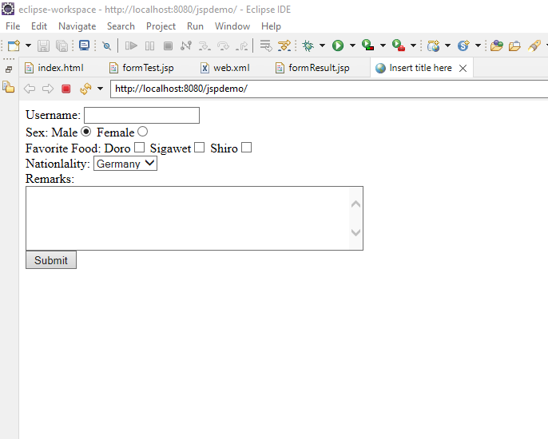
* Our aim is to send the form data to the formResult page using a post method. We can write the following code in the formResult.jsp file to achieve our goal.

## formResult.jsp
```jsp
<%@ page language="java" contentType="text/html; charset=ISO-8859-1"
    pageEncoding="ISO-8859-1"%>
<!DOCTYPE html>
<html>
<head>
<meta charset="ISO-8859-1">
<title>Insert title here</title>
</head>
<body>
Name: <%=request.getParameter("username") %><br>
Sex : <%=request.getParameter("sex") %><br>
Favorite Foods: <br>
	<ul>
	<% String[] foods = request.getParameterValues("ffood");
	 for (String food:foods)
	 {
	%>
	 <li> <%=food %></li>
	<%
	 }
	%>
	</ul> <br>
	 
	 Nationality is : <%= request.getParameter("country") %><br>
	 User remarks: <%= request.getParameter("remarks") %><br>
</body>
</html>
```

* Finally save all and refresh our page, then fill in our form.

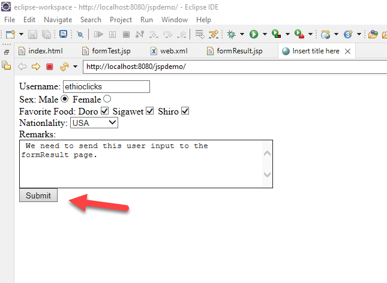
* lets click submit and see our redirected page.
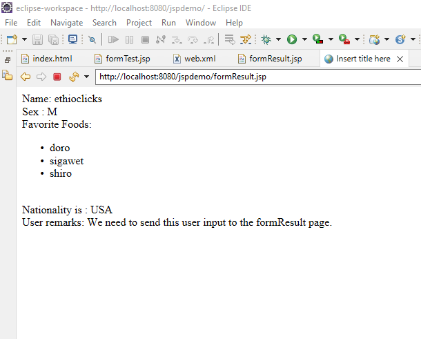
 
 ## For video tutorial go to [Forms in JSP ](https://youtu.be/FmzAnwSgjOc?list=PLfUANuySIYNMFFWkjqqd6toygvbVTfwyU)
---
# 7. JSTL tag library
During the span of this tutorial you might have noticed some advantages and disadvantages of using Jsp for web development. The main noticeable advantage is the integration of the dynamic java part and the static html part. but Jsp has its own drawbacks one the main drawbacks is code unreadability that creates confusion.
```jsp
<% String[] foods = request.getParameterValues("ffood");
	 for (String food:foods)
	 {
	%>
	 <li> <%=food %></li>
	<%
	 }
	%>
	</ul> <br>
```
This simple code snippet is a testimony of the confusions we face when we are using plain Jsp. A library called JSTL is needed to tackle the problems. 

The JavaServer Pages Standard Tag Library (JSTL) is a collection of useful JSP tags which encapsulates the core functionality common to many JSP applications. JSTL has support for common, structural tasks such as iteration and conditionals, tags for manipulating XML documents, internationalization tags, and SQL tags. It also provides a framework for integrating the existing custom tags with the JSTL tags.

First we need to Include this library in our project. To do that lets follow this steps.
* Download the library from the internet by searching "Jstl maven dependency" in our favorite search engine. ( or follow this link [Jstl Download](https://mvnrepository.com/artifact/jstl/jstl) ).
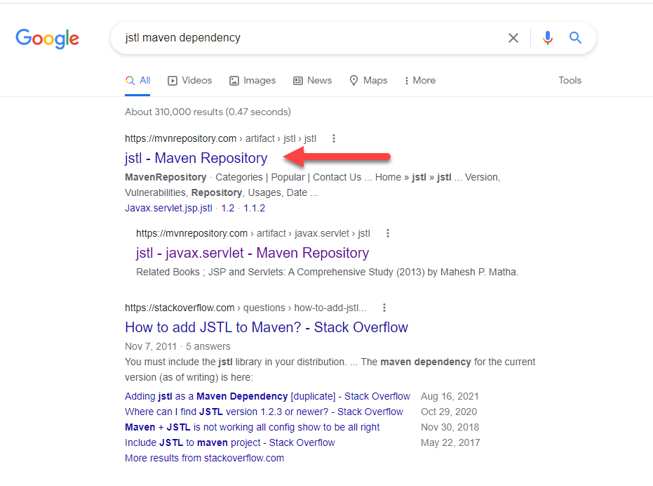
* Lets Choose the version we want (we can install this using maven but lets add it to our project manually for now as we will come back to maven later)
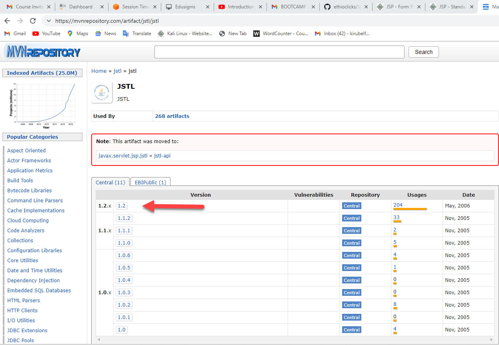
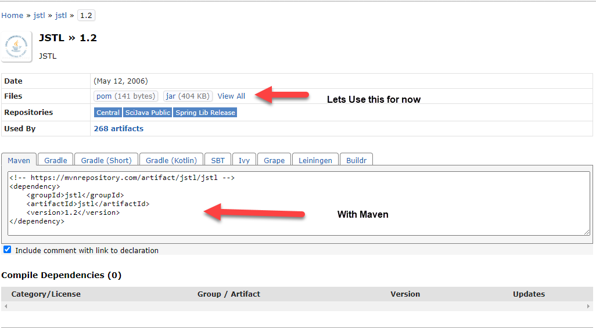
* On the next page lets right click on the first link the click save link as.
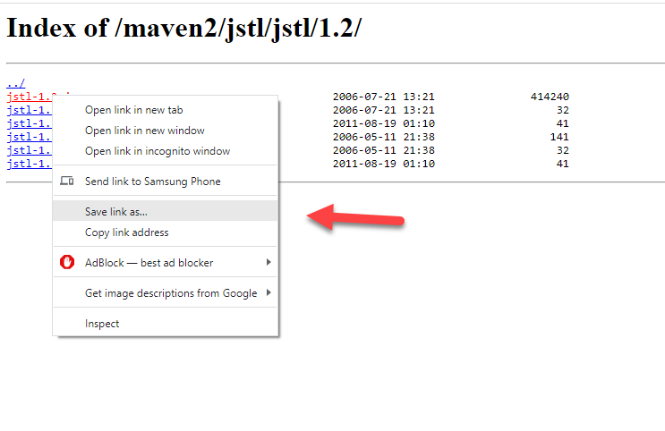
Save the link in the lib folder found within your project folder.
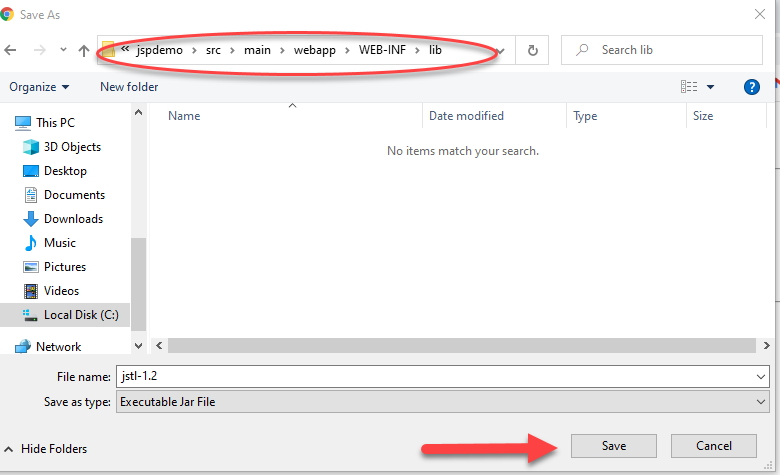
The jar file will be installed in the specified folder after you clicked save.

The JSTL tags can be classified, according to their functions, into the following JSTL tag library groups that can be used when creating a JSP page −

**Core Tags :**  The core group of tags are the most commonly used JSTL tags.
```jsp
<%@ taglib prefix = "c" uri = "http://java.sun.com/jsp/jstl/core" %>
```
**Formatting tags :** The JSTL formatting tags are used to format and display text, the date, the time, and numbers for internationalized Websites.
```jsp
<%@ taglib prefix = "fmt" uri = "http://java.sun.com/jsp/jstl/fmt" %>
```
**SQL tags :** The JSTL SQL tag library provides tags for interacting with relational databases (RDBMSs) such as Oracle, mySQL, or Microsoft SQL Server.
```jsp
<%@ taglib prefix = "sql" uri = "http://java.sun.com/jsp/jstl/sql" %>
```
**XML tags :** The JSTL XML tags provide a JSP-centric way of creating and manipulating the XML documents. The JSTL XML tag library has custom tags for interacting with the XML data. This includes parsing the XML, transforming the XML data, and the flow control based on the XPath expressions.
```jsp
<%@ taglib prefix = "x" 
   uri = "http://java.sun.com/jsp/jstl/xml" %>
```
**JSTL Functions :** JSTL includes a number of standard functions, most of which are common string manipulation functions.
```jsp
<%@ taglib prefix = "fn" 
   uri = "http://java.sun.com/jsp/jstl/functions" %>
```

 * After we add the library to our project we will create a new jsp file to test out jstl tags.
 * Save it as jstlTest.jsp and make it our default page in web.xml. 
 ## jstlTest.jsp
 ```jsp
<%@ page language="java" contentType="text/html; charset=ISO-8859-1"
    pageEncoding="ISO-8859-1"%>
<%@ taglib prefix = "c" uri = "http://java.sun.com/jsp/jstl/core" %> <!-- Using Core Tags from library  -->   
<!DOCTYPE html>
<html>
<head>
<meta charset="ISO-8859-1">
<title>Insert title here</title>
</head>
<body>
<c:set var="name" scope="session" value = "kebede.tessema"></c:set>
<c:set var="salary" scope="session" value = "${ 3000+100 }"></c:set>

<c:if test = "${salary>2000}">
<p> Your salary is <c:out value="${salary}"/>, It is a good salary </p>
</c:if>

<c:if test = "${salary<2000}">
<p> Your salary is <c:out value="${salary}"/>, It is not a good salary </p>
</c:if>
<hr>
</body>
</html>

 ```
 with this simple conditional program we can notice some changes in the syntax and it made our code more readable and understandable. lets run the project and see the intended out put.
 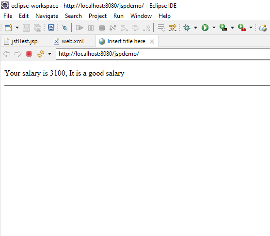

 * Lets see some more implementation. The following code shows the implementation of switch statements in JSTL library.
 ## jstlTest.jsp
```jsp
<%@ page language="java" contentType="text/html; charset=ISO-8859-1"
    pageEncoding="ISO-8859-1"%>
<%@ taglib prefix = "c" uri = "http://java.sun.com/jsp/jstl/core" %> <!-- Using Core Tags from library  -->   
<!DOCTYPE html>
<html>
<head>
<meta charset="ISO-8859-1">
<title>Insert title here</title>
</head>
<body>
<c:set var="name" scope="session" value = "kebede.tessema"></c:set>
<c:set var="salary" scope="session" value = "${ 3000+100 }"></c:set>

<c:if test = "${salary>2000}">
<p> Your salary is <c:out value="${salary}"/>, It is a good salary </p>
</c:if>

<c:if test = "${salary<2000}">
<p> Your salary is <c:out value="${salary}"/>, It is not a good salary </p>
</c:if>
<hr>

<c:choose>
<c:when test="${salary<2000}"> <p> It is a small salary !!</p>       </c:when>
<c:when test="${2000<salary && salary <4000}"> <p> It is a medium salary !!</p> </c:when>
<c:when test="${salary>4000}"> <p> It is a big salary !!</p>         </c:when>
</c:choose>

</body>
</html>
```
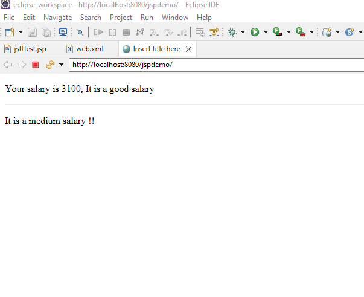
* Lets add some function Library Implementation in our code.
## jstlTest.jsp
```jsp
<%@ page language="java" contentType="text/html; charset=ISO-8859-1"
    pageEncoding="ISO-8859-1"%>
<%@ taglib prefix = "c" uri = "http://java.sun.com/jsp/jstl/core" %> <!-- Using Core Tags from library  -->   
<%@ taglib prefix = "fn" uri = "http://java.sun.com/jsp/jstl/functions" %> <!-- Using Jstl Functions from our Library -->
<!DOCTYPE html>
<html>
<head>
<meta charset="ISO-8859-1">
<title>Insert title here</title>
</head>
<body>
<c:set var="name" scope="session" value = "kebede.tessema"></c:set>
<c:set var="salary" scope="session" value = "${ 3000+100 }"></c:set>

<c:if test = "${salary>2000}">
<p> Your salary is <c:out value="${salary}"/>, It is a good salary </p>
</c:if>

<c:if test = "${salary<2000}">
<p> Your salary is <c:out value="${salary}"/>, It is not a good salary </p>
</c:if>
<!-- If Statment From JSTL-->
<hr>

<c:choose>
<c:when test="${salary<2000}"> <p> It is a small salary !!</p>       </c:when>
<c:when test="${2000<salary && salary <4000}"> <p> It is a medium salary !!</p> </c:when>
<c:when test="${salary>4000}"> <p> It is a big salary !!</p>         </c:when>
</c:choose>
<!-- Swich statment tag from JSTL -->
<hr>

<h2>About Your Name</h2> <br>
<c:if test="${fn:contains(name,'.') }"> 
<c:out value="Invalid Character . found at ${fn:indexOf(name,'.') } index"/><!-- using Cintains function from function library to point out invalid Character  --> <br>

Before change: <c:out value="${name}"/><br>

<c:set var="name" value="${fn:replace(name,'.',' ') }"/> <!-- Using replace function from function library to change the invalid character to a valid one  -->
After change:  <c:out value="${name}"/><br>
After Upper Case change:  <c:out value="${fn:toUpperCase(name) }"/><!--  Using toUpperCase function to change the letters in our name to upper case letters-->

</c:if>  <br>  

</body>
</html>
```
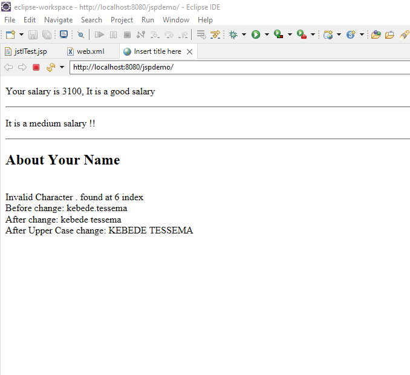

* we can use a lot more functions according to our need that are built in the JSTL function library we can also use different JSTL tags besides the once shown above.

 ## For video tutorial go to [JSTL Tag library ](https://youtu.be/VLi7OHCIvLM?list=PLfUANuySIYNMFFWkjqqd6toygvbVTfwyU)

 ---
 # 8. Creating JSP maven project
Maven is a powerful project management tool that is based on POM (project object model). It is used for projects build, dependency and documentation.we can tell maven is a tool that can be used for building and managing any Java-based project. maven make the day-to-day work of Java developers easier and generally help with the comprehension of any Java-based project.
* Lets see how to create a maven project in eclipse.
* Right click on our project explorer -> new -> other
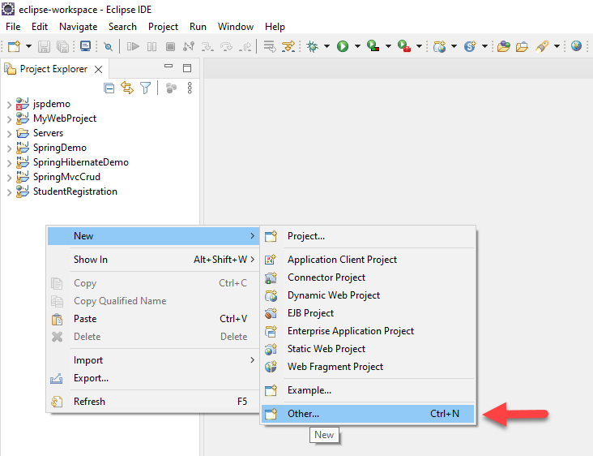
* On the search bar search for Maven and select Maven project.
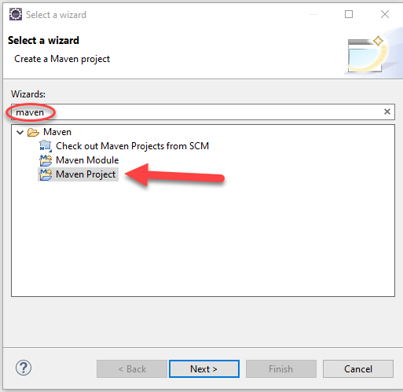
* Click on next
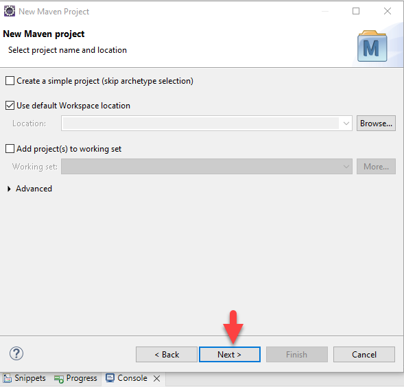
* In the filter box search for 'webapp' and select the one shown in the picture below Then click on next.
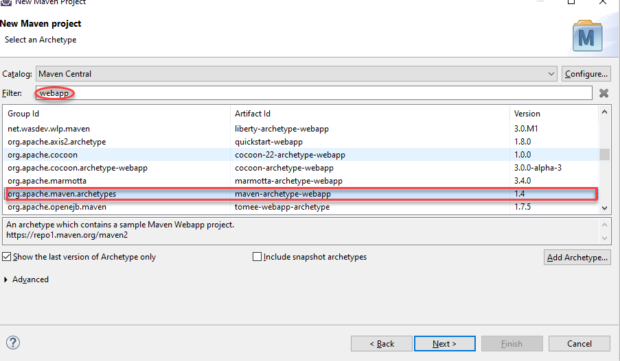

* Finally lets give identification to our project by naming it in the following manner.
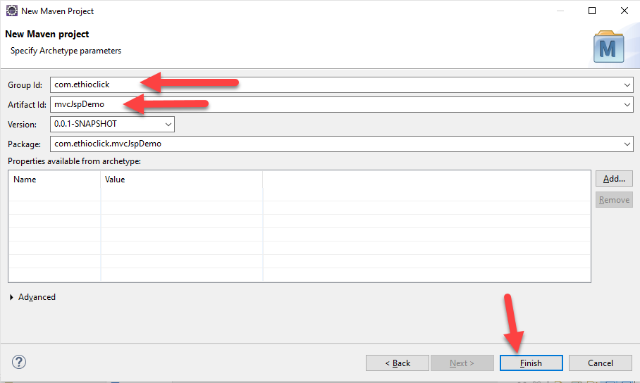

* Now our maven project is created.
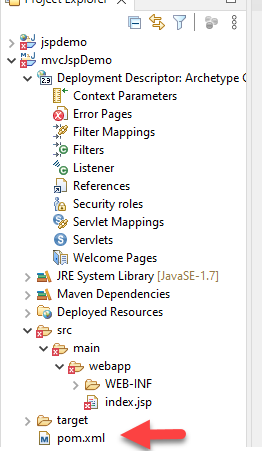

We can see some differences in the project structure. We can also notice an error in there. To fix it :
* Right-click our project -> properties -> Targeting Run time -> check the server we are using -> apply and close
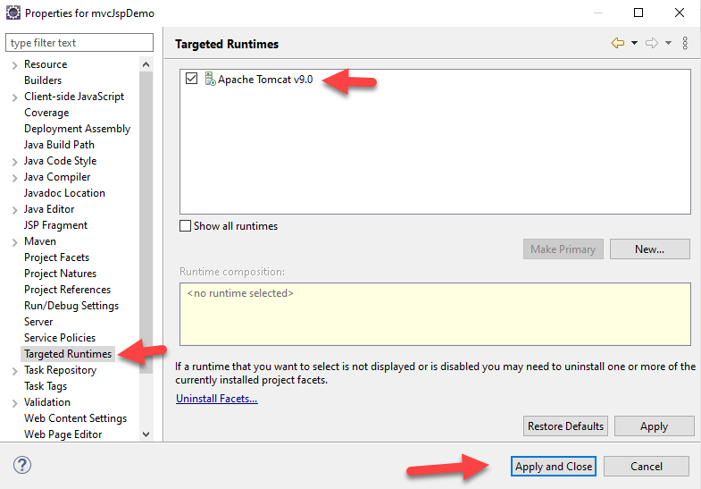
* Now the error is gone. 
In the previous chapter we have added the JSTL library to our project by manually downloading it from the web site. With maven we can automate that task by just writing dependencies in our pom.xml file.

## pom.xml

```xml
<?xml version="1.0" encoding="UTF-8"?>

<project xmlns="http://maven.apache.org/POM/4.0.0" xmlns:xsi="http://www.w3.org/2001/XMLSchema-instance"
  xsi:schemaLocation="http://maven.apache.org/POM/4.0.0 http://maven.apache.org/xsd/maven-4.0.0.xsd">
  <modelVersion>4.0.0</modelVersion>

  <groupId>com.ethioclick</groupId>
  <artifactId>mvcJspDemo</artifactId>
  <version>0.0.1-SNAPSHOT</version>
  <packaging>war</packaging>

  <name>mvcJspDemo Maven Webapp</name>
  <!-- FIXME change it to the project's website -->
  <url>http://www.example.com</url>

  <properties>
    <project.build.sourceEncoding>UTF-8</project.build.sourceEncoding>
    <maven.compiler.source>1.7</maven.compiler.source>
    <maven.compiler.target>1.7</maven.compiler.target>
  </properties>

  <dependencies>
    <dependency>
      <groupId>junit</groupId>
      <artifactId>junit</artifactId>
      <version>4.11</version>
      <scope>test</scope>
    </dependency>
  </dependencies>

  <build>
    <finalName>mvcJspDemo</finalName>
    <pluginManagement><!-- lock down plugins versions to avoid using Maven defaults (may be moved to parent pom) -->
      <plugins>
        <plugin>
          <artifactId>maven-clean-plugin</artifactId>
          <version>3.1.0</version>
        </plugin>
        <!-- see http://maven.apache.org/ref/current/maven-core/default-bindings.html#Plugin_bindings_for_war_packaging -->
        <plugin>
          <artifactId>maven-resources-plugin</artifactId>
          <version>3.0.2</version>
        </plugin>
        <plugin>
          <artifactId>maven-compiler-plugin</artifactId>
          <version>3.8.0</version>
        </plugin>
        <plugin>
          <artifactId>maven-surefire-plugin</artifactId>
          <version>2.22.1</version>
        </plugin>
        <plugin>
          <artifactId>maven-war-plugin</artifactId>
          <version>3.2.2</version>
        </plugin>
        <plugin>
          <artifactId>maven-install-plugin</artifactId>
          <version>2.5.2</version>
        </plugin>
        <plugin>
          <artifactId>maven-deploy-plugin</artifactId>
          <version>2.8.2</version>
        </plugin>
      </plugins>
    </pluginManagement>
  </build>
</project>


```

* We can add various libraries by writing their  dependencies in this file.
* Lets see this in action by adding the mysql library in our project. 
* Go to [Maven Repository](https://mvnrepository.com/artifact/jstl/jstl) on the web.
* Search for your intended library, in this case the mysql library.
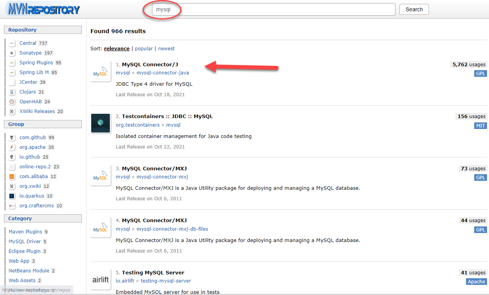
* Select the latest version 
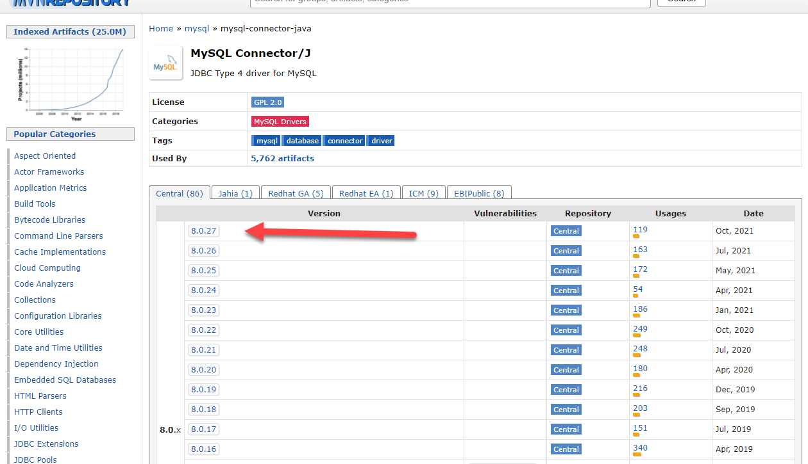
* Click on the box below to copy its content.
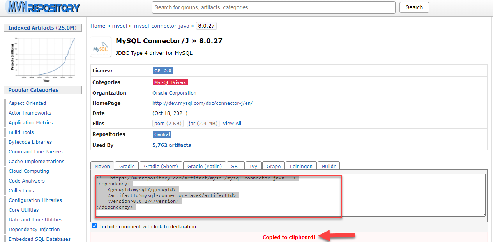
* Paste the dependency in the pom.xml file.
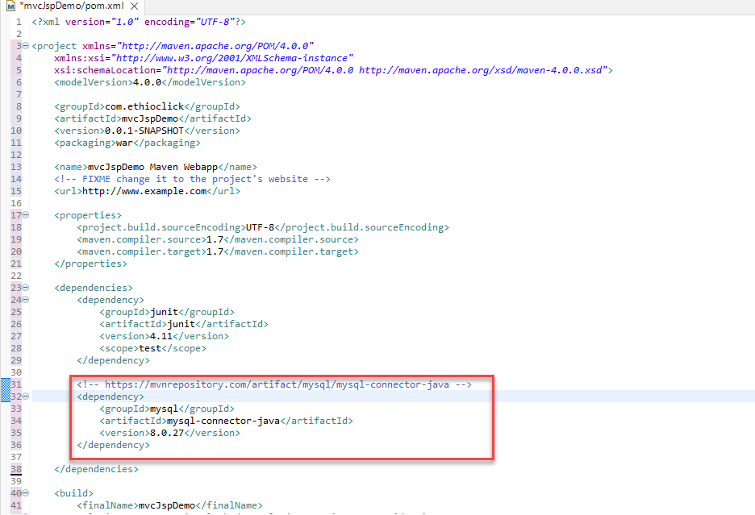
* When we save the file the library will be installed to our project automatically.
* We can use servlets in our maven project by adding a java folder in our main folder. we can also add other folders like a javascript folder or a css folder there if we want to use them in our project.
* src/main/java may not be visible in Package Explorer when you create your project. This folder may be important for using servlets and other java classes. Its actually present in our project its just not visible in the project explorer. To make it visible: 
    * Right click the Maven Project -> Build Path -> Configure Build Path
    * In Order and Export tab, you can see the message like '2 build path entries are missing'
    * Now select 'JRE System Library' and 'Maven Dependencies' checkbox
    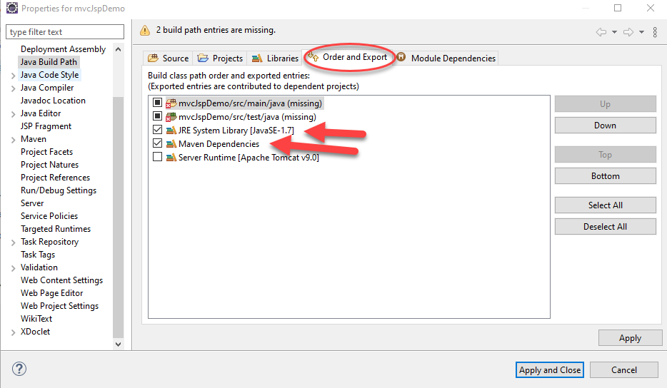
    * Click apply and close
Now you can see below in all type of Explorers 
* Now lets create a new servlet file in a package .
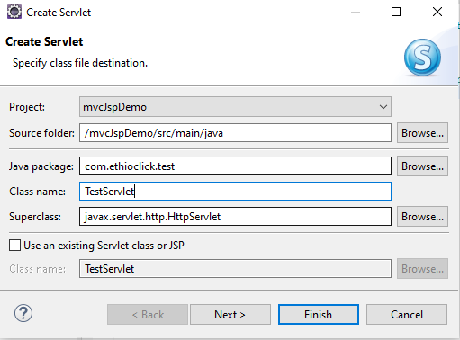
* Our maven project is ready to be used 
## For video tutorial go to [Creating JSP maven project ](https://youtu.be/LSY4KTExPdI?list=PLfUANuySIYNMFFWkjqqd6toygvbVTfwyU)

---
# 9. How to create a database connection from jsp project
The database is used for storing various types of data which are huge and has storing capacity in gigabytes. JSP can connect with such databases to create and manage the records. We will be using the mysql database to implement database connection in jsp.

* On our previous project lets create a class to handle our database connection.
* Right-click on our package -> new -> class. Then name or class.
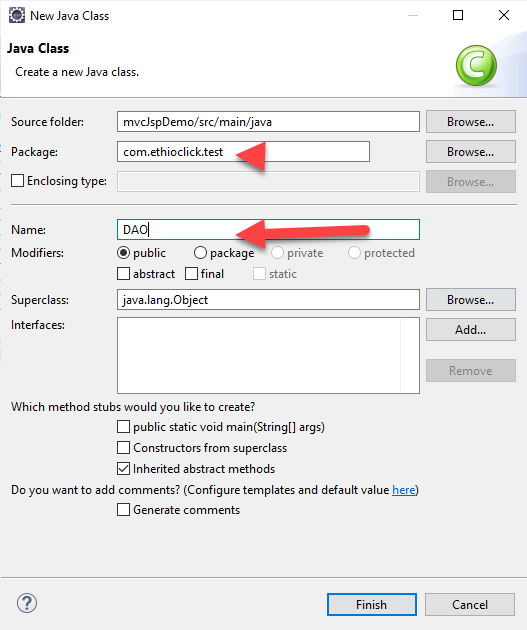
* Following the same step create another java class called User.java to get and set user data.
* We also need to create a database schema in mySql dbms. To know more about using mysql follow this link, [Introduction to Database project ](https://youtu.be/8sStck1O5G4?list=PLfUANuySIYNOupa8IVL5Dc9vm7i_X_7I7)

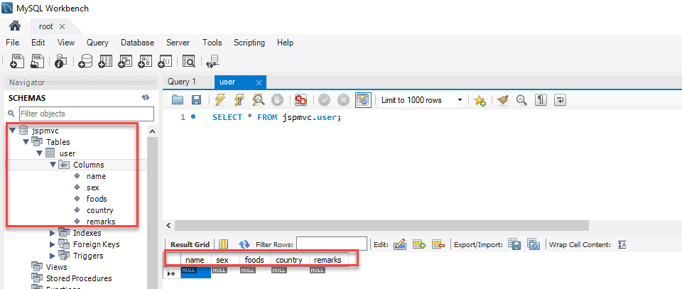
## User.java 
```java
package com.ethioclick.test;

public class User {
	private String name;
	private String sex;
	private String foods;
	private String country;
	private String remarks;
	
	
	public String getName() {
		return name;
	}
	public void setName(String name) {
		this.name = name;
	}
	public String getSex() {
		return sex;
	}
	public void setSex(String sex) {
		this.sex = sex;
	}
	public String getFoods() {
		return foods;
	}
	public void setFoods(String foods) {
		this.foods = foods;
	}
	public String getCountry() {
		return country;
	}
	public void setCountry(String country) {
		this.country = country;
	}
	public String getRemarks() {
		return remarks;
	}
	public void setRemarks(String remarks) {
		this.remarks = remarks;
	}
	

} 
```

## DAO.java 
```java
package com.ethioclick.test;

import java.sql.Connection;
import java.sql.DriverManager;
import java.sql.PreparedStatement;
import java.sql.ResultSet;
import java.sql.SQLException;
import java.util.ArrayList;
import java.util.List;

import com.mysql.cj.protocol.Resultset;

public class DAO {
 
	public boolean save (User user) {
		try {
			Class.forName("com.mysql.jdbc.Driver");
			Connection connection = DriverManager.getConnection("jdbc:mysql://localhost/jspmvc","root","root");
			String sql = "INSERT INTO user(name,sex,foods,country,remarks)"
					       + "VALUES(?,?,?,?,?)";
			
			PreparedStatement preparedstatement = connection.prepareStatement(sql);
			
			preparedstatement.setString(1, user.getName());
			preparedstatement.setString(2, user.getSex());
			preparedstatement.setString(3, user.getFoods());
			preparedstatement.setString(4, user.getCountry());
			preparedstatement.setString(5, user.getRemarks());
			
			int excute = preparedstatement.executeUpdate();
			return excute>0;
			
		} catch (ClassNotFoundException e) {
			// TODO Auto-generated catch block
			e.printStackTrace();
		} catch (SQLException e) {
			// TODO Auto-generated catch block
			e.printStackTrace();
		}
		
		return false;
	}
	
	public List<User> getAll(){
		List<User> users = new ArrayList<User>();
		try {
			Class.forName("com.mysql.jdbc.Driver");
			
			Connection connection = DriverManager.getConnection("jdbc:mysql://localhost/jspmvc","root","root");
		String sql = "SELECT * FROM jspmvc.user";
				      
		
		PreparedStatement preparedstatement = connection.prepareStatement(sql);
		ResultSet resultset= preparedstatement.executeQuery();
		User user = null;
		while(resultset.next()) {
			user = new User();
			user.setName(resultset.getString(1));
			user.setSex(resultset.getString(2));
			user.setFoods(resultset.getString(3));
			user.setCountry(resultset.getString(4));
			user.setRemarks(resultset.getString(5));
			users.add(user);
		}
		
			return users;
		
		} catch (ClassNotFoundException e) {
			// TODO Auto-generated catch block
			e.printStackTrace();
		} catch (SQLException e) {
			// TODO Auto-generated catch block
			e.printStackTrace();
		}
		
		
		return null;
	}

	public static void main(String[] args) {
		User testuser = new User();
		testuser.setName("Ethioclicks");
		testuser.setSex("Male");
		testuser.setFoods("Shiro");
		testuser.setCountry("Ethiopia");
		testuser.setRemarks("Shiro is the best");
		DAO dao = new DAO();
		boolean saved=dao.save(testuser);
		
		System.out.println("is saved: "+ saved);
		
		List <User> users = dao.getAll();
		for (User user:users) {
			System.out.println("Name: "+ user.getName());
		}
		
		
	}
	
}

```
* We can Run our project as a java application to test the output.

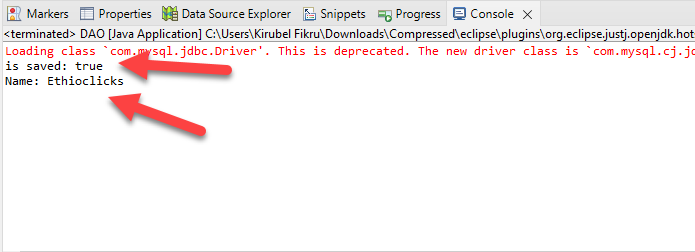
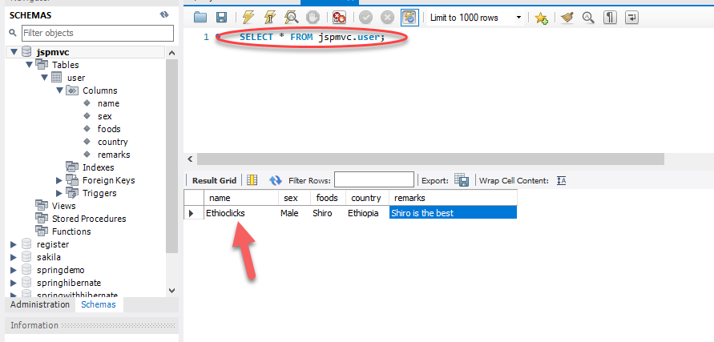
The input is written in our database. Next we will see a way of using forms in a webpage to read and write data in a database.
## For video tutorial go to [How to create a database connection from jsp project  ](https://youtu.be/3XS9svPx6bo?list=PLfUANuySIYNMFFWkjqqd6toygvbVTfwyU)

---

# 10. How data moves from UI to backend
 Previously, We have tested our Project to write data to our database. we also read from data base in a console application now lets use forms to input data into database and to read data from database on a different webpage.
 * Lets create a new jsp file in our project to write our form on.
 ## index.jsp
 ```jsp
<html>
<body>
<h2>Hello World!</h2>
<a href="registration.jsp"> Go To Registration Page !!!</a>
</body>
</html>

 ```

## registration.jsp
 ```jsp
 <%@ page language="java" contentType="text/html; charset=ISO-8859-1"
    pageEncoding="ISO-8859-1"%>
<!DOCTYPE html>
<html>
<head>
<meta charset="ISO-8859-1">
<title>Insert title here</title>
</head>
<body>
<form action="RegistrationHandler" method="post">
		Username: <input type="text" name="username" /> <br> 
		Sex: Male<input type = "radio" name = "sex" value = "M" checked ="checked" > 
		     Female<input type = "radio" name = "sex" value = "F" ><br/>
		Favorite Food: Doro<input type = "checkbox" name = "ffood" value = "doro" >
		               Sigawet<input type = "checkbox" name = "ffood" value = "sigawet">
		               Shiro<input type = "checkbox" name = "ffood" value = "shiro" >  <br>    
		Nationlality: <select name = "country">
						<option value = "GE"> Germany </option>
		                <option value = "USA"> USA </option>
		                <option value = "FR"> France </option>
					   </select><br>
		Remarks: <br>
		<textarea rows="5" cols="50" name ="remarks"> </textarea> <br>
					   	
					   	        
		<input type="submit" value="Submit" /><br>
	</form>
</body>
</html>
 ```
* Lets run our project on server.
 
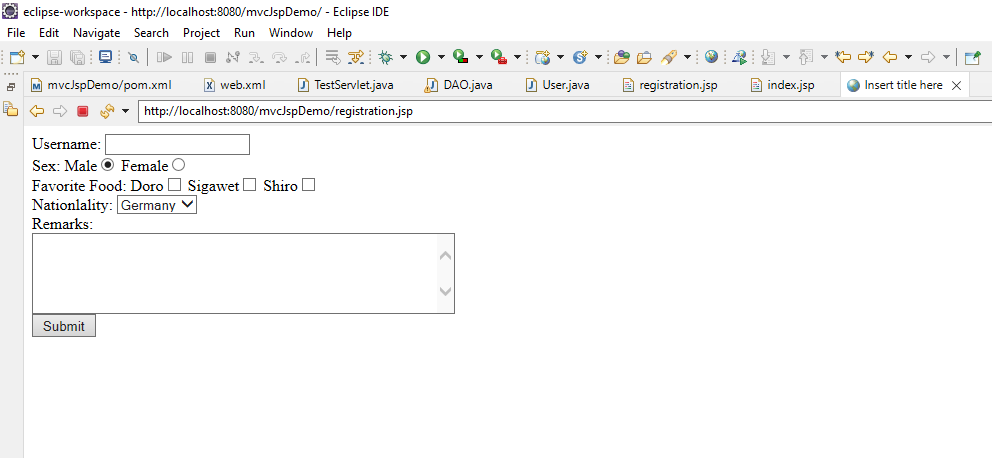

* We need a servlet to handle our input data so lets create a servlet called RegistrationHandler.
## RegistrationHandler.java
```java
package com.ethioclick.test;

import java.io.IOException;
import java.util.Arrays;
import java.util.List;

import javax.servlet.ServletException;
import javax.servlet.http.HttpServlet;
import javax.servlet.http.HttpServletRequest;
import javax.servlet.http.HttpServletResponse;
import javax.servlet.http.HttpSession;

/**
 * Servlet implementation class RegistrationHandler
 */
public class RegistrationHandler extends HttpServlet {
	private static final long serialVersionUID = 1L;
       
    /**
     * @see HttpServlet#HttpServlet()
     */
    public RegistrationHandler() {
        super();
        // TODO Auto-generated constructor stub
    }

	/**
	 * @see HttpServlet#doGet(HttpServletRequest request, HttpServletResponse response)
	 */
	protected void doGet(HttpServletRequest request, HttpServletResponse response) throws ServletException, IOException {
		// TODO Auto-generated method stub
		User user = new User();
		user.setName(request.getParameter("username"));
		user.setSex(request.getParameter("sex"));
		String[] foods = request.getParameterValues("ffood");
		user.setFoods(Arrays.toString(foods));
		user.setCountry(request.getParameter("country"));
		user.setRemarks(request.getParameter("remarks"));
		
		DAO dao = new DAO();
		boolean issaved = dao.save(user);
		
		if(issaved) {
			List<User>allusers=dao.getAll();
			HttpSession session = request.getSession();
			session.setAttribute("users", allusers);
			response.sendRedirect("dashboard.jsp");
		}
		else {
			HttpSession session = request.getSession();
			session.setAttribute("errorInfo", "Unable To Save or Fetch");
			response.sendRedirect("error.jsp");  
		}
		
	}

	/**
	 * @see HttpServlet#doPost(HttpServletRequest request, HttpServletResponse response)
	 */
	protected void doPost(HttpServletRequest request, HttpServletResponse response) throws ServletException, IOException {
		// TODO Auto-generated method stub
		doGet(request, response);
	}

}

```

After this we need to create two other jsp files namely dashboard.jsp and error.jsp that will be triggered based on scenarios in the registration handler.
## dashboard.jsp
```jsp
<%@ page language="java" contentType="text/html; charset=ISO-8859-1"
    pageEncoding="ISO-8859-1"
    import = "java.util.*,com.ethioclick.test.*"
    %>
<!DOCTYPE html>
<html>
<head>
<meta charset="ISO-8859-1">
<title>Insert title here</title>
</head>
<body>

<%
List<User> users = (List<User>)session.getAttribute("users");

%>
<table>
<tr><th>Name</th><th>Sex</th><th>Foods</th><th>Country</th><th>Remarks</th></tr>
<%
	for (User user:users){

%>
<tr><td><%=user.getName() %></td><td><%=user.getSex() %></td><td><%=user.getFoods() %></td><td><%=user.getCountry() %></td><td><%=user.getRemarks() %></td></tr>
<%}%>
</table>
</body>
</html>
```

## error.jsp
```jsp
<%@ page language="java" contentType="text/html; charset=ISO-8859-1"
    pageEncoding="ISO-8859-1"%>
<!DOCTYPE html>
<html>
<head>
<meta charset="ISO-8859-1">
<title>Insert title here</title>
</head>
<body>
<%=session.getAttribute("errorInfo") %>
</body>
</html>
```

Lets Run our project on a server and see the final output

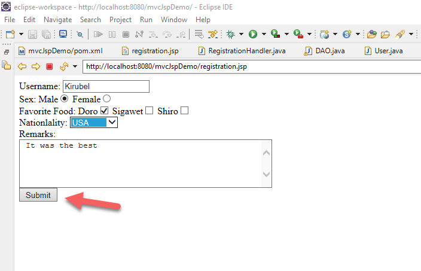
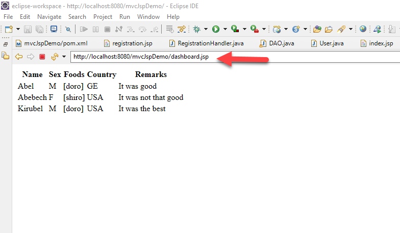
We can also check mysql if our data is written on the database
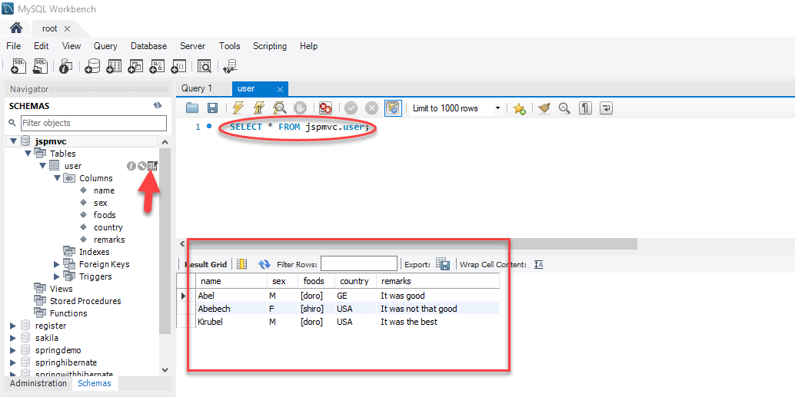

With this simple project we have summarized some of the topics we have seen on JSP and servlets. we can add more functionalities to this project to perform all CRUD operations. 

## For video tutorial go to [ How data moves from UI to backend.](https://youtu.be/kHVCbgemaiE?list=PLfUANuySIYNMFFWkjqqd6toygvbVTfwyU)