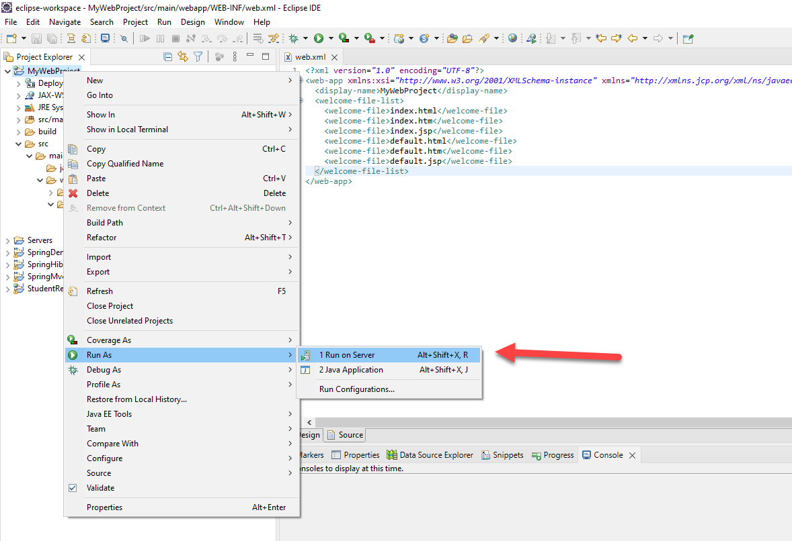
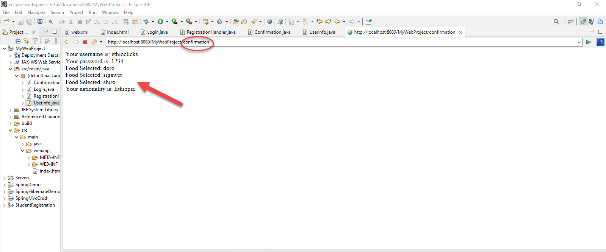

# **Java Servlet**
# 1.	How to install Eclipse IDE  
There are lots of IDEs that can be used for the development of Java programs. Eclipse is one of the most popular one and we will be using Eclipse for this tutorial. 

We will see how we can download and install eclipse on our computers step by step.The first phase is to download Eclipse from the Eclipse download page. To download eclipse we will follow these steps.

*	Go to a search engine and search for eclipse download. ( or follow this link [Eclipse Download](https://www.eclipse.org/downloads/ "Download Here") ).


* Click the first link and you will be presented a page to download Eclipse IDE . Click on “download packages”.


* You will have multiple eclipse software options to choose from for the development of various applications with different programming languages. Our interest is web development using java and the software we need for that is [Eclipse IDE for Enterprise Java and Web Developers](https://www.eclipse.org/downloads/packages/release/2021-12/r/eclipse-ide-enterprise-java-and-web-developers). This software is equipped with Tools for developers working with Java and Web applications, including a Java IDE, tools for JavaScript, TypeScript, Java Server Pages and Faces, Yaml, Markdown, Web Services, JPA and Data Tools, Maven and Gradle, Git, and more. 
    * Choose the appropriate software for your operating system and proceed. We will continue with windows operating system.


* We will proceed by clicking "download" and our download will start automatically.


* After the download is completed, we will go to our download folder and extract the eclipse zip file.

    * We click into the extracted folder and start eclipse by double clicking on the eclipse application file.
    

* We will select our workspace and Eclipse IDE will launch after we click the launch button.


* We have successfully installed eclipse IDE on our system and we can proceed to develop enterprise systems on it.


 ### **Your First Program** 
* Create a new project called "Testing".


* Then create a java class called JavaTesting  
    * Right click on your project -> new -> class
    
    

 proceed to write the following code.

```java
public class JavaTesting {
	public static void main (String[] args ) {
		System.out.println("It Is working");
	}
}
```
*Run your code and check the out put on the console.*

---
# 2. How to download and run Apache Tomcat on Eclipse IDE
Java can be used for different kinds of applications. We can develop desktop applications, mobile applications, web-based applications and many more. Java can be used to create complete applications that may run on a single computer or be distributed among servers and clients in a network.

A server is a computer connected to a network of other workstations called 'clients'. Client computers request information from the server over the network. We can use Apache tomcat to implement a pure Java web server environment. 
Apache Tomcat is a Java Servlet container, or web container, that provides the extended functionality to interact with Java Servlets, while also implementing several technical specifications of the Java platform: JavaServer Pages (JSP), Java Expression Language (Java EL) and WebSocket. 

The following steps can be followed to download and run Apache Tomcat on Eclipse IDE.
* Go to a search engine and search for apache tomcat download. ( or follow this link [Apache Tomcat Download](https://www.eclipse.org/downloads/ "Download Here") ).

* Choose the appropriate version and package for your system.
    * When choosing the tomcat version keep in mind that the latest version might not be stable and it might be in the alpha or beta testing phase so it is recommended to choose a stable version. It will be mentioned on the web page if the version is in a testing phase.
    * For the package choose the file that is compatible with your operating system. we will continue with tomcat 9. You can choose the zip file if your  of operating system is windows or Mac. If your OS is linux you can choose the tar file.


* After we click on the tomcat package the download will start and a zip file will be downloaded in our default download folder. We will extract the package.


* Next we will configure the tomcat server on eclipse. We will open our eclipse software we downloaded earlier. 
* We will look for a tab called Server in the system menu. Sometimes the server tab is not visible in the menu.
 
 * To include the server tab we will click on 
 Windows -> show view -> other and search for Server
 
 

 * After that we can see the server tab in the system menu. we will proceed by clicking on it and following the link under.
 

 * We will choose the tomcat version and click on next
 
 * We must specify the location of of our server so we browse to the place where we extracted our tomcat package.
 
 
 * Click on select folder then Finish. Now we can see our tomcat is configured when we open our server tab.
 

 * We can use our server to run our web applications. Make sure the port number is not being used by another application. By default, Apache Tomcat runs on port 8080.
---
 # 3. How to create servlet
**What exactly is a servlet?**

A servlet is nothing but a Java class that is used to extend the capabilities of servers. Although servlets can respond to any type of request, they are commonly used to extend the applications hosted by web servers.

### **Servlet life-cycle**

A servlet life cycle can be defined as the entire process from its creation till the destruction. The following are the paths followed by a servlet.

* The servlet is initialized by calling the init() method.

* The servlet calls service() method to process a client's request.

* The servlet is terminated by calling the destroy() method.

* Finally, servlet is garbage collected by the garbage collector of the JVM.

*Now let us discuss the life cycle methods in detail.*

### The init() Method 

The init method is called only once. It is called only when the servlet is created, and not called for any user requests afterwards. So, it is used for one-time initializations. The servlet is normally created when a user first invokes a URL corresponding to the servlet, but you can also specify that the servlet be loaded when the server is first started.When a user invokes a servlet, a single instance of each servlet gets created, with each user request resulting in a new thread that is handed off to doGet or doPost as appropriate. The init() method simply creates or loads some data that will be used throughout the life of the servlet.

The init method definition looks like this −

```java
public void init() throws ServletException {
   // Initialization code...
}
```
### The service() Method

The service() method is the main method to perform the actual task. The servlet container (i.e. web server) calls the service() method to handle requests coming from the client( browsers) and to write the formatted response back to the client. Each time the server receives a request for a servlet, the server spawns a new thread and calls service. The service() method checks the HTTP request type (GET, POST, PUT, DELETE, etc.) and calls doGet, doPost, doPut, doDelete, etc. methods as appropriate.

Here is the signature of this method −
```java 
public void service(ServletRequest request, ServletResponse response) 
   throws ServletException, IOException {
}
```
The service () method is called by the container and service method invokes doGet, doPost, doPut, doDelete, etc. methods as appropriate. So you have nothing to do with service() method but you override either doGet() or doPost() depending on what type of request you receive from the client.

The doGet() and doPost() are most frequently used methods with in each service request. Here is the signature of these two methods.

### The doGet() Method

A GET request results from a normal request for a URL or from an HTML form that has no METHOD specified and it should be handled by doGet() method.
```java
    public void doGet(HttpServletRequest request, HttpServletResponse response)
   throws ServletException, IOException {
   // Servlet code
}    
```
### The doPost() Method

A POST request results from an HTML form that specifically lists POST as the METHOD and it should be handled by doPost() method.
```java
public void doPost(HttpServletRequest request, HttpServletResponse response)
   throws ServletException, IOException {
   // Servlet code
}
```
### The destroy() Method

The destroy() method is called only once at the end of the life cycle of a servlet. This method gives your servlet a chance to close database connections, halt background threads, write cookie lists or hit counts to disk, and perform other such cleanup activities.

After the destroy() method is called, the servlet object is marked for garbage collection. 
The destroy method definition looks like this −
```java
public void destroy() {
   // Finalization code...
}
``` 
---
## Your First Servlet Application

To create a servlet application you need to configure tomcat server as we did earlier. follow this steps to create a servlet application. 

* Right click Project Explorer -> new -> Dynamic web page
    
*  Name your project and proceed by clicking next.
     

* Make sure to generate the web.xml file automatically by checking on the checkbox. Then click on Finish.
     

* we will find our project in the Project explorer menu.
        

## web.xml
```xml
<?xml version="1.0" encoding="UTF-8"?>
<web-app xmlns:xsi="http://www.w3.org/2001/XMLSchema-instance" xmlns="http://xmlns.jcp.org/xml/ns/javaee" xsi:schemaLocation="http://xmlns.jcp.org/xml/ns/javaee http://xmlns.jcp.org/xml/ns/javaee/web-app_4_0.xsd" id="WebApp_ID" version="4.0">
  <display-name>MyWebProject</display-name>
  <welcome-file-list>
    <welcome-file>index.html</welcome-file>
    <welcome-file>index.htm</welcome-file>
    <welcome-file>index.jsp</welcome-file>
    <welcome-file>default.html</welcome-file>
    <welcome-file>default.htm</welcome-file>
    <welcome-file>default.jsp</welcome-file>
  </welcome-file-list>
</web-app>
``` 
A web application's deployment descriptor describes the classes, resources and configuration of the application and how the web server uses them to serve web requests. When the web server receives a request for the application, it uses the deployment descriptor to map the URL of the request to the code that ought to handle the request. 

The deployment descriptor is a file named web.xml. It resides in the app's WAR under the WEB-INF/ directory. The file is an XML file whose root element is <web-app>.

Let us run our project on a server and see the output. Lets follow this steps.   

* Right-click on our project -> Run as -> Run on server
    * Then Deploy our project to the server and click finish
     
* An error page will show up because the application called a non existent page.
     
    * To fix this we must create an index.html as that is the file name mentioned in the deployment descriptor.
        * Right-Click on our project -> New -> HTML file
         

## index.html        
``` html
<!DOCTYPE html>
<html>
<head>
<meta charset="ISO-8859-1">
<title>Insert title here</title>
</head>
<body>
 Hello World
</body>
</html>
```
When We run our project on our server we will be presented by a working page returning our request. **(Don't forget to save your files first)**


--- 
We didn't use any Servlets until now. Remember a servlet is just a java class inheriting the HttpServlet class. The next phase is creating our Servlet. To create a servlet.
* Right-click on our project -> New -> Servlet
    * Give a name to your Servlet and click next twice
    
    * You can add additional methods automatically by checking the check boxes. Finally click Finish.
    

## Login.java
```java


import java.io.IOException;
import javax.servlet.ServletConfig;
import javax.servlet.ServletException;
import javax.servlet.annotation.WebServlet;
import javax.servlet.http.HttpServlet;
import javax.servlet.http.HttpServletRequest;
import javax.servlet.http.HttpServletResponse;

/**
 * Servlet implementation class Login
 */
@WebServlet("/Login")
public class Login extends HttpServlet {
	private static final long serialVersionUID = 1L;

    /**
     * Default constructor. 
     */
    public Login() {
        // TODO Auto-generated constructor stub
    }

	/**
	 * @see Servlet#init(ServletConfig)
	 */
	public void init(ServletConfig config) throws ServletException {
		// TODO Auto-generated method stub
	}

	/**
	 * @see HttpServlet#doGet(HttpServletRequest request, HttpServletResponse response)
	 */
	protected void doGet(HttpServletRequest request, HttpServletResponse response) throws ServletException, IOException {
		// TODO Auto-generated method stub
		response.getWriter().append("Served at: ").append(request.getContextPath());
	}

	/**
	 * @see HttpServlet#doPost(HttpServletRequest request, HttpServletResponse response)
	 */
	protected void doPost(HttpServletRequest request, HttpServletResponse response) throws ServletException, IOException {
		// TODO Auto-generated method stub
		doGet(request, response);
	}

}

```

### The above code will be generated automatically when we click finish. But its infested with errors because the classes we are using are external classes used by the servlet frame work. To fix this we must follow the following steps.
* Right-click on our project -> build path -> configure build path
    * Click on class path then click add external JARs.
    
* Browse to the extracted tomcat server That we deployed earlier and go to the lib folder.
    * In the lib folder find "servlet-api.jar" and click on open Then apply and close.
    

Now all the Errors are gone. Lets tweak some things to test or servlet. 

 The first thing we need to do is servlet mapping.Servlet mapping specifies the web container of which java servlet should be invoked for a url given by client. It maps url patterns to servlets. When there is a request from a client, servlet container decides to which application it should forward to. Then context path of url is matched for mapping servlets.

How is servlet mapping defined?

Servlets should be registered with servlet container. For that, you should add entries in web deployment descriptor web.xml.  

## web.xml
```xml
<?xml version="1.0" encoding="UTF-8"?>
-<web-app version="4.0" id="WebApp_ID" xsi:schemaLocation="http://xmlns.jcp.org/xml/ns/javaee http://xmlns.jcp.org/xml/ns/javaee/web-app_4_0.xsd" xmlns="http://xmlns.jcp.org/xml/ns/javaee" xmlns:xsi="http://www.w3.org/2001/XMLSchema-instance">
<display-name>MyWebProject</display-name>
-<welcome-file-list>
<welcome-file>index.html</welcome-file>
<welcome-file>index.htm</welcome-file>
<welcome-file>index.jsp</welcome-file>
<welcome-file>default.html</welcome-file>
<welcome-file>default.htm</welcome-file>
<welcome-file>default.jsp</welcome-file>
</welcome-file-list>

<servlet>
    <servlet-name> Login </servlet-name>
    <servlet-class> Login </servlet-class>
</servlet>

<servlet-mapping>
    <servlet-name>Login</servlet-name>
    <url-pattern>/mylogin</url-pattern>
</servlet-mapping>
</web-app>
```
Update the doGet method in login.java
```java
protected void doGet(HttpServletRequest request, HttpServletResponse response) throws ServletException, IOException {
		// TODO Auto-generated method stub
		response.getWriter().append("This is a Login page ");
	}
```
 Now Run the the project on server. The index page will be shown as expected. but we need to see the login page to do that just add the url part at the end.


---

# 4. How GET Method works in servlet 

We have discussed about the doGet method in the previous chapter. Now we will see how doGet works in a servlet program.

Let us update our index.html file to incorporate a form.

## index.html
```html
<!DOCTYPE html>
<html>
<head>
<meta charset="ISO-8859-1">
<title>Insert title here</title>
</head>
<body>
 <h1> This is Login Page </h1>
 	<form action="/MyWebProject/login" method = "get">
 		<input type = "text" name = "username" />
 		<input type = "password" name = "password" /><br>
 		<input type = "submit" value = "Submit" /> <br>	
 	</form >
</body>
</html>
```
The above html code is a simple login form to send a request to the server. let us see the output when we run our index.html.


Lets dive a little bit in our code

 Next we will go to login.java and update the doGet() method.
 ## Login.java
 ```java
 /**
	 * @see HttpServlet#doGet(HttpServletRequest request, HttpServletResponse response)
	 */
	protected void doGet(HttpServletRequest request, HttpServletResponse response) throws ServletException, IOException {
		// TODO Auto-generated method stub
		//response.getWriter().append("Served at: ").append(request.getContextPath());
		//response.getWriter().append("This is a Login page ");
			String username = request.getParameter("username");
			String password = request.getParameter("password");
        response.getWriter().append("This is login page : ").append(" Your username is  " + username).append("  Your password is "+ password);
			
	}
 ```
  Here we are getting the parameters username and  password from the form and put it on string values called username and password respectively. Then we are simply outputting the values on our web page. Let us run our project and examine our output.
   
  Fill in the form with username and password then click Submit.
  

Note that The GET method is the default method to pass information from browser to web server and it produces a long string that appears in your browser's URl box. Never use the GET method if you have password or other sensitive information to pass to the server. 

---
# 5. How POST Method works in servlet 
Now we will see how doPost works in a servlet program. We will update the doPost method in the login.java file.

##Login.java

```java
/**
	 * @see HttpServlet#doPost(HttpServletRequest request, HttpServletResponse response)
	 */
	protected void doPost(HttpServletRequest request, HttpServletResponse response) throws ServletException, IOException {
		// TODO Auto-generated method stub
		String username = request.getParameter("username");
		String password = request.getParameter("password");
	response.getWriter().append("This is login page Using post Method: ").append(" Your username is  " + username).append("  Your password is "+ password);
		
	}
```
Everything will be the same as in the doGet method but we need to change the method we intend to use in the index.html file.

## index.html
```html
<!DOCTYPE html>
<html>
<head>
<meta charset="ISO-8859-1">
<title>Insert title here</title>
</head>
<body>
 <h1> This is Login Page </h1>
 	<form action="/MyWebProject/mylogin" method = "post">
 		<input type = "text" name = "username" />
 		<input type = "password" name = "password" /><br>
 		<input type = "submit" value = "Submit" /> <br>	
 	</form >
</body>
</html>
```
Notice we changed the method in our from frm get to post. Lets run our project and examine the difference between our earlier code.


The Post method is generally more reliable method of passing information to a backend. This packages the information in exactly the same way as GET method. This message comes to the backend program in the form of the standard input which you can parse and use for your processing. Servlet handles this type of requests using doPost() method.
---
# 6.How to get and process request data in servlet
   * Let us create a registration form in index.html.

## index.html    
```html 

<!DOCTYPE html>
<html>
<head>
<meta charset="ISO-8859-1">
<title>Insert title here</title>
</head>
<body>
<!--
	<h1>This is Login Page</h1>
	<form action="/MyWebProject/mylogin" method="post">
		<input type="text" name="username" />
		 <input type="password" name="password" /><br> <input type="submit" value="Submit" />
		<br>
	</form>
	-->
	
	<h1>This is A registration Page</h1>
	<form action="/MyWebProject/register" method="post">
		Username:<input type="text" name="username" /> 
		Password:<input type="password" name="password" /><br> 
		Sex:Male<input type = "radio" name = "sex" value = "M" >
		     Female<input type = "radio" name = "sex" value = "F" ><br/>
		Favorite Food:Doro<input type = "checkbox" name = "food" value = "doro" >
		              Sigawet<input type = "checkbox" name = "food" value = "sigawet">
		              Shiro<input type = "checkbox" name = "food" value = "shiro" >  <br>    
		Nationality:<select name = "nationality">
						<option value = "Ethiopia"> Ethiopia </option>
		                <option value = "USA"> USA </option>
		                <option value = "Kenya"> Kenya </option>
					   </select><br>		        
		<input type="submit" value="Submit" /><br>
	</form>
</body>
</html>
```
* Now create a servlet to handle our request by following the steps we used to create a servlet file.
## RegistrationHandler.Java
```java


import java.io.IOException;
import javax.servlet.ServletConfig;
import javax.servlet.ServletException;
import javax.servlet.annotation.WebServlet;
import javax.servlet.http.HttpServlet;
import javax.servlet.http.HttpServletRequest;
import javax.servlet.http.HttpServletResponse;

/**
 * Servlet implementation class RegistrationHandler
 */
@WebServlet("/RegistrationHandler")
public class RegistrationHandler extends HttpServlet {
	private static final long serialVersionUID = 1L;
       
    /**
     * @see HttpServlet#HttpServlet()
     */
    public RegistrationHandler() {
        super();
        // TODO Auto-generated constructor stub
    }

	/**
	 * @see Servlet#init(ServletConfig)
	 */
	public void init(ServletConfig config) throws ServletException {
		// TODO Auto-generated method stub
	}

	/**
	 * @see HttpServlet#doGet(HttpServletRequest request, HttpServletResponse response)
	 */
	protected void doGet(HttpServletRequest request, HttpServletResponse response) throws ServletException, IOException {
		// TODO Auto-generated method stub
	}

	/**
	 * @see HttpServlet#doPost(HttpServletRequest request, HttpServletResponse response)
	 */
	protected void doPost(HttpServletRequest request, HttpServletResponse response) throws ServletException, IOException {
		// TODO Auto-generated method stub
		//doGet(request, response);
		String username = request.getParameter("username");
		String pass = request.getParameter("password");
		String sex = request.getParameter("sex");
		String foods[] = request.getParameterValues("food");
		String nationality = request.getParameter("nationality");
		
		// Test the out put in console
		System.out.println("User name is:" + username);
		System.out.println("Password is:" + pass);
		System.out.println("Sex is:" + sex);
	    
		for(String food:foods) {    //Enhanced for loop 
			System.out.println("Food Selected:" + food);
		}
		System.out.println("Nationality is:" + nationality);
	}

}

```
* Notice that we used different methods to handle the requested form data. Servlets handle form data parsing automatically using the following methods depending on the situation. Here are the functions we use.

**getParameter()** − You call request.getParameter() method to get the value of a form parameter.

**getParameterValues()** − Call this method if the parameter appears more than once and returns multiple values, for example the  checkbox we used for foods.

**getParameterNames()** − Call this method if you want a complete list of all parameters in the current request.

* Enhanced for loop provides an alternative approach to traverse the array or collection in Java. It is mainly used to traverse the array or collection elements.

* Let us do servlet mapping for RegistrationHandler in web.xml
## web.xml
```xml
<?xml version="1.0" encoding="UTF-8"?>
<web-app xmlns:xsi="http://www.w3.org/2001/XMLSchema-instance" xmlns="http://xmlns.jcp.org/xml/ns/javaee" xsi:schemaLocation="http://xmlns.jcp.org/xml/ns/javaee http://xmlns.jcp.org/xml/ns/javaee/web-app_4_0.xsd" id="WebApp_ID" version="4.0">
  <display-name>MyWebProject</display-name>
  <welcome-file-list>
    <welcome-file>index.html</welcome-file>
    <welcome-file>index.htm</welcome-file>
    <welcome-file>index.jsp</welcome-file>
    <welcome-file>default.html</welcome-file>
    <welcome-file>default.htm</welcome-file>
    <welcome-file>default.jsp</welcome-file>
  </welcome-file-list>
  
<servlet>
    <servlet-name> Login </servlet-name>
    <servlet-class> Login </servlet-class>
</servlet>
<servlet>
    <servlet-name> RegistrationHandler </servlet-name>
    <servlet-class> RegistrationHandler </servlet-class>
</servlet>
<servlet-mapping>
    <servlet-name>Login</servlet-name>
    <url-pattern>/mylogin</url-pattern>
</servlet-mapping>

<servlet-mapping>
    <servlet-name>RegistrationHandler</servlet-name>
    <url-pattern>/register</url-pattern>
</servlet-mapping>
</web-app>
```
* Finally let us run our project and see the Result.


---
# 7. How to redirect request in servlet
    Java or HTML based web applications are made by compiling multiple screens and servlets. The control of the execution process is transferred from one server to another  server using two methods, namely, forward method and redirect method.
## Comparison Between Forward and Redirect 
| Forward |
-----------------
* In applications and web based systems, the forward command or method is used when there is a need to forward the request from one or servlet to another servlet.
* When the forward command is applied, the web container processes the request internally and thus the client does not have direct involvement in the process
* The control of the execution command in the forward method remains within the currently ongoing web application.
* The forward command works within a single server, therefore, it operates at a faster speed.
* The forward command is most efficient when the component performs a business logic and the result is shared with another component.

| Redirect |
-----------------
* In web based systems, the redirect or send redirect command or method is used when there is a need to redirect the request of the client to a different URL that is located on a different server.
* When the redirect command is applied, the current window is redirected to a different window and the client gets the proper information about what is going on, thus they have direct involvement in the process.
* The control of the execution command in the redirect method is transferred to the new or another window when it shows up.
* The redirect command works slower as compared to the forward command since it operates within multiple servers.
* The redirect command works most efficiently when the client is to be redirected from one page to another.

### **Let us see how this is implemented practically.**
* After we input user information like in the previous registration form will will go to the Registration handler to handle the inserted data using the forward method.
## RegistrationHandler.java
```java


import java.io.IOException;
import javax.servlet.ServletConfig;
import javax.servlet.ServletException;
import javax.servlet.annotation.WebServlet;
import javax.servlet.http.HttpServlet;
import javax.servlet.http.HttpServletRequest;
import javax.servlet.http.HttpServletResponse;

/**
 * Servlet implementation class RegistrationHandler
 */
@WebServlet("/RegistrationHandler")
public class RegistrationHandler extends HttpServlet {
	private static final long serialVersionUID = 1L;
       
    /**
     * @see HttpServlet#HttpServlet()
     */
    public RegistrationHandler() {
        super();
        // TODO Auto-generated constructor stub
    }

	/**
	 * @see Servlet#init(ServletConfig)
	 */
	public void init(ServletConfig config) throws ServletException {
		// TODO Auto-generated method stub
	}

	/**
	 * @see HttpServlet#doGet(HttpServletRequest request, HttpServletResponse response)
	 */
	protected void doGet(HttpServletRequest request, HttpServletResponse response) throws ServletException, IOException {
		// TODO Auto-generated method stub
	}

	/**
	 * @see HttpServlet#doPost(HttpServletRequest request, HttpServletResponse response)
	 */
	protected void doPost(HttpServletRequest request, HttpServletResponse response) throws ServletException, IOException {
		// TODO Auto-generated method stub
		//doGet(request, response);
		String username = request.getParameter("username");

		String pass = request.getParameter("password");
		String sex = request.getParameter("sex");
		String foods[] = request.getParameterValues("food");
		String nationality = request.getParameter("nationality");
		request.getRequestDispatcher("/confirmation").forward(request, response);
		
	}

}

```
* Now we will create another servlet called Confirmation using the steps we used to create a servlet. Also, don't forget to map our servlet in web.xml file.
## Confirmation.java

```java


import java.io.IOException;
import javax.servlet.ServletException;
import javax.servlet.annotation.WebServlet;
import javax.servlet.http.HttpServlet;
import javax.servlet.http.HttpServletRequest;
import javax.servlet.http.HttpServletResponse;

/**
 * Servlet implementation class Confirmation
 */
@WebServlet("/Confirmation")
public class Confirmation extends HttpServlet {
	private static final long serialVersionUID = 1L;
       
    /**
     * @see HttpServlet#HttpServlet()
     */
    public Confirmation() {
        super();
        // TODO Auto-generated constructor stub
    }

	/**
	 * @see HttpServlet#doGet(HttpServletRequest request, HttpServletResponse response)
	 */
	protected void doGet(HttpServletRequest request, HttpServletResponse response) throws ServletException, IOException {
		// TODO Auto-generated method stub
		response.getWriter().append("Served at: ").append(request.getContextPath());
	}

	/**
	 * @see HttpServlet#doPost(HttpServletRequest request, HttpServletResponse response)
	 */
	protected void doPost(HttpServletRequest request, HttpServletResponse response) throws ServletException, IOException {
		
		String foods[] = request.getParameterValues("food");
		
		response.getWriter().append("Your username is: " + request.getParameter("username"));
		response.getWriter().append("<br> Your password is: " + request.getParameter("password"));
		for(String food:foods) {    //Enhanced arrays
			response.getWriter().append("<br>The food you selected is: " + food);
		}
		
		response.getWriter().append("<br>Your nationality is: " + request.getParameter("nationality"));
	}

}

```
* We can run our project and see the output that resulted from using the forward method.


* We can use sendRedirect method to redirect to a different page.Let us update our RegistrationHandler and Confirmation page to incorporate the send redirect method .
## Confirmation.java
```java


import java.io.IOException;
import javax.servlet.ServletException;
import javax.servlet.annotation.WebServlet;
import javax.servlet.http.HttpServlet;
import javax.servlet.http.HttpServletRequest;
import javax.servlet.http.HttpServletResponse;

/**
 * Servlet implementation class Confirmation
 */
@WebServlet("/Confirmation")
public class Confirmation extends HttpServlet {
	private static final long serialVersionUID = 1L;
       
    /**
     * @see HttpServlet#HttpServlet()
     */
    public Confirmation() {
        super();
        // TODO Auto-generated constructor stub
    }

	/**
	 * @see HttpServlet#doGet(HttpServletRequest request, HttpServletResponse response)
	 */
	protected void doGet(HttpServletRequest request, HttpServletResponse response) throws ServletException, IOException {
	
		response.getWriter().append("Your username is: " + request.getParameter("username"));
		response.getWriter().append("<br> Your password is: " + request.getParameter("password"));
		response.getWriter().append("<br>The food you selcted is: " + request.getParameterValues("food"));
		response.getWriter().append("<br>Your nationality is: " + request.getParameter("nationality"));
	}

	/**
	 * @see HttpServlet#doPost(HttpServletRequest request, HttpServletResponse response)
	 */
	protected void doPost(HttpServletRequest request, HttpServletResponse response) throws ServletException, IOException {
		doGet(request, response);
	}

}

```
# RegistrationHandler
```java


import java.io.IOException;
import javax.servlet.ServletConfig;
import javax.servlet.ServletException;
import javax.servlet.annotation.WebServlet;
import javax.servlet.http.HttpServlet;
import javax.servlet.http.HttpServletRequest;
import javax.servlet.http.HttpServletResponse;

/**
 * Servlet implementation class RegistrationHandler
 */
@WebServlet("/RegistrationHandler")
public class RegistrationHandler extends HttpServlet {
	private static final long serialVersionUID = 1L;
       
    /**
     * @see HttpServlet#HttpServlet()
     */
    public RegistrationHandler() {
        super();
        // TODO Auto-generated constructor stub
    }

	/**
	 * @see Servlet#init(ServletConfig)
	 */
	public void init(ServletConfig config) throws ServletException {
		// TODO Auto-generated method stub
	}

	/**
	 * @see HttpServlet#doGet(HttpServletRequest request, HttpServletResponse response)
	 */
	protected void doGet(HttpServletRequest request, HttpServletResponse response) throws ServletException, IOException {
		// TODO Auto-generated method stub
	}

	/**
	 * @see HttpServlet#doPost(HttpServletRequest request, HttpServletResponse response)
	 */
	protected void doPost(HttpServletRequest request, HttpServletResponse response) throws ServletException, IOException {
		// TODO Auto-generated method stub
		//doGet(request, response);
		String username = request.getParameter("username");

		String pass = request.getParameter("password");
		String sex = request.getParameter("sex");
		String foods[] = request.getParameterValues("food");
		String nationality = request.getParameter("nationality");
		
		
		//request.getRequestDispatcher("/confirmation").forward(request, response);
		response.sendRedirect("/MyWebProject/confirmation");
		
	}

}


```
Some difference can be noticed between our previous code where we used the forward method and this code where we used the sendRedirect method. The main difference we notice is we used the doGet method when it comes to sendRedirect this is because redirect is always uses GET method, redirection means a new request.

When we give send redirect actually happening is a new request from the user.It is always get. Since it is a new request we cant access the old request parameters.Remember a request to a Http or a URL link is always a Get request whether the URL is to a servlet within application or to external location.

* Finally lets notice differences in the out put of our projects.


* One  thing we notice is the url, it is directly redirected to the confirmation page instead of the register page like the previous out put.
* Also The input we inserted into our form is not returned to this page. This is because the sendRedirect method is not used for that purpose and we are actually calling a new call here. That is why using GET doesn't affect the security our program because we are not actually returning data.
* So sendRedirect can only be used when we want client to initiate completely new Request which does not completely depend on the previous operation. 
---
# 8. How to session in servlet
A session indicates a period of time that a single user visits a website. A session starts when the user requests for the first page. And during a session, the user can view as many pages as he wants. The session ends if the user hasn’t requested any pages for a given amount of time (timeout).

 Http protocol is a stateless so we need to maintain state using session tracking techniques. Each time user requests to the server, server treats the request as the new request. So we need to maintain the state of an user to recognize to particular user.

 We use session mechanism to manage user’s information that persists only in particular session, such as authentication state, username or any data that need to be shared across requests.
	
* we can see how this is implemented practically by updating our previous code.

Let us create a java class to handle our user information and generate a getter and setter for each data.

## UserInfo.java
```java
public class UserInfo {

	private String username;
	private String password;
	private String sex;
	private String[] foods;
	private String nationality;
	
	
	public String getUsername() {
		return username;
	}
	public void setUsername(String username) {
		this.username = username;
	}
	public String getPassword() {
		return password;
	}
	public void setPassword(String password) {
		this.password = password;
	}
	public String getSex() {
		return sex;
	}
	public void setSex(String sex) {
		this.sex = sex;
	}
	public String[] getFoods() {
		return foods;
	}
	public void setFoods(String[] foods) {
		this.foods = foods;
	}
	public String getNationality() {
		return nationality;
	}
	public void setNationality(String nationality) {
		this.nationality = nationality;
	}
	
	
}

```
## RegistrationHandler.java
```java


import java.io.IOException;
import javax.servlet.ServletConfig;
import javax.servlet.ServletException;
import javax.servlet.annotation.WebServlet;
import javax.servlet.http.HttpServlet;
import javax.servlet.http.HttpServletRequest;
import javax.servlet.http.HttpServletResponse;

/**
 * Servlet implementation class RegistrationHandler
 */
@WebServlet("/RegistrationHandler")
public class RegistrationHandler extends HttpServlet {
	private static final long serialVersionUID = 1L;
       
    /**
     * @see HttpServlet#HttpServlet()
     */
    public RegistrationHandler() {
        super();
        // TODO Auto-generated constructor stub
    }

	/**
	 * @see Servlet#init(ServletConfig)
	 */
	public void init(ServletConfig config) throws ServletException {
		// TODO Auto-generated method stub
	}

	/**
	 * @see HttpServlet#doGet(HttpServletRequest request, HttpServletResponse response)
	 */
	protected void doGet(HttpServletRequest request, HttpServletResponse response) throws ServletException, IOException {
		// TODO Auto-generated method stub
	}

	/**
	 * @see HttpServlet#doPost(HttpServletRequest request, HttpServletResponse response)
	 */
	protected void doPost(HttpServletRequest request, HttpServletResponse response) throws ServletException, IOException {
		// TODO Auto-generated method stub
		//doGet(request, response);
		
		UserInfo userinfo = new UserInfo();
		
		String username = request.getParameter("username");
		userinfo.setUsername(username);
		
		
		String pass = request.getParameter("password");
		userinfo.setPassword(pass);
		
		String sex = request.getParameter("sex");
	    userinfo.setSex(sex);
		
		String foods[] = request.getParameterValues("food");
		userinfo.setFoods(foods);
		
		String nationality = request.getParameter("nationality");
		userinfo.setNationality(nationality);
		
		request.getSession().setAttribute("myuserinfo", userinfo);
	    response.sendRedirect("/MyWebProject/confirmation");
		
	}

}

```
Now let us update our confirmation page.
## Confirmation.java

```java


import java.io.IOException;
import java.io.PrintWriter;

import javax.servlet.ServletException;
import javax.servlet.annotation.WebServlet;
import javax.servlet.http.HttpServlet;
import javax.servlet.http.HttpServletRequest;
import javax.servlet.http.HttpServletResponse;

/**
 * Servlet implementation class Confirmation
 */
@WebServlet("/Confirmation")
public class Confirmation extends HttpServlet {
	private static final long serialVersionUID = 1L;
       
    /**
     * @see HttpServlet#HttpServlet()
     */
    public Confirmation() {
        super();
        // TODO Auto-generated constructor stub
    }

	/**
	 * @see HttpServlet#doGet(HttpServletRequest request, HttpServletResponse response)
	 */
	protected void doGet(HttpServletRequest request, HttpServletResponse response) throws ServletException, IOException {
		
		// TODO Auto-generated method stub
		
	   UserInfo userinfo = (UserInfo) request.getSession().getAttribute("myuserinfo");
	  PrintWriter writer = response.getWriter().append("Your username is: " + userinfo.getUsername())
	   .append("<br>Your password is: " + userinfo.getPassword());
	   	
		
	  for(String food:userinfo.getFoods()) {    //Enhanced array
			writer.append(" <br>Food Selected: " + food);
		}
	  
	  writer.append("<br>Your nationality is: " + userinfo.getNationality());
	  
	
	}

	/**
	 * @see HttpServlet#doPost(HttpServletRequest request, HttpServletResponse response)
	 */
	protected void doPost(HttpServletRequest request, HttpServletResponse response) throws ServletException, IOException {
		doGet(request, response);
		
	}

}

```
* Finally let us run our project and see the output.




* So using sessions we can transfer persistent data using serverRedirect() method to a completely new Request which does not completely depend on the previous operation. Sessions are further implemented with databases.
---