# Spring MVC

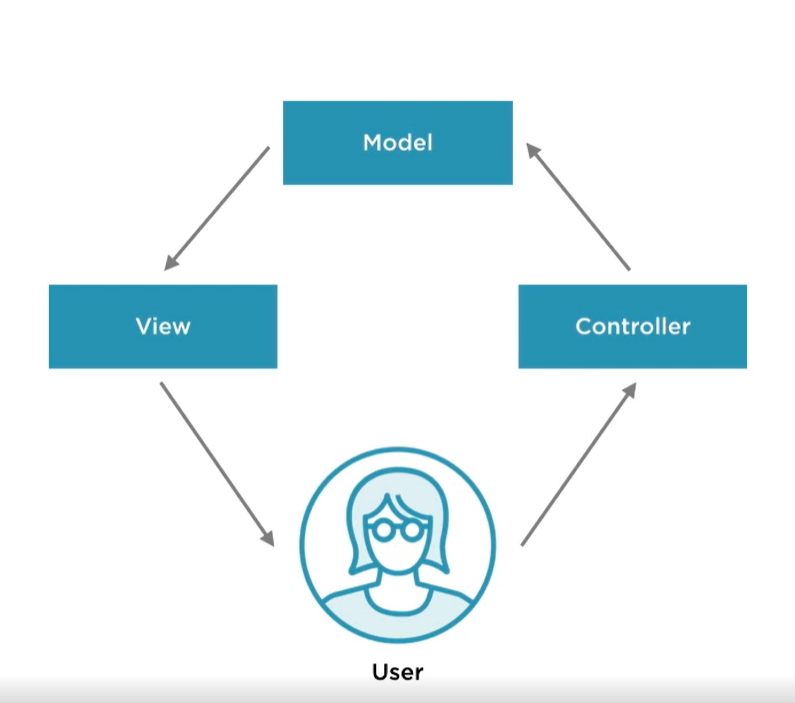
Spring MVC is a web development design pattern in that our application divided in to three components namely Model, View and Controller. In this design pattern the user request handled by the controller. After the business logic execution, the result will be delivered to the user through the view(view-template). Refer the following detail diagram that shows the MVC implementation in detail. 

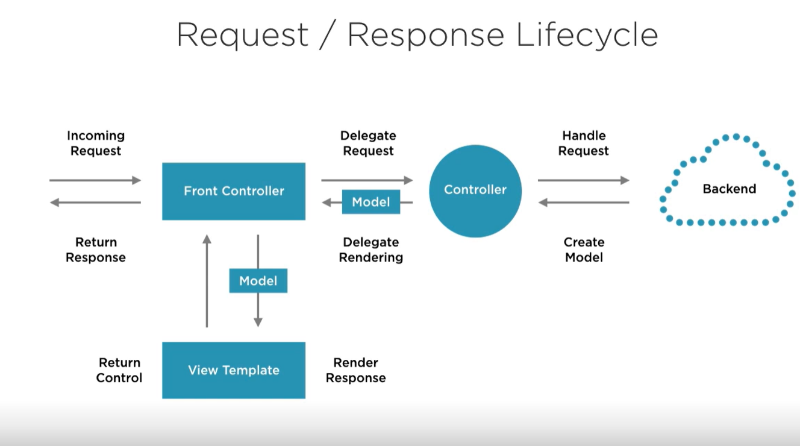

##Creating web application using Spring MVC
###Creating spring using maven
<<<<reference to how to create spring mvc with maven>>>>

###Creating spring project using spring initializer
Spring initializer(https://start.spring.io)is a web platform that help us to generate initial spring application based on common configuration across spring community.

Go to https://start.spring.io and crate a project as follows:
* type=>maven
* language=>java 
* project metadata=>
o group=com.xyz
o Atrifact=your project name
o packaging=jar
o java=8 or 11 
* dependencies=>spring web

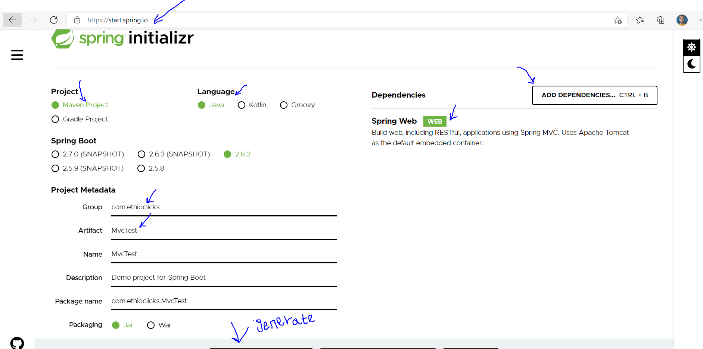

After you add spring web dependency, press generate button. Spring application based on your chois a project will be generated and zipped file will be downloaded. Once the project is downloaded, extract the file and you can import the project in your IDE(IntelliJ or STS).

If you are opening IntelliJ you will get new or import project as follows. Choose import and show your directory where you downloaded and unzipped the project.

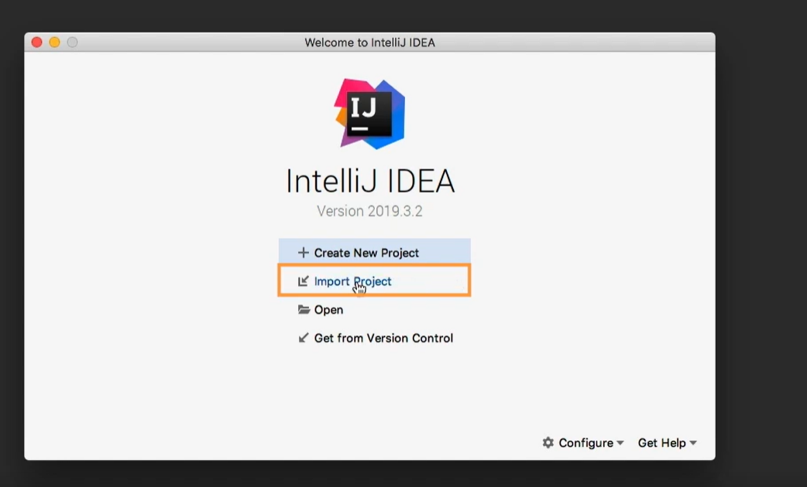

If you are on another project and you want to open the downloaded project, Go to File->Open->add your project directory->open

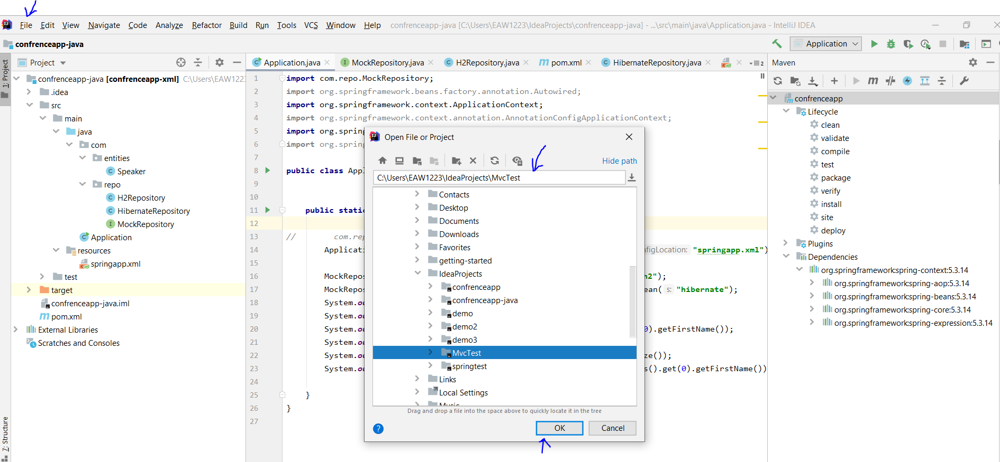

Note: the download project has an embedded tomcat.

### Running spring MVC application
If we are using Java 8 we need to update pom.xml by adding the following plugin configuration as we <<<<<see in the previous section>>>>>>
<plugin>
   <groupId>org.apache.maven.plugins</groupId>
   <artifactId>maven-compiler-plugin</artifactId>
   <version>3.8.1</version>
   <configuration>
      <source>1.8</source>
      <target>1.8</target>
   </configuration>
</plugin>

By selecting install option in the maven section, you can Install your dependency for your project using the embedded maven.

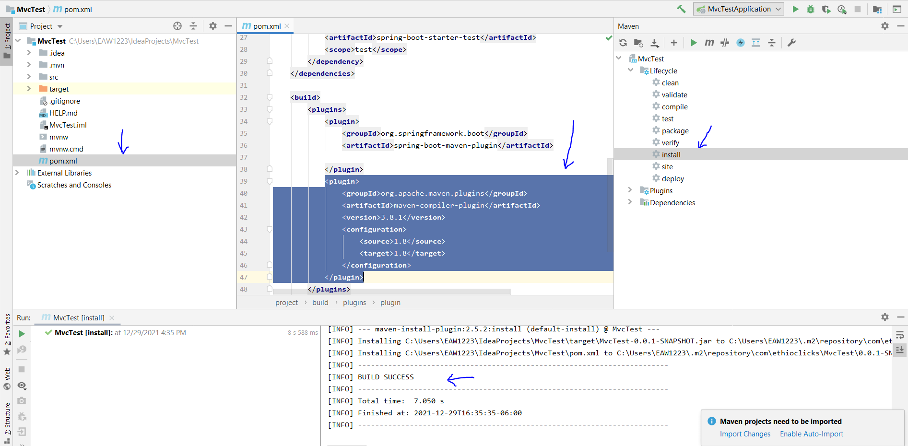

Once you installed the dependency, you can run your application as follows:
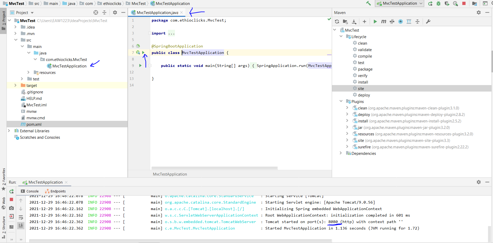

In the bottom section you�re your IDE, you should get at what port your application is running. Usually, it runs at port 8080. To verify your application is running, open your borowser and navigate to http://localhost:8080 you should get a message as follows:
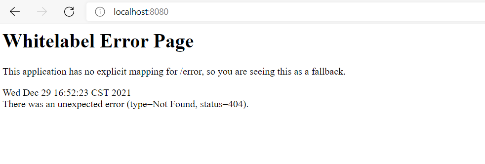
The error message is telling us there is no page to display that mapped to handle request at http://localhost:8080 if we have index.html file that would be displayed. Let us go and add index.html to our project. Go to resources->static->right click->new->HTML 4/ HTML 5-> name it as �indx.html�->put some text in it and rerun the application.
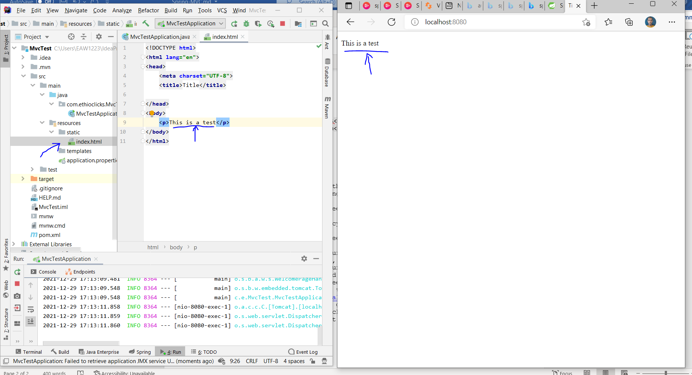

### understanding web application architectures and layers
The one advantage of MVC pattern is it allow us to implement separation of concern. It help us to divide the application in to different layers and different developers with different concerns/skills can work on different layers based on their concerns.

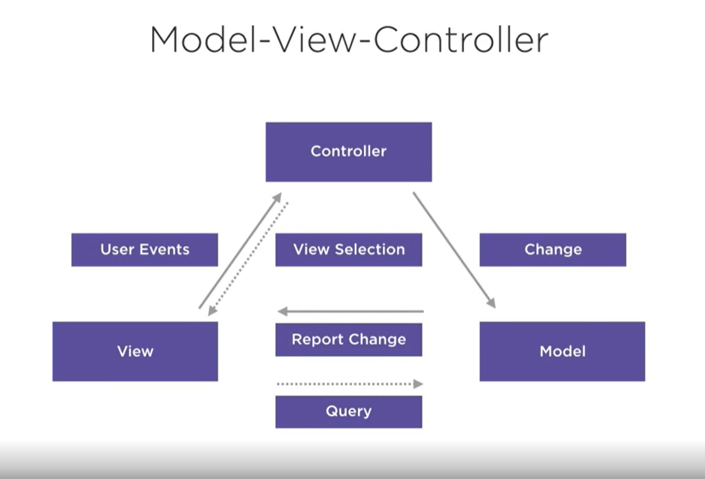

It is common to divide our application in two different layers such as view layer, business logic layer and data layer as follows:
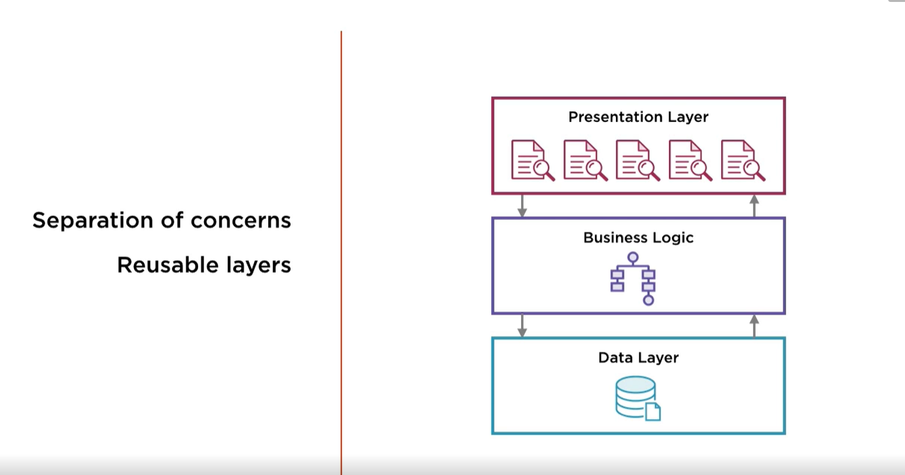
Spring provides us different stereo type annotations that used on each of these layers such as 
* @Controller controller layer
* @Service service layer
* @Repository data layer

### Request handler(Controller)
In order to handle the request coming form the user we need to create a class with annotation of @Controller. In this class we will have method definitions that annotated with different Http request related annotations in order to specify which method handles which kinds of request. There are multiple kinds of http request method such as:
* GET for mainly retrieving information
* POST for saving information
* DELETE for updating information
* PUT for updating information
* OPTION for checking the validity of a URL
When the front end application needs to communicate with back end it needs to use this methods. This might be specifying it inside HTML form tag as a method element.
<form path=�/greeting� method=�POST|GET�>
Name:<input type=�text� />
</form>

 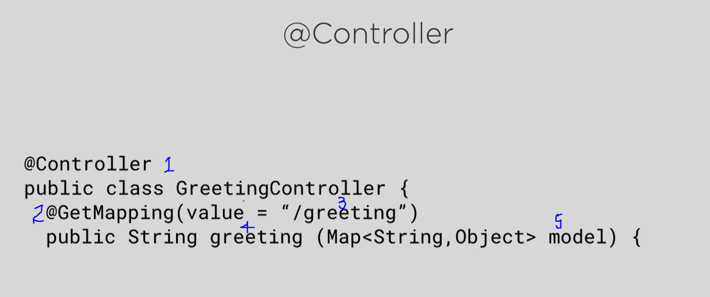
As indicated on the above image we can specify our service using different annotation.
1-Controller: Specifying this class is a controller class which handles client requests.
2-GetMapping: Specifying the method is handling GET request
3-URL path: Specifying the URL path this method is handling
4-Method name

Now let go and create our first controller that greets the user. Go and create controller class and annotate it with @Controller annotation as follows:
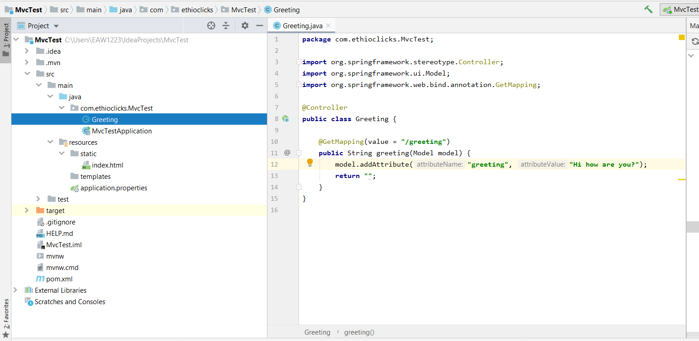
This controller handles greeting request and put on the model the greeting message using a variable called �greeting�. Next we need to have a template which takes our model and display it. We can use JSP or Thymleafe templating engine.

##Note about thymeleaf

##Adding Thymeleaf in our project

In order to use thyemleaf in our project we need to add thyemleaf dependency. We can add thyemleaf dependencies using theyemleaf starter.
<dependency>
   <groupId>org.springframework.boot</groupId>
   <artifactId>spring-boot-starter-thymeleaf</artifactId>
</dependency>
This dependency will insert all theyemeleaf related dependencies in our project.

After we add thyemeleaf dependency we need to create HTML file inside of template folder and we need to add theyme leaf name space as follows:
<html lang="en" xmlns:th="http://www.thymeleaf.org">

th in to spacify to use theymleaf tag from the namespace. Here we used text to display a text using greeting value from the model

