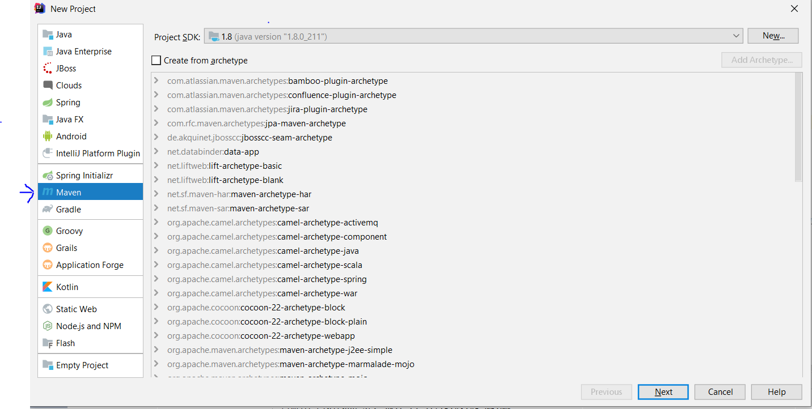
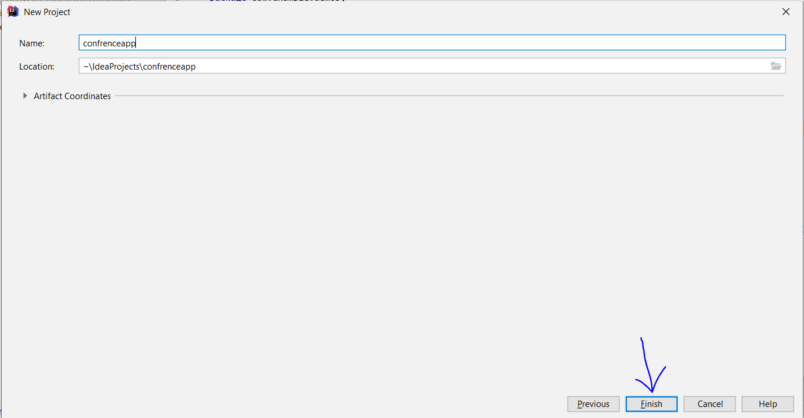
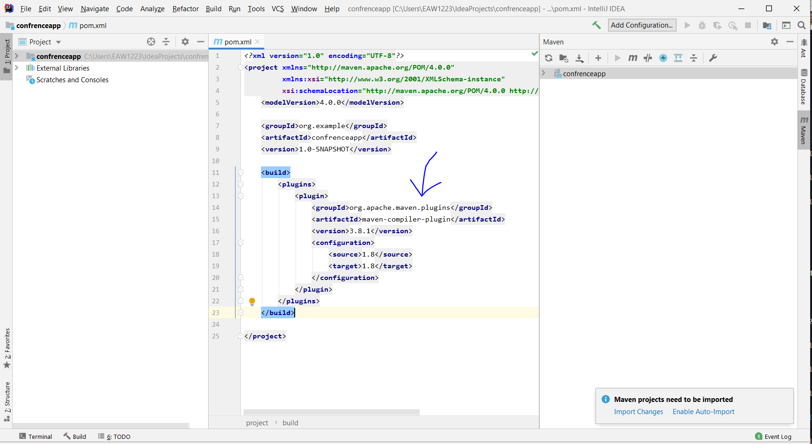

# Spring tutorial
## Basic Spring Application with Maven

### How to create new maven project for spring tutorial



since maven is older version of java by default, we have to add java 8 plugin to our maven (if we use latest jave we have to add that version plugin)

```
<build>
        <plugins>
            <plugin>
                <groupId>org.apache.maven.plugins</groupId>
                <artifactId>maven-compiler-plugin</artifactId>
                <version>3.8.1</version>
                <configuration>
                    <source>1.8</source>
                    <target>1.8</target>
                </configuration>
            </plugin>
        </plugins>
    </build>
```


