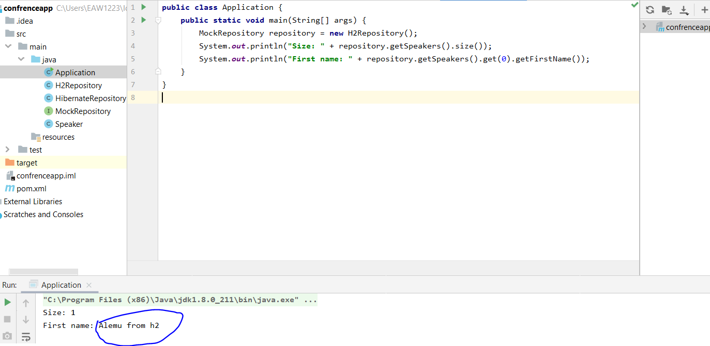

# Spring tutorial
## Basic Spring Application with Maven

### How to create new maven project for spring tutorial
Open your IntelliJ IDE and create new project as follows

Select your workspace and create


Since maven is using older version of java by default, we have to add java 8 plugin to our maven (if we use latest Jave we have to add that version plugin) as follows.

```
<build>
        <plugins>
            <plugin>
                <groupId>org.apache.maven.plugins</groupId>
                <artifactId>maven-compiler-plugin</artifactId>
                <version>3.8.1</version>
                <configuration>
                    <source>1.8</source>
                    <target>1.8</target>
                </configuration>
            </plugin>
        </plugins>
    </build>
```


### Add entity class
public class Speaker {

    String firstName;
    String lastName;

    public String getFirstName() {
        return firstName;
    }

    public void setFirstName(String firstName) {
        this.firstName = firstName;
    }

    public String getLastName() {
        return lastName;
    }

    public void setLastName(String lastName) {
        this.lastName = lastName;
    }
}

### add an interface 
import java.util.List;

public interface MockRepository {
    List<Speaker> getSpeakers();
}

### implement an interface
import java.util.ArrayList;
import java.util.List;

public class HibernateRepository implements MockRepository {
    private ArrayList<Speaker> speakers;

    HibernateRepository() {
        speakers = new ArrayList<Speaker>();
        Speaker speaker = new Speaker();
        speaker.setFirstName("Alemu");
        speaker.setLastName("Kebede");
        speakers.add(speaker);
    }
    
    public List<Speaker> getSpeakers() {
        return speakers;
    }
}


### Create Application class and run the application
#### Implementing the repository
public class Application {
    public static void main(String[] args) {
        MockRepository repository = new HibernateRepository();
        System.out.println("Size: " + repository.getSpeakers().size());
        System.out.println("First name: " + repository.getSpeakers().get(0).getFirstName());
    }
}

#### Out put


### adding another implementation for mock H2 DB
import java.util.ArrayList;
import java.util.List;

public class H2Repository implements MockRepository {
    private ArrayList<Speaker> speakers;

    H2Repository() {
        speakers = new ArrayList<Speaker>();
        Speaker speaker = new Speaker();
        speaker.setFirstName("Alemu from h2");
        speaker.setLastName("Kebede from h2");
        speakers.add(speaker);
    }

    public List<Speaker> getSpeakers() {
        return speakers;
    }
}

### run the app again and will get another result

public class Application {
    public static void main(String[] args) {
        MockRepository repository = new H2Repository();
        System.out.println("Size: " + repository.getSpeakers().size());
        System.out.println("First name: " + repository.getSpeakers().get(0).getFirstName());
    }
}


#### Out put
This time it is using H2 Repository.



